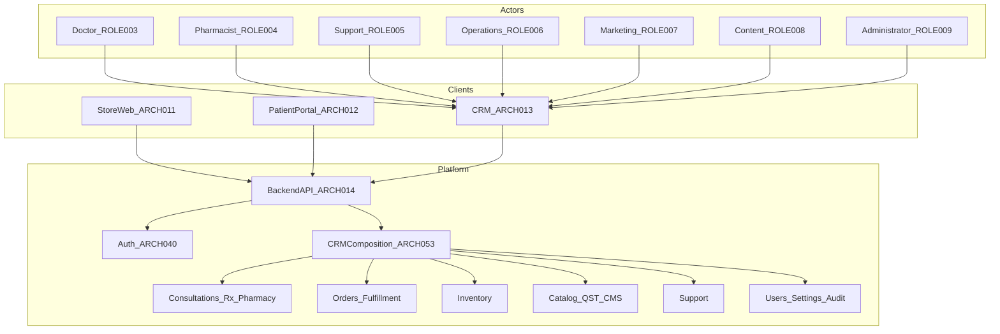
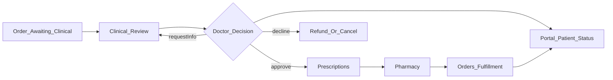
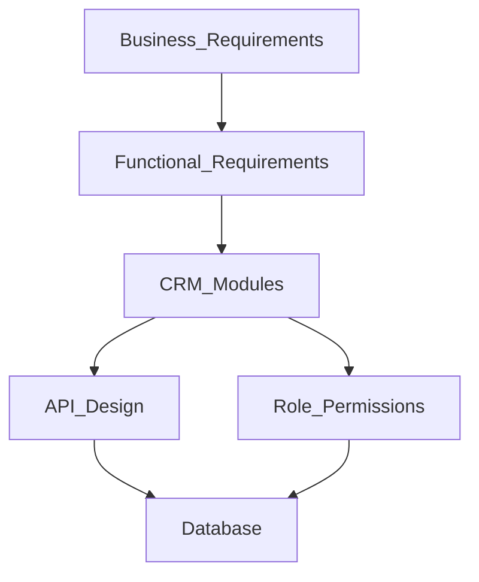
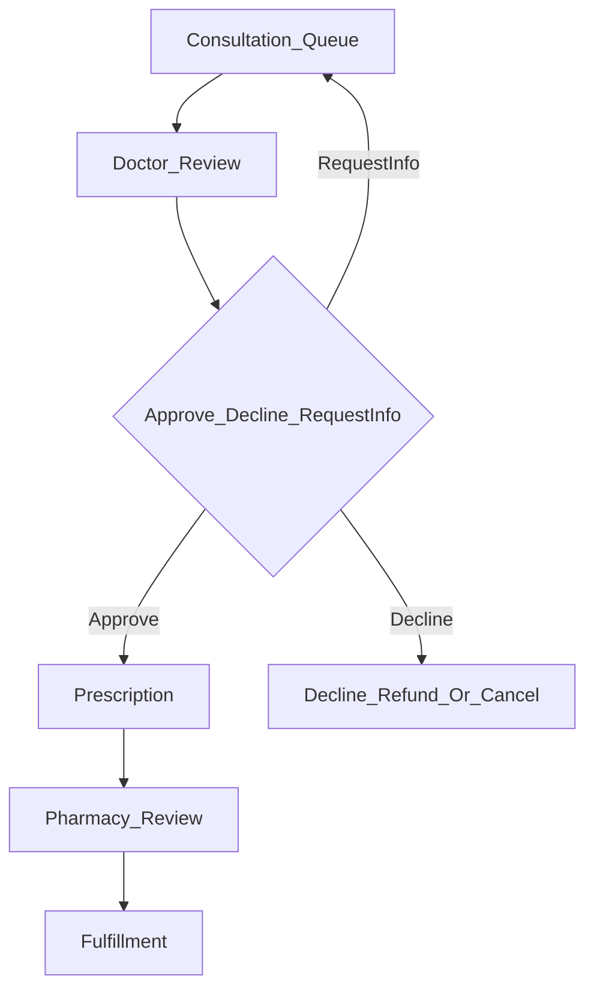

# 18 — CRM

| Field | Value |
| --- | --- |
| Document | CRM Architecture — Internal Platform operational context |
| Product | Clinexa |
| Version | 1.3 |
| Status | Approved — Implementation Ready |
| Primary market | United States |
| Audience | Principal Enterprise Solution Architecture, Healthcare CRM Architecture, Enterprise Operations Architecture, Principal Frontend Architecture, Frontend Engineering, Product, QA, Security |
| Source of truth | [00 — Product Requirements Document](00-product-requirements-document.md) |
| Related docs | [01 — Project overview](01-project-overview.md), [02 — Business requirements](02-business-requirements.md), [03 — Functional requirements](03-functional-requirements.md), [04 — Non-functional requirements](04-non-functional-requirements.md), [05 — System architecture](05-system-architecture.md), [06 — User personas](06-user-personas.md), [07 — User journeys](07-user-journeys.md), [08 — Role permissions](08-role-permissions.md), [09 — Feature roadmap](09-feature-roadmap.md), [10 — Database design](10-database-design.md), [11 — API design](11-api-design.md), [12 — Authentication flow](12-authentication-flow.md), [13 — Security](13-security.md), [14 — Notifications](14-notifications.md), [15 — Payment flow](15-payment-flow.md), [16 — Store architecture](16-store-architecture.md), [17 — Patient portal](17-patient-portal.md), [25 — Guardian](25-guardian.md), [27 — Module registry](27-module-registry.md), [28 — Ownership matrix](28-ownership-matrix.md), [29 — Navigation blueprint](29-navigation-blueprint.md) |

This document is the **authoritative CRM architecture** for Clinexa Version 1. CRM is the **operational context of the Clinexa Internal Platform** (`ARCH-013` inside `ARCH-171`)—not the whole staff control plane. It defines CRM responsibilities, module boundaries, role-based navigation, operational workflows, logical frontend state ownership, API integration surfaces, and CRM performance, accessibility, and security posture—without prescribing frameworks, component libraries, styling systems, or application source code.

> **Internal Platform context boundary (authoritative):** CRM owns the **operational lifecycle**; **Guardian** (`ARCH-172`, [25 — Guardian](25-guardian.md)) owns the **administrative lifecycle**. Both are contexts inside one authenticated application sharing authentication, sessions, RBAC, backend, APIs, design system, and application shell; only modules, workflows, and permissions differ. CRM lives under `/crm/*`, Guardian under `/guardian/*`.
>
> **Destructive operations are never exposed in CRM** (`ARCH-165`): delete, archive, restore, financial corrections, administrative overrides, bulk cleanup, and hard delete belong to Guardian and are gated by Guardian-owned permissions server-side. Administrative modules historically catalogued here (user administration, catalog and category authoring, coupons, CMS/blogs, notification templates, audit log query, system settings) are **Guardian-owned**; see §2.8 for the relocation table.

It expands [PRD §7.4](00-product-requirements-document.md) (CRM), [PRD §8](00-product-requirements-document.md) CRM-facing capabilities and §8.12, [PRD §9](00-product-requirements-document.md) staff journeys, [PRD §12.1](00-product-requirements-document.md)/[§12.4](00-product-requirements-document.md)/[§12.6](00-product-requirements-document.md), [03](03-functional-requirements.md) `FR-CRM-*` and related clinical/ops/admin FRs, [05](05-system-architecture.md) `ARCH-013` / `ARCH-053`, [08](08-role-permissions.md) staff roles and `PERM-CRM-*`, [11](11-api-design.md) CRM/admin consumer APIs, [12](12-authentication-flow.md) `AUTH-027`, [13](13-security.md), [14](14-notifications.md) admin templates and clinical triggers, [16](16-store-architecture.md) Store↔CRM publish boundary (`STORE-014`), and [17](17-patient-portal.md) Portal↔CRM status boundary (`PORTAL-013`).

It does **not** redefine functional module behavior ([03](03-functional-requirements.md)), journey step narrative ([07](07-user-journeys.md)), API path catalogs ([11](11-api-design.md)), database schemas ([10](10-database-design.md)), authentication sequences ([12](12-authentication-flow.md)), security control catalogs ([13](13-security.md)), notification event catalogs ([14](14-notifications.md)), payment lifecycle ([15](15-payment-flow.md)), Store public commerce ([16](16-store-architecture.md)), or Patient Portal self-service ([17](17-patient-portal.md)). Those documents remain authoritative for their topics; this document owns CRM client architecture and the `CRM-*` control catalog.

> **Compliance posture:** CRM handles **authenticated, staff-scoped** clinical and operational work. Clinical PHI and payment card PAN are not owned as durable truths by CRM clients. Patterns are **HIPAA-aware** and **PCI-aware** without claiming certification as V1 delivery gates (PRD §1.5; `NFR-065`).

> **Implementation independence:** `CRM-*` IDs are logical architecture controls. Framework choice, rendering runtime, component structure, styling, state libraries, and SDK selection are out of scope. No React, TypeScript, CSS, Tailwind, or framework-specific examples appear here.

> **Role naming:** V1 product roles are Doctor, Pharmacist, Support, Operations, Marketing, Content, Administrator, and Super Administrator (`ROLE-003`–`ROLE-010`). There is **no Finance** product role. Finance-adjacent work (refunds, operational reports) is performed under Support, Operations, and Administrator within existing separation of duties ([08](08-role-permissions.md)). Super Administrator is a **normal RBAC role** (`PERM-ADM-020` for Administration Access) and never bypasses AuthN/AuthZ/guards.

---

## Table of contents

1. [Introduction](#1-introduction)
2. [CRM Overview](#2-crm-overview)
3. [CRM Modules](#3-crm-modules)
4. [Application Shell](#4-application-shell)
5. [Role-Based Navigation](#5-role-based-navigation)
6. [Operational Workflows](#6-operational-workflows)
7. [CRM State Management](#7-crm-state-management)
8. [API Integration](#8-api-integration)
9. [Performance Strategy](#9-performance-strategy)
10. [Accessibility](#10-accessibility)
11. [CRM Security](#11-crm-security)
12. [CRM Traceability Matrix](#12-crm-traceability-matrix)
13. [Revision History](#13-revision-history)

---

## 1. Introduction

### 1.1 Purpose

Define a production-grade CRM architecture for Clinexa so that:

- Clinical and operational staff (`ROLE-003`–`ROLE-009`) work in one role-scoped control plane (`BO-2`, `BO-4`, `BO-5`; `FR-CRM-001`; `ARCH-013`).
- CRM modules behave as thin clients of one Backend API (`ARCH-003`, `ARCH-004`, `ARCH-053`).
- Doctor consultation, prescription creation after approval, and pharmacist review enforce clinical gates (`FR-CRM-002`–`004`; `OR-03`–`05`).
- Operations manage orders, inventory, and fulfillment within RBAC (`FR-CRM-005`).
- Marketing and Content are denied default access to clinical notes and full questionnaire answers (`FR-CRM-006`; `OR-07`).
- Catalog, questionnaires, treatment plans, subscriptions, and consultation workflows are configurable without code deploy for ordinary expansion (`FR-CRM-007`; `OR-14`).
- Accessibility and performance targets for dense clinical/ops screens are architecturally accountable (`NFR-003`, `NFR-006`, `NFR-008`, `NFR-092`, `NFR-093`, `NFR-100`).
- Module boundaries prevent CRM from owning public SEO storefront rendering or Patient Portal self-service UX.

### 1.2 Scope

#### In scope (V1)

| Area | Coverage |
| --- | --- |
| CRM context | Operational context of the Internal Platform (`ARCH-013` within `ARCH-171`), served under `/crm/*` |
| Modules (CRM-owned) | Dashboard, patient management, orders (operational), clinical review, prescriptions, pharmacy, questionnaires (clinician case view), appointments, subscriptions (operational actions), documents, support, operational reports |
| Modules (catalogued here, Guardian-owned) | User administration, products, categories, **Inventory administration**, questionnaire configuration, coupons, CMS/blogs/review moderation, notification templates, audit log query, system settings — behavior remains traceable via `CRM-*` IDs, but the surface is Guardian (§2.8, [25](25-guardian.md)). Inventory consume widgets may appear in CRM order/fulfillment context (`CRM-037`) |
| Navigation | Permission-driven, role-scoped shell; route protection; dynamic navigation |
| Operational workflows | Order review, clinical approval, prescription processing, pharmacy fulfillment readiness, inventory **visibility and reservation service calls**, subscription assist, appointment management, support resolution, document management |
| Logical FE state | Auth/session, users, patients, orders, clinical queue, prescriptions, products, CMS, support, reports, notification templates, UI state; inventory **summaries** as consume-only |
| API consumption | Staff/admin APIs per [11](11-api-design.md) CRM consumer map |
| Qualities | Performance, accessibility, CRM security posture |
| Traceability | Business → Functional → CRM modules → API → Auth → Database |

#### Out of scope

| Area | Deferred to / note |
| --- | --- |
| Public Store discovery / SEO catalog / cart / checkout finalize | [16](16-store-architecture.md) (`ARCH-011`) |
| Patient Portal self-service UX | [17](17-patient-portal.md) (`ARCH-012`); `FR-PRT-006` |
| Backend clinical/payment gate ownership | [05](05-system-architecture.md); API Domain/Business layers (`ARCH-004`) |
| Native mobile CRM as primary clinical workstation | Out of V1 (`NFR-100`; future [19](19-mobile-app.md)) |
| Live video telemedicine / in-CRM video visits | Out of V1 (PRD §11; `FR-APT-004`) |
| Real-time clinician chat | Out of V1 (PRD §11) |
| Full ambulatory EHR / EHR replacement | Out of V1 (PRD §11) |
| Guest or Patient CRM access | Hard deny (`RBAC-023`; `PERM-CRM-020`) |
| Administrative lifecycle (provisioning, master data, platform governance) | [25 — Guardian](25-guardian.md) (`ARCH-172`, `ARCH-164`) |
| Destructive operations (delete, archive, restore, financial corrections, administrative overrides, bulk cleanup, hard delete) | Guardian only (`ARCH-165`; §2.8) |
| Guardian navigation, groups, and shell behavior | [29 — Navigation blueprint](29-navigation-blueprint.md) |
| Finance product role | Not a V1 product role; Super Administrator (`ROLE-010`) is in scope via normal RBAC ([08](08-role-permissions.md)) |
| Named frameworks, SDKs, component libraries, styling systems | Implementation |
| Physical DB DDL / API path invention | [10](10-database-design.md) / [11](11-api-design.md) |

### 1.3 Audience

| Audience | Use of this document |
| --- | --- |
| Principal enterprise / healthcare CRM architects | Module and navigation boundaries; clinical–ops SoD |
| Enterprise operations architects | Fulfillment, inventory, support, reports, config velocity |
| Principal frontend architects | Client responsibilities, state ownership, API consumption |
| Frontend engineers | CRM shell, route protection, domain module composition |
| Product | Scope discipline vs Store/Portal and future enhancements |
| QA | Journey coverage for `JRN-011`–`016`, `JRN-031`–`033`, a11y, RBAC |
| Security | Session, route protection, PHI least privilege, audit, XSS/CSRF |

### 1.4 References

| Document | Relevance |
| --- | --- |
| [00 — PRD](00-product-requirements-document.md) | Single source of truth; §7.4 CRM; §8 CRM-facing; §8.12; §9 journeys; §11 OOS; §12 NFRs |
| [01 — Project overview](01-project-overview.md) | Care-commerce loop; surface separation |
| [02 — Business requirements](02-business-requirements.md) | `BO-2`/`4`/`5`, `BP-03`–`05`/`09`–`11`, `OR-03`–`08`/`10`–`14`, `AC-BR-02`/`03`/`05`/`13` |
| [03 — Functional requirements](03-functional-requirements.md) | `FR-CRM-*` and domain FRs consumed by CRM |
| [04 — Non-functional requirements](04-non-functional-requirements.md) | Performance, a11y, session, desktop for CRM |
| [05 — System architecture](05-system-architecture.md) | `ARCH-013`, `ARCH-053`, thin clients |
| [06 — User personas](06-user-personas.md) | `USER-003`–`USER-009` staff personas |
| [07 — User journeys](07-user-journeys.md) | `JRN-011`–`016`, `JRN-020`, `JRN-022`, `JRN-025`–`026`, `JRN-031`–`033` |
| [08 — Role permissions](08-role-permissions.md) | `ROLE-003`–`009`, `PERM-CRM-*`, screen matrix |
| [09 — Feature roadmap](09-feature-roadmap.md) | `ROAD-011`–`014`, `ROAD-018`, `ROAD-020`–`026`; `MS-05` |
| [10 — Database design](10-database-design.md) | Staff/clinical/ops entities |
| [11 — API design](11-api-design.md) | CRM/admin consumer endpoint groups |
| [12 — Authentication flow](12-authentication-flow.md) | Staff auth; `AUTH-027` |
| [13 — Security](13-security.md) | Staff zone; PHI; SoD; XSS/CSRF |
| [14 — Notifications](14-notifications.md) | Worker-sent outcomes; admin templates |
| [15 — Payment flow](15-payment-flow.md) | Refunds; payment ≠ dispensing |
| [16 — Store architecture](16-store-architecture.md) | Publish boundary `STORE-014` |
| [17 — Patient portal](17-patient-portal.md) | Status boundary `PORTAL-013` |

### 1.5 CRM Architecture Principles

| ID | Principle | Implication |
| --- | --- | --- |
| CRM-001 | Thin staff client | CRM must not embed divergent clinical, inventory, or payment business rules (`ARCH-004`) |
| CRM-002 | Staff-only shell | CRM shell requires `PERM-CRM-020`; Guest and Patient are hard-denied (`RBAC-023`) |
| CRM-003 | Server-side AuthZ truth | Every privileged and PHI-adjacent action is re-checked by the Backend API (`FR-AUTH-004`; `NFR-045`) |
| CRM-004 | Separation of duties | Doctor ≠ fulfill; Pharmacist ≠ prescribe; Support ≠ Rx approve; Marketing/Content ≠ clinical charts by default (`FR-CRM-006`; `FR-SUP-004`; `RBAC-020`–`028`) |
| CRM-005 | Clinical honesty | Payment success is never clinical approval or dispensing (`OR-03`; `RBAC-027`) |
| CRM-006 | Config without deploy | Ordinary catalog, questionnaire, plan, and workflow expansion is CRM-configurable (`FR-CRM-007`; `OR-14`) |
| CRM-007 | Need-to-know PHI | Staff see patient data only as required for assigned case, ticket, order, or pharmacy context (`OR-06`; `RBAC-003`) |
| CRM-008 | Attributable staff | No shared anonymous clinical accounts; actions carry actor identity (`OR-06`; `NFR-047`) |
| CRM-009 | One API, many clients | CRM shares the Backend API with Guardian, Store, Portal, and future clients; the API is application-agnostic and authorizes identity, not caller (`ARCH-003`, `ARCH-160`) |
| CRM-010 | Accessibility for clinical density | Primary clinical workflows are keyboard-operable; AA goal for queue and decision paths (`NFR-092`, `NFR-093`) |
| CRM-160 | Operational lifecycle only | CRM owns day-to-day processing; the administrative lifecycle belongs to Guardian (`ARCH-164`) |
| CRM-161 | No destructive exposure | CRM must never render or invoke delete, archive, restore, financial correction, administrative override, bulk cleanup, or hard delete affordances (`ARCH-165`) |
| CRM-162 | One platform, two contexts | CRM shares authentication, session, RBAC engine, shell, and design system with Guardian; a context switch is navigation, never a second login (`ARCH-163`, `ARCH-153`) |
| CRM-163 | Platform modules are consumed | CRM consumes backend platform modules; it owns none of them (`ARCH-161`) |
| CRM-164 | Context-prefixed routing | Every CRM route lives under `/crm/*` and is resolvable as CRM context from the pathname alone (`ARCH-116`) |
| CRM-165 | Escalation, not duplication | When operational staff need an administrative or destructive action, the path is a permission-gated Guardian escalation—never a parallel CRM implementation |
| CRM-166 | Visual unity | CRM must remain visually and behaviorally indistinguishable from Guardian in chrome, tokens, and component patterns (`ARCH-166`) |

---

## 2. CRM Overview

### 2.1 CRM responsibilities

The CRM context (`ARCH-013`) is the authenticated **operational control plane** for internal staff, served under `/crm/*` inside the Internal Platform (`ARCH-171`). It primarily serves Doctor, Pharmacist, Support, and Operations personas (`USER-003`–`USER-006` / `ROLE-003`–`ROLE-006`), with scoped Administrator visibility. Backend composition of authorized staff views is described as `ARCH-053`.

| Responsibility | Owning context | CRM owns (UX) | Server owns (truth) |
| --- | --- | --- | --- |
| Dashboard | CRM (operational) | Role-scoped operational summaries and queue entry | Aggregates and AuthZ (`PERM-CRM-020`) |
| Patient management | CRM | Staff-scoped search and case-context views | Isolation and field redaction (`PERM-CRM-010`; `SEC-061`) |
| Clinical review | CRM | Consult queue; approve / decline / request info; notes | Decisions, audit, order clinical states (`FR-CRM-002`) |
| Prescriptions | CRM | Create/update after approval; status for pharmacy/ops | Rx after doctor approval only (`FR-CRM-003`) |
| Pharmacy | CRM | Pharmacy queue; ready / flag | Pharmacist review before Rx fulfillment (`FR-CRM-004`) |
| Orders / fulfillment (operational) | CRM | Staff lists, fulfill, cancel within policy, timeline, documents, internal notes | Lifecycle gates; inventory side effects **only** via Inventory services (`FR-CRM-005`; `FR-ORD-003`; [34](34-inventory-module.md)) |
| Inventory | **Guardian** (admin); CRM consume | CRM: availability / reserved / summaries / order-scoped movements; Reserve/Release/Commit via Inventory services | Ledger SoT and policies in Inventory module (`FR-INV-*`; [34](34-inventory-module.md)). CRM never adjusts, receives, or configures warehouses/policies |
| Subscriptions (operational) | CRM | Pause / resume / cancel assist / renewal retry within policy — **no Create** | Renewal, dunning, and clinical reassessment rules (`FR-SUB-*`; `OR-10`; [36](36-subscriptions-module.md)) |
| Support | CRM | Triage, reply, resolve; policy-scoped refund assist | Ticket lifecycle; never Rx approve (`FR-SUP-002`/`004`) |
| Operational reports | CRM | Role-scoped operational dashboards and exports | Query/export AuthZ and PHI minimization (`FR-RPT-*`, `FR-ANL-*`) |
| Questionnaires (case view) | CRM | Clinician view of full answers in case context | Versioning and redaction (`FR-QST-005`) |
| User administration | **Guardian** | — (escalate to `/guardian/users`) | Users/RBAC persistence and audit (`FR-ADM-001`) |
| Catalog / QST / plans / workflow configuration | **Guardian** | — (escalate to `/guardian/*`) | Publish safety validation (`FR-CRM-007`; `OR-14`) |
| Coupons / CMS / blogs / review moderation | **Guardian** | — | Published-only Store consume; moderation (`FR-CPN-*`, `FR-CMS-*`, `FR-BLG-*`, `FR-REV-*`) |
| Notification templates | **Guardian** | — | Workers send; clients never invent sends (`NTF-001`) |
| Audit query / platform settings | **Guardian** | — | Append-only audit; server-applied settings |
| Order administration, financial corrections, overrides | **Guardian** | — | Refund/correction authorization and audit (`ARCH-165`) |
| Delete / archive / restore / bulk cleanup / hard delete | **Guardian** | — (never rendered in CRM) | Guardian-owned permissions enforced server-side (`ARCH-152`) |

**CRM-011** — CRM is a presentation and staff-orchestration client. All durable clinical, commerce, inventory, and identity decisions are enforced by the Backend API.

### 2.2 Relationship with Store

| Aspect | CRM | Store |
| --- | --- | --- |
| Catalog / CMS / blogs / coupons | Read for operational context; authoring and publishing belong to Guardian ([25 §2.3](25-guardian.md#23-relationship-with-store)) | Consume published only |
| Reviews | Read; moderation is a Guardian surface | Display approved |
| Clinical / inventory / ops | Own clinical/ops queues; inventory **consume** only (Inventory module owns stock truth) | Never mutate |
| SEO metadata | Read; editable in Guardian | Render indexable pages |
| Access | Staff roles only | Guest/Patient denied CRM (`PERM-CRM-020`) |

**CRM-012** — CRM never exposes public Store commerce UX (browse, cart, checkout finalize). Content and catalog changes appear on Store only after publish (`OR-14`; `FR-CMS-002`; `STORE-014`).

### 2.3 Relationship with Patient Portal

| Aspect | CRM | Patient Portal |
| --- | --- | --- |
| Clinical / pharmacy / fulfillment | Own queues and truth | Status visibility only |
| Support | Triage and resolve staff tickets | Patient create/view/reply on own tickets |
| Documents | Staff upload/attach | Patient list/download own |
| Catalog / CMS / coupons / admin | Configure and publish | Never exposed (`FR-PRT-006`) |
| Access | Staff roles only | Patient denied CRM shell (`PERM-CRM-020`) |

**CRM-013** — CRM never exposes patient self-service as a substitute for Portal. Clinical decisions appear to patients only as authorized status and documents (`PORTAL-013`).

### 2.4 Relationship with Backend API

| Aspect | Architecture rule |
| --- | --- |
| Protocol | HTTPS to Backend API only (`ARCH-014`; `SEC-019`) |
| Domain authority | Auth, clinical decisions, Rx, pharmacy, orders, inventory, catalog, QST, appointments, documents, support, coupons, CMS, blogs, reports, analytics, admin, settings |
| Forbidden | Direct DB access; PSP merchant secrets in CRM; client-side clinical gate bypass; inventing approve/decline/dispense outcomes |
| Messaging | API error and state responses drive UX; CRM must not invent clearance or fulfillment eligibility |

**CRM-014** — CRM communicates exclusively with the Backend API for domain operations. Private/PHI routes must not be CDN-cached as public content (`SEC-020`).

### 2.5 Relationship with Authentication

| Aspect | Rule |
| --- | --- |
| Identity | Staff Admin-provisioned (`FR-ADM-001`); never Store self-register into staff roles |
| Flow | CRM Staff Login `AUTH-027`: CRM entry → `API-004` → session → shell needs `PERM-CRM-020` → each action re-checks `PERM-*` + object scope |
| Principals | `ROLE-003`–`ROLE-008` staff; `ROLE-009` Administrator |
| Denials | Patient/Guest on CRM → `ERR-AUTHZ-003`; Marketing/Content clinical → `ERR-AUTHZ-004` |
| Session | Idle ≤ 30 min (staff/PHI); absolute ≤ 12 h; password reset invalidates all sessions (`NFR-044`) |
| MFA | Not required V1 (`AUTH-037`); must not preclude future MFA |
| Attributable accounts | No shared anonymous clinical staff accounts (`NFR-047`) |

**CRM-015** — Authentication into CRM does not grant clinical powers beyond assigned role permissions, and does not bypass object-scope or clinical-gate checks.

### 2.6 Architecture diagram

### 2.7 Explicit non-ownership summary

| ID | CRM must not |
| --- | --- |
| CRM-016 | Render public SEO storefront, cart, or checkout finalize (Store) |
| CRM-017 | Host patient self-service as primary UX (Portal) |
| CRM-018 | Allow Guest or Patient into the CRM shell |
| CRM-019 | Invent clinical outcomes, pharmacy readiness, or fulfillment clearance client-side |
| CRM-020 | Grant Marketing/Content default clinical notes or full questionnaire answers |
| CRM-021 | Allow Support to approve prescriptions or Operations to fulfill Rx before doctor + pharmacist gates |
| CRM-022 | Expose any destructive administrative operation, or any Guardian-owned administrative module, under `/crm/*` (`ARCH-165`) |

### 2.8 Relationship with Guardian

Guardian (`ARCH-172`) is the **administrative** context of the same application. It is not a separate product, not a settings panel, and not a second backend.

| Aspect | CRM (`/crm/*`) | Guardian (`/guardian/*`) |
| --- | --- | --- |
| Lifecycle | Operational: process, review, fulfill, support | Administrative: provision, configure, govern, correct |
| Shared entities (Users, Orders, Subscriptions) | Operational, clinical, and support fields | Administrative fields, financial corrections, lifecycle state |
| Destructive operations | Never exposed | Sole exposure point (`ARCH-165`) |
| Navigation model | Role-scoped operational queues | Grouped enterprise navigation (Commerce, Content, Users, Marketing, Platform, …) |
| Session and shell | Same session, same shell, same design tokens | Same session, same shell, same design tokens |
| Backend | Consumes platform modules | Consumes the same platform modules with administrative permissions |

#### Module relocation (authoritative)

`CRM-0xx` control IDs remain valid for traceability; the **surface** for the rows below is Guardian, and their detailed architecture lives in [25 — Guardian](25-guardian.md).

| Catalogued module | ID | Owning context | Notes |
| --- | --- | --- | --- |
| Dashboard | `CRM-030` | Both (context-specific) | CRM shows operational queues; Guardian shows administrative KPIs |
| User Management | `CRM-031` | Guardian | Full administrative user lifecycle including delete/archive/restore |
| Patient Management | `CRM-032` | CRM | Need-to-know clinical/ops context |
| Orders | `CRM-033` | Both | CRM operational workflow; Guardian administration, corrections, destructive actions |
| Clinical Review | `CRM-034` | CRM | Doctor-only |
| Prescriptions | `CRM-035` | CRM | Clinical |
| Pharmacy | `CRM-036` | CRM | Pharmacist-only |
| Inventory | `CRM-037` | Guardian admin; CRM consume-only | CRM is not an Inventory Management System; oversell/policy in Guardian ([34](34-inventory-module.md)) |
| Products | `CRM-038` | Guardian | Catalog authoring and publish |
| Categories | `CRM-039` | Guardian | Catalog taxonomy |
| Questionnaires | `CRM-040` | CRM | CRM-only Internal Platform surface: clinician case view and definition/configuration |
| Appointments | `CRM-041` | CRM operational; Guardian types/slots configuration | Scheduling only |
| Subscriptions | `CRM-042` | Both | CRM pause/resume/cancel/renewal assist (**no Create**); Guardian plans, admin create, Class D ([36](36-subscriptions-module.md)) |
| Documents | `CRM-043` | CRM | Case-scoped attachment |
| Support | `CRM-044` | CRM | Ticket lifecycle |
| Coupons | `CRM-045` | Guardian | Marketing administration |
| CMS (pages, blogs, review moderation) | `CRM-046` | Guardian | Content administration |
| Notifications (templates) | `CRM-047` | Guardian | Template administration |
| Reports | `CRM-048` | CRM | CRM-only Internal Platform surface for operational and clinical-ops reports |
| Audit Logs | `CRM-049` | Guardian | Governance surface |
| System Settings | `CRM-050` | Guardian | Platform policy |

#### Escalation pattern

**CRM-167** — When an operational task requires an administrative or destructive action, CRM surfaces a permission-aware link into the corresponding Guardian module (for example, order detail → `/guardian/orders/:id`). CRM must not reimplement the action, and the link must be hidden when the principal lacks Guardian access.

---

## 3. CRM Modules

### 3.1 Module map

Context legend: **CRM** = operational surface under `/crm/*`; **Guardian** = administrative surface under `/guardian/*` (see §2.8 and [25](25-guardian.md)); **Both** = dual-mounted with different action sets.

| ID | Module | Context | MoSCoW | Primary FRs | Primary journeys / processes |
| --- | --- | --- | --- | --- | --- |
| CRM-030 | Dashboard | Both | Must | `FR-CRM-001`, `FR-ANL-*` | Staff home; `NFR-006` |
| CRM-031 | User Management | Guardian | Must | `FR-ADM-001` | `JRN-031` |
| CRM-032 | Patient Management | CRM | Must | `FR-CRM-001`, `FR-SRCH-002`, `PERM-CRM-010` | Clinical/ops context |
| CRM-033 | Orders | Both | Must | `FR-CRM-005`, `FR-ORD-003`–`006` | `JRN-016`; `BP-05`; blueprint [35](35-orders-module.md) |
| CRM-034 | Clinical Review | CRM | Must | `FR-CRM-002` | `JRN-011`–`014`; `BP-03` |
| CRM-035 | Prescriptions | CRM | Must | `FR-CRM-003` | `JRN-012`; `BP-04`; cross-module |
| CRM-036 | Pharmacy | CRM | Must | `FR-CRM-004` | `JRN-015`; `BP-04`/`05` |
| CRM-037 | Inventory | Guardian admin; CRM consume | Must | `FR-INV-001`–`005`, `FR-CRM-005` | `JRN-016`; `OR-12`; blueprint [34](34-inventory-module.md) |
| CRM-038 | Products | Guardian | Must | `FR-PRD-002`, `FR-CRM-007` | `JRN-031`; `BP-10` |
| CRM-039 | Categories | Guardian | Must | `FR-CAT-002`, `FR-CRM-007` | `JRN-031`; `BP-10` |
| CRM-040 | Questionnaires | CRM | Must | `FR-QST-001`/`002`/`005`, `FR-CRM-007` | CRM-only; case view and definitions |
| CRM-041 | Appointments | Both | Should | `FR-APT-002`/`003` | `JRN-022` |
| CRM-042 | Subscriptions | Both | Must | `FR-SUB-003`/`004`, `OR-10` | `JRN-020` assist; blueprint [36](36-subscriptions-module.md) |
| CRM-043 | Documents | CRM | Must | `FR-DOC-003`/`004` | Clinical/ops attach |
| CRM-044 | Support | CRM | Must | `FR-SUP-002`–`005` | `JRN-025`/`026` |
| CRM-045 | Coupons | Guardian | Should | `FR-CPN-001`/`003` | `JRN-032` |
| CRM-046 | CMS | Guardian | Should | `FR-CMS-*`, `FR-BLG-*`, `FR-REV-003` | `JRN-033`; moderation |
| CRM-047 | Notifications | Guardian | Must | `FR-NTF-002` | Admin templates |
| CRM-048 | Reports | CRM | Should | `FR-RPT-*`, `FR-ANL-*` | Ops/clinical-ops/marketing-safe; CRM-only Internal Platform UI |
| CRM-049 | Audit Logs | Guardian | Must | `FR-ADM-004` | Admin accountability |
| CRM-050 | System Settings | Guardian | Must | `FR-SET-001`–`004` | `JRN-031`; publish/oversell policy |

### 3.2 Dashboard (`CRM-030`)

| Aspect | Detail |
| --- | --- |
| Responsibilities | Role-scoped landing: queue counts, ops alerts, marketing-safe summaries, config shortcuts |
| Ownership | CRM shell UX; Backend aggregates (`ARCH-053`, analytics/report APIs) |
| Boundaries | Metrics are permission-filtered; Marketing never receives clinical chart dumps (`FR-CRM-006`) |

### 3.3 User Management (`CRM-031`)

| Aspect | Detail |
| --- | --- |
| Responsibilities | Operational find/view/edit of patient and staff records within permission; escalate administrative and destructive actions to Guardian (`/guardian/users`) |
| Ownership | Platform Users module ([32](32-users-module.md)); CRM surfaces operational/clinical/support fields only (`PERM-CRM-010`, scoped) |
| Boundaries | **No** create staff, delete, archive, or restore in CRM; Admin config ≠ default clinical prescribe (`RBAC-028`); role assignment and Class D lifecycle are Guardian-only |

### 3.4 Patient Management (`CRM-032`)

| Aspect | Detail |
| --- | --- |
| Responsibilities | Staff search and view patient records within need-to-know / case-ticket-order scope |
| Ownership | Doctor, Pharmacist, Support, Operations, Admin (scoped); `PERM-CRM-010` |
| Boundaries | Not an EHR replacement (PRD §11); Marketing/Content denied clinical charts; CRM search RBAC-filtered (`FR-SRCH-002`) |

### 3.5 Orders (`CRM-033`)

| Aspect | Detail |
| --- | --- |
| Responsibilities | Staff order list/detail; operational field edits (allowlist); cancel within policy; fulfill/ship when gates clear; refund assist with Support; notes, history, activity |
| Ownership | Operations primary for fulfill (`PERM-ORD-003`); Doctor/Pharmacist/Support/Admin scoped views; edit via `PERM-ORD-005` ops scope |
| Boundaries | **No CRM Order Create** in V1 (no route/API/UI); **no Class D** (delete/archive/restore/Correct/Override); payment ≠ dispensing (`OR-03`); Rx fulfill requires doctor approve + pharmacist review (`FR-ORD-003`); Marketing/Content denied order lists; inventory only via Inventory services; clinical approve/decline owned by Consultations — see blueprint [35](35-orders-module.md). **P13c:** CRM list/detail/edit/cancel/fulfill/notes/history/activity live at `/crm/orders` via shared Orders domain. |

### 3.6 Clinical Review (`CRM-034`)

| Aspect | Detail |
| --- | --- |
| Responsibilities | Doctor consultation queue; case open with intake context; approve, decline, or request additional information; clinical notes |
| Ownership | Doctor only (`PERM-CRM-001`–`005`); `FR-CRM-002` |
| Boundaries | Decisions attributable with actor and timestamp; Pharmacist/Support/Ops/Admin cannot clinically approve |

### 3.7 Prescriptions (`CRM-035`)

| Aspect | Detail |
| --- | --- |
| Responsibilities | Create/update prescriptions after clinical approval; staff Rx detail for pharmacy and scoped status for Support/Ops |
| Ownership | Doctor create/update (`FR-CRM-003`); Pharmacist review context; cross-module with QST, Orders, Documents, Notifications, Portal |
| Boundaries | Prescriptions are **not** a standalone FR module ([03](03-functional-requirements.md) intro); cannot precede doctor approval (`OR-04`) |

### 3.8 Pharmacy (`CRM-036`)

| Aspect | Detail |
| --- | --- |
| Responsibilities | Pharmacy review queue; mark ready or flag issues to doctor/operations |
| Ownership | Pharmacist (`PERM-CRM-006`/`007`); `FR-CRM-004` |
| Boundaries | Pharmacy readiness ≠ medical judgment; cannot replace doctor approve (`RBAC-021`) |

### 3.9 Inventory (`CRM-037`)

| Aspect | Detail |
| --- | --- |
| Responsibilities | **Consume only:** view availability / reserved / summaries; observe low-stock signals; Reserve / Release / Commit via Inventory services during order workflows; show order-relevant movement history |
| Ownership | Inventory platform module owns ledger SoT; Guardian owns administration ([34](34-inventory-module.md)); Operations may hold CRM consume + Guardian admin grants as needed |
| Boundaries | CRM must **never** adjust stock, CRUD warehouses, receive, transfer, reconcile, cycle-count, or configure inventory policies. Escalate to `/guardian/inventory` for admin work |

### 3.10 Products (`CRM-038`)

| Aspect | Detail |
| --- | --- |
| Responsibilities | Create/update/publish/unpublish products and variants; media metadata; Rx-eligibility and bindings awareness |
| Ownership | Administrator; `FR-PRD-002` |
| Boundaries | Unsafe Rx setups blocked at publish (`OR-14`); Store shows published only |

### 3.11 Categories (`CRM-039`)

| Aspect | Detail |
| --- | --- |
| Responsibilities | Create/update/publish/unpublish categories for Store navigation and SEO landings |
| Ownership | Administrator; `FR-CAT-002` |
| Boundaries | Demo categories are seed data only; publish safety applies |

### 3.12 Questionnaires (`CRM-040`)

| Aspect | Detail |
| --- | --- |
| Responsibilities | Definitions, versions, bindings, consultation workflow config, and clinician full answers in case context — all on CRM |
| Ownership | Admin config (`FR-QST-001`/`002`, `FR-CRM-007`); Doctor (and Pharmacist scoped) case view (`FR-QST-005`) |
| Boundaries | **CRM-only Internal Platform UI** — not navigated or hosted under Guardian. Marketing/Content denied full answers by default (`FR-CRM-006`); prior versions with answers immutable |

### 3.13 Appointments (`CRM-041`)

| Aspect | Detail |
| --- | --- |
| Responsibilities | Staff list/manage appointments; Admin configure types and slots |
| Ownership | Doctor, Pharmacist, Support, Operations, Admin scoped; `FR-APT-002` |
| Boundaries | Scheduling only—no integrated video telemedicine (`FR-APT-004`) |

### 3.14 Subscriptions (`CRM-042`)

| Aspect | Detail |
| --- | --- |
| Responsibilities | Staff visibility of past-due/grace; pause/resume; policy cancel assist; renewal/retry assist without gate bypass; notes/history/activity |
| Ownership | Support assist; Operations scoped; Admin plans in **Guardian**; `OR-10`; `FR-SUB-*`; [36](36-subscriptions-module.md) |
| Boundaries | **No CRM Create. No Class D.** CRM assist does not invent clinical clearance, execute payments, or mutate inventory. Escalate to `/guardian/subscriptions/:id` for admin/Class D (`CRM-167`) |

### 3.15 Documents (`CRM-043`)

| Aspect | Detail |
| --- | --- |
| Responsibilities | Staff upload/attach case-scoped documents; metadata visibility within ACL |
| Ownership | Doctor, Pharmacist, Support, Operations, Admin as permitted; `FR-DOC-003` |
| Boundaries | PHI downloads audited (`FR-DOC-004`); patients download via Portal, not CRM self-service |

### 3.16 Support (`CRM-044`)

| Aspect | Detail |
| --- | --- |
| Responsibilities | Ticket triage queue; reply; resolve; refund initiation per `OR-11` tiers with order context |
| Ownership | Support primary; Admin limited; `FR-SUP-002`/`005` |
| Boundaries | Support **cannot** approve prescriptions (`FR-SUP-004`; `RBAC-024`) |

### 3.17 Coupons (`CRM-045`)

| Aspect | Detail |
| --- | --- |
| Responsibilities | Create/update/deactivate coupons; view redemptions |
| Ownership | Marketing, Administrator; `FR-CPN-001` |
| Boundaries | Not a paid-ads platform (`JRN-032` scope); Store redeems only |

### 3.18 CMS (`CRM-046`)

| Aspect | Detail |
| --- | --- |
| Responsibilities | CMS pages/blocks publish; blog authoring/publish; review moderation approve/reject; SEO metadata fields |
| Ownership | Content/Admin primary; Marketing limited CMS/analytics; `FR-CMS-*`, `FR-BLG-*`, `FR-REV-003` |
| Boundaries | Drafts never public until publish; Content has no clinical queues; moderation before public display (V1 default) |

### 3.19 Notifications (`CRM-047`)

| Aspect | Detail |
| --- | --- |
| Responsibilities | Admin manage notification templates |
| Ownership | Administrator; `FR-NTF-002`; `API-135`/`136` |
| Boundaries | No V1 staff in-app notification center (`NTF-015`/`017`); CRM decisions trigger worker-sent patient/ops messages; clients never invent sends (`NTF-001`) |

### 3.20 Reports (`CRM-048`)

| Aspect | Detail |
| --- | --- |
| Responsibilities | Operational/clinical-ops tabular reports; sync run and async export; role-scoped analytics (ops metrics vs marketing-safe funnel) |
| Ownership | Operations/Admin full; Doctor/Pharmacist/Support limited; Marketing marketing-safe only; `FR-RPT-*`, `FR-ANL-*` |
| Boundaries | PHI-minimized; exports audited; large exports async (`NFR-012`) |

### 3.21 Audit Logs (`CRM-049`)

| Aspect | Detail |
| --- | --- |
| Responsibilities | Query append-only audit of privileged clinical/admin and PHI-sensitive document access |
| Ownership | Administrator; `FR-ADM-004` |
| Boundaries | Audit retention ≥ 1 year (`SEC-036`); CRM UI cannot rewrite audit history |

### 3.22 System Settings (`CRM-050`)

| Aspect | Detail |
| --- | --- |
| Responsibilities | Platform settings: oversell policy, review moderation policy, publish-related controls |
| Ownership | Administrator; `FR-SET-001`–`004` |
| Boundaries | Settings are server-applied and audited; cannot globally disable clinical gates |

---

## 4. Application Shell

This section is the **contributor source of truth** for the shared **Internal Platform** application shell (ROAD-021 foundation). The shell is **one shell for both contexts**: CRM and Guardian render inside it with identical chrome. Framework-specific code lives in `apps/admin`; architecture rules below must not be violated by future modules. Navigation structure, grouping, nesting, and fly-out behavior are specified in [29 — Navigation blueprint](29-navigation-blueprint.md).

### 4.1 Sidebar architecture

- The left sidebar is the **permanent application navigation** for every future module in either context.
- It is a thin renderer over a configuration-driven navigation catalog; catalog entries are **context-tagged** (`crm` | `guardian`) and the active context filters what renders.
- Collapse/expand (desktop) and off-canvas (mobile) belong to the shell chrome, not to individual modules.
- The sidebar must support nested modules, expandable groups, and fly-out submenus without per-module shell changes.

### 4.2 Header architecture

- Permanent top header slots: sidebar trigger, breadcrumbs, **Application Switcher**, theme switch, user profile menu.
- Header does not own module route lists; it composes independent slot components.

### 4.3 Navigation philosophy

- Navigation is **fully configuration-driven** (single catalog for sidebar labels, routes, icons, permissions, order, context, and group).
- Visibility is **permission-filtered** (`PERM-*`) and **context-filtered**. A user who cannot access a context never sees its navigation or its switcher entry.
- **Administrator (`ROLE-009`)** is the primary operational role for CRM business modules and must receive matrix grants so nav items are never hidden by default.
- **Administration** (`PERM-ADM-020`) is the primary platform-only exclusivity for Super Administrator (`ROLE-010`); **Guardian context access** requires `PERM-GRD-001` ([08](08-role-permissions.md)).
- CRM navigation stays role-scoped operational queues; Guardian navigation uses grouped enterprise navigation. The grouping model differs; the rendering components do not.
- Extensible metadata (`badge`, `category`, `hidden`, `disabled`, `featureFlag`, `role`) may exist on the type for future use; only required fields are populated until needed.
- **Extension guideline:** add a nav-config entry (with context + group) + App Router page under the correct prefix + matching permission gate. Do **not** modify sidebar/header/shell implementation for routine module adds.

### 4.4 Breadcrumbs

- Breadcrumbs are generated from the navigation configuration + current pathname; the context segment (`/crm` or `/guardian`) is the authoritative root.
- Do not maintain a separate breadcrumb map. Navigation titles are the single source of truth.

### 4.5 Theme philosophy

- Light/dark (and system) theming uses semantic design tokens only.
- Shell and future pages must not use direct palette colors (`bg-white`, `text-gray-*`, etc.).
- Components that use tokens inherit the active theme automatically.
- Theme and shell state survive a context switch; CRM and Guardian must never look like different products (`CRM-166`).

### 4.6 Application Switcher (replaces the Vendor Switcher placeholder)

- The header switcher selects the **application context**: **CRM** or **Guardian**.
- Switching changes context, navigation, and URL prefix only. It reuses the same authenticated session—no second login, no theme reset.
- The switcher is permission-aware: a context the principal cannot access is hidden (or denied on deep link).
- It does **not** imply multi-vendor. Vendor switching remains a later phase and would be an additional header abstraction, not a repurposing of this control.

### 4.7 Icons

- **Lucide** is the official and only icon library for the Internal Platform. Do not mix React Icons, Heroicons, or other packs.

### 4.8 Dashboard placeholder

- The current Dashboard page is a **placeholder** only.
- Each context has its own dashboard (operational queues in CRM; administrative KPIs in Guardian).
- Future dashboard widgets, analytics, and KPIs are implemented as page/feature content **without changing shell architecture**.

### 4.9 Super Administrator (ROLE-010)

- `ROLE-010` exists only as another RBAC role. It must never bypass authentication, authorization, guards, or permission evaluation.
- **Super Administrator is not the primary operational CRM role.** It adds platform Administration (`PERM-ADM-020`), the full Guardian destructive permission class, and future platform-only surfaces (multi-vendor, licenses, global system settings).
- **Business modules** remain visible to both Administrator and Super Administrator via the normal permission matrix.

### 4.10 Administrator business-module policy (ROLE-009)

- **Administrator** is the primary operational CRM role and a primary Guardian role.
- All V1 business modules (Dashboard, Users, Orders, Prescriptions, Questionnaires, Activity Log, Reports, Settings, and future business surfaces) must remain visible and accessible in their owning context unless explicitly documented otherwise.
- New business modules: add nav-config entry + matrix grants for `ROLE-009` and `ROLE-010` (Super Admin inherits the same business grants).
- Destructive permissions are **not** implied by business-module access; they are granted explicitly and only in Guardian ([08](08-role-permissions.md)).

---

## 5. Role-Based Navigation

### 5.1 Navigation principles

| ID | Control | Rule |
| --- | --- | --- |
| CRM-051 | Module visibility | Nav items appear only when the authenticated staff principal holds the corresponding `PERM-*` (advisory claims may hint UI; server re-resolves) |
| CRM-052 | Permission-driven navigation | Navigation is an affordance guide; Backend API remains authoritative (`FR-AUTH-004`; `RBAC-086`) |
| CRM-053 | Route protection | All `/crm/*` routes require `PERM-CRM-020`; all `/guardian/*` routes require `PERM-GRD-001`; deep links re-checked after login (`AUTH-027`) |
| CRM-053a | Context filtering | The navigation catalog is filtered first by context, then by permission; a CRM principal never receives Guardian entries and vice versa |
| CRM-054 | Dynamic navigation | Role change or privilege revocation invalidates prior sessions/token version; next shell load reflects current grants |
| CRM-055 | Guest/Patient deny | Guest and Patient have no CRM Dashboard or modules (`RBAC-023`) |
| CRM-056 | Staff + Super Admin nav | V1 nav catalogs `ROLE-003`–`ROLE-010`; Administration requires `PERM-ADM-020` (Super Administrator only); finance-adjacent refunds/reports appear under Support/Operations/Admin modules |
| CRM-056a | Destructive affordances | Destructive controls are absent from the CRM catalog entirely—not merely disabled—and are rendered only in Guardian for principals holding the relevant Guardian destructive permission (`ARCH-165`) |

### 5.2 Module visibility by role

Legend: **Full** = primary functions; **Limited** = scoped / status-appropriate / marketing-safe; **—** = no access. Derived from [08](08-role-permissions.md) Screen-to-Role Access Matrix.

The matrix below is **module-level**, spanning both contexts. Rows marked Guardian-owned in §2.8 (User Management, Products / Categories, Coupons, CMS, Notification templates, Audit Logs, System Settings) are reachable only in the Guardian context and therefore additionally require `PERM-GRD-001`. Marketing (`ROLE-007`) and Content (`ROLE-008`) work primarily in Guardian for that reason.

| Module | Doctor | Pharmacist | Support | Operations | Marketing | Content | Admin |
| --- | --- | --- | --- | --- | --- | --- | --- |
| Dashboard | Full | Full | Full | Full | Full | Full | Full |
| Clinical Review | Full | — | — | — | — | — | — |
| Pharmacy | — | Full | — | — | — | — | — |
| Prescriptions | Full | Limited | Limited | Limited | — | — | Full |
| Patient Management | Limited | Limited | Limited | Limited | — | — | Limited |
| Orders | Limited | Limited | Limited | Limited | — | — | Limited |
| Inventory | — | View (consume) | — | View + service Reserve/Release/Commit; escalate to Guardian for admin | — | — | View (consume) |
| Documents | Limited | Limited | Limited | Limited | — | — | Limited |
| Appointments | Limited | Limited | Limited | Limited | — | — | Full |
| Subscriptions | Limited | Limited | Limited | Limited | — | — | Limited |
| Support | — | — | Full | — | — | — | Limited |
| Coupons | — | — | — | — | Full | — | Full |
| CMS / Blogs / Reviews | — | — | Limited reviews | — | Limited | Full | Full |
| Products / Categories / QST config | — | — | — | — | — | — | Full |
| Notifications (templates) | — | — | — | — | — | — | Full |
| Reports / Analytics | Limited | Limited | Limited | Full | Limited (mkt-safe) | — | Full |
| User Management | — | — | — | — | — | — | Full |
| Audit Logs | — | — | — | — | — | — | Full |
| System Settings | — | — | — | — | — | — | Full |

### 5.3 Role navigation summaries

| Role | Primary nav destinations |
| --- | --- |
| Doctor (`ROLE-003`) | Dashboard → Clinical Review → Prescriptions → scoped Patients/Orders/Documents/Appointments → limited Reports |
| Pharmacist (`ROLE-004`) | Dashboard → Pharmacy → Prescriptions → limited Orders/Documents → limited Reports (inventory availability via order context) |
| Support (`ROLE-005`) | Dashboard → Support → scoped Orders/Patients/Subscriptions/Documents/Appointments → refunds → limited Reports |
| Operations (`ROLE-006`) | Dashboard → Orders → Documents/Appointments → Reports/Analytics; inventory admin via Guardian escalation when granted |
| Marketing (`ROLE-007`) | Dashboard → Coupons → limited CMS → marketing-safe Analytics |
| Content (`ROLE-008`) | Dashboard → CMS / Blogs → review moderation |
| Administrator (`ROLE-009`) | Dashboard → Users → Orders → Prescriptions → Questionnaires → Activity Log → Reports → Settings → catalog/QST/plans/workflows; **no** Administration (`PERM-ADM-020`) |
| Super Administrator (`ROLE-010`) | Same business-module destinations as Administrator **plus** Administration (`PERM-ADM-020`) |

**CRM-057** — Dual-role assignments, if granted, union permissions still subject to hard denies (e.g., Support never gains Rx approve via configuration that would violate `FR-SUP-004`).

### 5.4 Route protection and dynamic navigation

| ID | Topic | Rule |
| --- | --- | --- |
| CRM-058 | Unauthenticated | Redirect to CRM auth entry; no privileged shell paint |
| CRM-059 | Wrong surface token | Patient session on CRM route denied (`ERR-AUTHZ-003`) |
| CRM-060 | Missing module perm | Hide nav and deny route; API returns AuthZ error if called directly |
| CRM-061 | Clinical gate UI | Approve/decline/fulfill controls disabled or omitted when server state forbids; client never overrides |
| CRM-062 | Field redaction | Responses may omit clinical notes / full QST for Marketing/Content; UI must not assume fields exist (`SEC-061`) |
| CRM-063 | Search nav | Global CRM search (`API-039`) filters by RBAC; unauthorized hits excluded without leakage |
| CRM-064 | Publish nav | Admin/Content publish actions require publish safety validation outcomes from API |
| CRM-065 | Refund nav | Support/Ops refund UX follows `OR-11`; does not imply clinical authority |
| CRM-066 | Desktop shell | CRM optimized ≥ 1024 px (prefer ≥ 1280); not primary mobile clinical workstation (`NFR-100`) |
| CRM-067 | Advisory permissions | Token `permissions` claims are UI hints only; fresh policy loaded server-side |
| CRM-068 | Session expiry | Idle/absolute expiry clears shell state and requires re-auth (`NFR-044`) |
| CRM-069 | Privilege change | Role change bumps token/session version; prior CRM sessions invalid |
| CRM-070 | Fail closed | AuthZ or clinical-gate uncertainty fails closed—no optimistic clearance |

---

## 6. Operational Workflows

High-level staff workflows. Step narrative remains authoritative in [07](07-user-journeys.md); business process ownership in [02](02-business-requirements.md).

### 5.1 Clinical–ops chain

### 5.2 Workflow catalog

| ID | Workflow | Primary actors | References | CRM modules |
| --- | --- | --- | --- | --- |
| CRM-071 | Order Review | Ops, Support, Doctor/Pharm (scoped) | `FR-ORD-005`; `JRN-016`; `OR-08` | Orders, Dashboard |
| CRM-072 | Clinical Approval | Doctor | `BP-03`; `JRN-011`/`012`; `FR-CRM-002`/`003`; `AC-BR-02` | Clinical Review, Prescriptions |
| CRM-073 | Prescription Processing | Doctor → Pharmacist | `BP-04`; `FR-CRM-003`; `ROAD-012` | Prescriptions, Documents |
| CRM-074 | Pharmacy Fulfillment readiness | Pharmacist → Operations | `JRN-015`/`016`; `FR-CRM-004`; `OR-05`; `FR-ORD-003` | Pharmacy, Orders, Inventory |
| CRM-075 | Inventory visibility / service calls | Operations | `FR-INV-*`; `OR-12`; low-stock event consumers; [34](34-inventory-module.md) | Orders (consume); Guardian Inventory for admin |
| CRM-076 | Subscription Management | Support assist; Admin plans | `BP-06`; `OR-10`; `JRN-020` | Subscriptions, Support |
| CRM-077 | Appointment Management | Staff; Admin types/slots | `BP-07`; `FR-APT-002`; `JRN-022` | Appointments |
| CRM-078 | Support Resolution | Support | `BP-09`; `JRN-025`/`026`; `FR-SUP-002`/`004`/`005` | Support, Orders |
| CRM-079 | Document Management | Clinical/ops staff | `FR-DOC-003`/`004` | Documents, Clinical Review, Pharmacy |

### 5.3 Workflow notes

| Workflow | High-level outcome |
| --- | --- |
| Order Review | Staff see lifecycle states; no fulfill until clearance (`OR-08`) |
| Clinical Approval | Approve → enables Rx path; Decline → refund/cancel path; Request info → patient supplemental intake then re-queue (`JRN-014`) |
| Prescription Processing | Rx created/updated only after doctor approval (`OR-04`) |
| Pharmacy Fulfillment | Pharmacist ready/flag; Ops fulfill decrements inventory when gates pass |
| Inventory Updates | Adjustments audited; reserve/decrement/restock via order lifecycle |
| Subscription Management | Past-due surfaced; assist recovery; no gate bypass |
| Appointment Management | Staff visibility/manage; no video visits |
| Support Resolution | Triage/resolve tickets; refunds per tier; never Rx approve |
| Document Management | Attach to case/order; PHI access audited; Portal remains patient download surface |

---

## 7. CRM State Management

Logical frontend state domains only. Library choice is out of scope.

| ID | Domain | Ownership | Lifecycle |
| --- | --- | --- | --- |
| CRM-080 | Authentication | Session/token, role, advisory permissions, idle timers | Created on `AUTH-027` login; cleared on logout, expiry, or privilege revocation |
| CRM-081 | Users | Admin user list/detail and role assignment drafts | Loaded on User Management routes; invalidated after create/update/deactivate/role change |
| CRM-082 | Patients | Search results and scoped patient context | Short-lived; need-to-know; never cache cross-patient dumps |
| CRM-083 | Orders | Staff lists, detail, fulfill/cancel pending UX | Revalidate after mutations and when entering fulfillment views |
| CRM-084 | Clinical Queue | Queue page, filters, open case, notes draft | Paginated; refresh after approve/decline/request-info; drafts discarded on navigate-away per UX policy |
| CRM-085 | Prescriptions | Rx detail and pharmacy-related views | Valid only post-approval path; refresh after create/update/pharmacy review |
| CRM-086 | Inventory | Balances, adjustments, low-stock | Revalidate after adjust and fulfillment side effects |
| CRM-087 | Products | Admin catalog drafts/lists (products, categories, bindings as composed) | Invalidate on publish/unpublish; drafts distinct from published Store view |
| CRM-088 | CMS | Pages, blogs, review moderation queue | Draft vs published; refresh after publish/moderate |
| CRM-089 | Support | Ticket queue, detail, messages | Refresh after reply/resolve/refund linkage |
| CRM-090 | Reports | Report params, sync results, export job ids | Sync results ephemeral; export jobs polled until complete |
| CRM-091 | Notifications | Admin template list/editors | Loaded on template routes; workers own send state |
| CRM-092 | UI State | Nav expansion, filters, table sort, toasts, focus restore | Ephemeral; must not store PHI in durable client storage as a product pattern |

**State rules**

- Server truth over cache after clinical or fulfillment mutations.
- AuthZ never trusted from client state alone (`CRM-003`).
- Marketing/Content client state must not retain clinical notes or full QST answers if API redacts them.

---

## 8. API Integration

CRM consumes documented APIs only ([11](11-api-design.md)). CRM must not invent endpoints or clinical outcomes.

### 7.1 Integration principles

| ID | Rule |
| --- | --- |
| CRM-100 | Consume-only documented `/v1` staff and admin APIs over HTTPS |
| CRM-101 | Every mutation carries attributable staff identity via session; privileged actions re-authorized |
| CRM-102 | Paginate list endpoints; honor RBAC-filtered search |
| CRM-103 | Present API-safe errors; no stack traces, secrets, or other patients’ PHI (`SEC-050`) |

### 7.2 Domain API map

| Domain | API IDs | CRM use |
| --- | --- | --- |
| Auth | `API-004`–`008` | Staff login/logout/reset/session (`AUTH-027`) |
| Users | `API-009`–`015`, `API-168`–`171` | User management, roles, permissions, audit |
| Patients / search | `API-039` | CRM search; patient linkage via case/order/ticket/document context |
| Orders | `API-072`–`076`, refunds `API-067` | Staff orders; fulfill; cancel |
| Subscriptions | `API-083`, `API-213`–`224` | Staff subscriptions; pause/resume/assist; **no create** |
| Clinical review | `API-088`–`094` | Consult queue, approve/decline/request-info, notes |
| Prescriptions | `API-097`–`099` | Create/update/view after approval |
| Pharmacy | `API-102`–`104` | Pharmacy queue and reviews |
| Inventory | `API-105`–`109` | Balances, adjust, movements, low-stock |
| Products | `API-021`–`030` | Admin products/variants/media/publish |
| Categories | `API-033`–`037` | Admin categories publish |
| Questionnaires / workflows | `API-046`–`052`, `API-095`–`096` | Definitions/bindings and clinician answers view — CRM context only |
| Appointments | `API-120`–`124` | Staff manage; Admin types/slots |
| Documents | `API-113` | Staff upload/attach |
| Support | `API-129`–`132` | Triage, reply, resolve |
| Notifications | `API-135`–`136` | Admin templates only |
| Coupons | `API-143`–`147` | Marketing/Admin coupons |
| CMS / Blogs / Reviews | `API-150`–`154`, `API-157`–`160`, `API-139`–`141` | Author/publish; moderation |
| Reports / Analytics | `API-161`–`167` | Sync reports, async exports, funnel/ops analytics |
| Treatment plans | `API-172`–`174` | Admin plan config (`FR-CRM-007`) |
| Settings | `API-175`–`176` | Platform settings |

| ID | Integration control |
| --- | --- |
| CRM-104 | CRM must not call patient-only Portal self-service mutation paths as a substitute for staff APIs |
| CRM-105 | Store public catalog reads are not the CRM authoring surface; use `/admin/*` for drafts |
| CRM-106 | Notification send is worker-owned; CRM does not POST ad-hoc patient messages outside domain events |
| CRM-107 | Report exports use async job pattern; do not block shell on unbounded queries |
| CRM-108 | Idempotency keys required where API design mandates (e.g., refunds `API-067`) |

---

## 9. Performance Strategy

Reference [04](04-non-functional-requirements.md) §2 and CRM latency targets. Remain implementation-independent.

| ID | Area | Strategy |
| --- | --- | --- |
| CRM-110 | Large datasets | Bounded page sizes for queues, orders, patients, tickets, audit; no unbounded full-table dumps to UI (`NFR-020`) |
| CRM-111 | Pagination | Default oldest-first or ops-appropriate sort with explicit page cursors/offsets per API contract |
| CRM-112 | Filtering | Server-side filters for status, date, assignee/queue; client filters must not bypass AuthZ |
| CRM-113 | Background refresh | Soft refresh on focus for clinical queue and fulfillment lists without starving interactive APIs (`NFR-014`) |
| CRM-114 | Search optimization | CRM search p95 &lt; 1 s with RBAC filtering (`NFR-008`); debounce user input at UX layer without inventing search APIs |
| CRM-115 | Lazy loading | Load module data on navigation; defer heavy report/analytics panels until entered |
| CRM-116 | Data synchronization | After approve/decline/pharmacy/fulfill/adjust/publish, invalidate related domains and re-fetch server truth |
| CRM-117 | Queue/case latency | Consultation queue list and case open p95 &lt; 1 s (`NFR-003`) |
| CRM-118 | Dashboards / reports | Default dashboards TTI ≤ 3 s Should (`NFR-006`); sync reports &lt; 5 s Should (`NFR-011`); large exports async (`NFR-012`) |
| CRM-119 | Concurrency / device | Design for ≤ 10 concurrent CRM staff nominal; desktop ≥ 1024 px (`NFR-100`) |

---

## 10. Accessibility

Reference [04](04-non-functional-requirements.md) §11 and PRD §12.4.

| ID | Area | Requirement |
| --- | --- | --- |
| CRM-130 | WCAG goals | Primary clinical workflows aim for WCAG 2.2 Level AA (`NFR-093` Should); Store/Portal AA Must does not replace CRM keyboard Must |
| CRM-131 | Keyboard navigation | Dense operational screens operable without pointer-only traps; logical focus order (`NFR-092`, `NFR-095`) |
| CRM-132 | Tables | Queue, order, inventory, ticket, and report tables expose headers; status not conveyed by color alone |
| CRM-133 | Forms | Clinical decision, pharmacy review, inventory adjust, publish, and support reply forms: visible labels, associated errors |
| CRM-134 | Error handling | AuthZ, validation, and gate failures announced accessibly; no silent approve/fulfill failures |
| CRM-135 | High-density interfaces | Focus remains visible in multi-column clinical layouts; skip mechanisms to main queue/case content |
| CRM-136 | Contrast and focus | AA contrast; visible focus (`NFR-094`, `NFR-095`) |
| CRM-137 | Desktop a11y priority | Usable at ≥ 1024 px; CRM is not optimized as primary mobile clinical workstation in V1 (`NFR-100`) |

---

## 11. CRM Security

Cross-reference [12](12-authentication-flow.md), [13](13-security.md), and [08](08-role-permissions.md).

| ID | Area | Control |
| --- | --- | --- |
| CRM-140 | Role isolation | Staff zones separated: Clinical, Ops/Support, Growth (coupons/CMS), Admin; Guest/Patient hard-denied |
| CRM-141 | Least privilege | Permissions granted minimally for duty; Marketing/Content default-deny clinical notes/full QST (`FR-CRM-006`; `NFR-060`; `SEC-002`/`006`) |
| CRM-142 | PHI handling | Need-to-know case/ticket/order scope; field-level redaction (`SEC-061`); minimize PHI in client logs and toasts |
| CRM-143 | Audit logging | Clinical/admin actions and PHI document access audited; retention ≥ 1 year (`SEC-008`/`036`; `FR-ADM-004`) |
| CRM-144 | Sensitive operations | Approve/decline/request-info, pharmacy review, fulfill, inventory adjust, publish, role change, refund, settings update—all server-authorized and audited |
| CRM-145 | Session handling | Validate session on PHI-adjacent calls; idle ≤ 30 min; absolute ≤ 12 h; logout revokes; password reset invalidates all (`NFR-044`) |
| CRM-146 | XSS awareness | Output encoding for patient- and staff-influenced strings rendered in CRM (`SEC-041`); CSP (`SEC-045`) |
| CRM-147 | CSRF considerations | Cookie-bound sessions require anti-CSRF per `SEC-044` / `AUTH-039`; bearer-in-header patterns follow Auth design |
| CRM-148 | Secure API communication | HTTPS only to `/v1` (`SEC-019`); patient tokens must not access CRM; CDN never caches private/PHI |
| CRM-149 | Clinical fail-closed | Gates fail closed (`SEC-005`); payment success ≠ dispensing |
| CRM-150 | Document ACLs | CRM document resources honor case/ticket/document ACLs (`SEC-053`) |
| CRM-151 | Attributable identity | No shared anonymous clinical accounts (`NFR-047`; `OR-06`; `RBAC-029`) |
| CRM-152 | Destructive-operation exclusion | CRM exposes no destructive administrative affordance; the API rejects such calls from any principal lacking Guardian-owned destructive permissions, regardless of calling surface (`ARCH-152`, `ARCH-165`) |
| CRM-153 | Context boundary | A principal without `PERM-GRD-001` is denied every `/guardian/*` route and receives no Guardian navigation or switcher entry; denial is server-verified, not UI-only |

---

## 12. CRM Traceability Matrix

### 11.1 Business → Functional → CRM → API → Auth → Database

| Business | Functional | CRM module / control | API | Auth / PERM | Database |
| --- | --- | --- | --- | --- | --- |
| `BO-2`, `BP-03`, `AC-BR-02` | `FR-CRM-002`/`003` | CRM-034, CRM-035, CRM-072 | `API-088`–`094`, `API-097`–`099` | `PERM-CRM-001`–`005`, `ROLE-003` | `DB-037`–`040` |
| `BP-04`, `OR-05`, `AC-BR-03` | `FR-CRM-004`, `FR-ORD-003` | CRM-036, CRM-074 | `API-102`–`104`, `API-075` | `PERM-CRM-006`/`007`, `ROLE-004` | `DB-040`–`041` |
| `BO-4`, `BP-05`, `OR-12` | `FR-CRM-005`, `FR-INV-*` | CRM-033, CRM-037, CRM-071/`075` | `API-072`–`076`, `API-105`–`109` | Ops perms; `ROLE-006` | `DB-026`–`027`, `DB-042`–`043` |
| `OR-07`, `AC-BR-13` | `FR-CRM-006` | CRM-004, CRM-020, CRM-141 | Redacted clinical APIs | Mk/Ct deny; `ERR-AUTHZ-004` | `DB-039`, `DB-036` |
| `BO-5`, `BP-10`, `AC-BR-05`, `OR-14` | `FR-CRM-007`, `FR-PRD-002`, `FR-CAT-002`, `FR-QST-001` | CRM-038–`040`, CRM-050 | `API-021`–`037`, `API-047`–`052`, `API-095`–`096` | Admin; publish perms | `DB-010`–`021` |
| `OR-06`, `NFR-047` | `FR-CRM-001`, `FR-ADM-001` | CRM-002, CRM-031, CRM-151 | `API-004`, `API-009`–`015` | `PERM-CRM-020`, `ROLE-003`–`009` | `DB-001`–`009` |
| `BP-09`, `OR-11` | `FR-SUP-002`–`005`, `FR-PAY-003` | CRM-044, CRM-078 | `API-129`–`132`, `API-067` | Support; never Rx approve | `DB-048`–`049`, `DB-029` |
| `BP-11`, `OR-13` | `FR-CMS-*`, `FR-BLG-*`, `FR-REV-003` | CRM-046, CRM-045 | `API-150`–`160`, `API-139`–`141`, `API-143`–`147` | Content/Marketing/Admin | `DB-024`–`025`, `DB-050`–`053` |
| `BP-06`, `OR-10` | `FR-SUB-003`/`004` | CRM-042, CRM-076 | `API-083`, `API-213`–`224` | Support/Ops/Admin | `DB-032`–`034` |
| `BP-07` | `FR-APT-002`/`003` | CRM-041, CRM-077 | `API-120`–`124` | Staff/Admin | `DB-044`–`046` |
| Docs / audit | `FR-DOC-003`/`004`, `FR-ADM-004` | CRM-043, CRM-049, CRM-079 | `API-113`, `API-171` | Staff scoped; Admin audit | `DB-047`, `DB-057` |
| Reports / observability | `FR-RPT-*`, `FR-ANL-*`, `AC-BR-14` | CRM-048, CRM-030 | `API-161`–`167` | Role-scoped | `DB-060`–`061` |
| Notifications | `FR-NTF-002`; `NTF-001` | CRM-047 | `API-135`–`136` | Admin | `DB-054` |
| Settings | `FR-SET-001`–`004` | CRM-050 | `API-175`–`176` | Admin | `DB-058` |
| Perf / a11y | `NFR-003`/`006`/`008`/`020`/`092`/`093`/`100` | CRM-110–137 | Queue/search/report APIs | Staff session | — |

### 11.2 Roadmap alignment

| ROAD | CRM relevance | Milestone |
| --- | --- | --- |
| `ROAD-011` | Doctor consultation / clinical review | MS-03 |
| `ROAD-012` | Prescriptions (cross-module) | MS-03 |
| `ROAD-013` | Pharmacist review | MS-03 |
| `ROAD-014` | Inventory and fulfillment | MS-03 |
| `ROAD-018` | Support ticketing Portal↔CRM | MS-04 |
| `ROAD-020` | Administration and publish safety | MS-07 |
| `ROAD-021` | CRM staff control plane | MS-05 |
| `ROAD-022` | Coupons | Growth |
| `ROAD-023` | Reviews and moderation | Growth |
| `ROAD-024` | CMS and blogs | MS-08 |
| `ROAD-025` | Appointments | Appointments track |
| `ROAD-026` | Analytics and reports | MS-09 |

### 11.3 Journey → CRM module map

| Journey | CRM modules |
| --- | --- |
| `JRN-011` Doctor review | Clinical Review, Patient Management, Questionnaires (case) |
| `JRN-012` Doctor approval | Clinical Review, Prescriptions |
| `JRN-013` Doctor rejection | Clinical Review, Orders, Support/refunds path |
| `JRN-014` Request additional information | Clinical Review; Portal intake continuity |
| `JRN-015` Pharmacist review | Pharmacy, Prescriptions, Orders |
| `JRN-016` Order fulfillment | Orders, Inventory, Pharmacy readiness |
| `JRN-020` Subscription renewal | Subscriptions, Support (assist) |
| `JRN-022` Appointment booking | Appointments (staff visibility) |
| `JRN-025` Support ticket | Support |
| `JRN-026` Refund request | Support, Orders |
| `JRN-028` Review moderation | CMS (reviews) |
| `JRN-031` Administrator configuration | User Management, Products, Categories, Questionnaires, Settings |
| `JRN-032` Marketing campaign | Coupons, Reports (marketing-safe) |
| `JRN-033` Content publishing | CMS / Blogs |

### 11.4 Responsibility matrix

| Concern | Store | Portal | CRM | Guardian | Backend API |
| --- | --- | --- | --- | --- | --- |
| Public SEO catalog | Render | — | — | Configure/publish | Enforce publish |
| Clinical approval | No | Status view | Yes (Doctor) | No | Enforce |
| Pharmacist review | No | Status view | Yes (Pharmacist) | No | Enforce |
| Fulfillment / inventory | No | Status view | Yes (Ops) | Policy and master data | Enforce ledger/gates |
| Support tickets | Contact CMS only | Create/view | Triage | Administrative visibility | Persist |
| Coupons | Redeem | — | — | Configure | Validate |
| CMS / blogs | Consume published | Consume | — | Author/publish | Enforce draft/publish |
| Catalog / QST config | — | Forbidden | Clinician case view only | Configure | Validate bindings |
| Analytics / reports | — | — | Operational, role-scoped | Administrative reports and exports | Query AuthZ |
| Notification send | No | Prefs only | No | Templates | Workers |
| User lifecycle | Self-register (patient) | Own profile | Operational/support fields | Full administrative lifecycle | Enforce RBAC and audit |
| Destructive operations | No | No | No | Sole exposure | Enforce Guardian-owned permissions |

### 11.5 Traceability flow

### 11.6 CRM ownership matrix

| CRM area | Primary owner | Supporting teams |
| --- | --- | --- |
| Clinical Review / Prescriptions | Clinical Operations + CRM Frontend | Backend clinical domain, Doctors, Security, QA |
| Pharmacy | Pharmacy Operations + CRM Frontend | Backend Rx/pharmacy APIs, Ops fulfillment, QA |
| Orders / Inventory | Operations + Backend Orders/Inventory | CRM Frontend, Pharmacist gates, QA |
| Support | Support Operations + CRM Frontend | Backend Support/Payments, Product, QA |
| Coupons / Marketing analytics | Marketing + Product | CRM Frontend, Backend coupons/analytics, QA |
| CMS / Blogs / Reviews | Content + Product | CRM Frontend, Store rendering, QA |
| Admin / Settings / Audit | Administrator + Security | Backend ADM/SET, CRM Frontend, Compliance advisors |
| Shell / navigation / a11y | CRM Frontend Architecture | Security, QA, Product |

### 11.7 CRM Dashboard Widget Matrix

Role-scoped Dashboard widget visibility. Complements §5 Role-Based Navigation and §3.2 Dashboard (`CRM-030`). Widgets are navigation affordances only; Backend API remains the AuthZ enforcement point (`FR-AUTH-004`; `RBAC-086`).

Legend: **Full** = primary widget functions; **Limited** = scoped / status-appropriate / marketing-safe summary; **—** = not shown.

| Dashboard Widget | Doctor | Pharmacist | Support | Operations | Marketing | Content | Administrator |
| --- | --- | --- | --- | --- | --- | --- | --- |
| Clinical Queue | Full | — | — | — | — | — | — |
| Pharmacy Queue | — | Full | — | — | — | — | — |
| Order Queue | Limited | Limited | Limited | Full | — | — | Limited |
| Inventory Alerts | — | Limited | — | Full | — | — | Limited |
| Support Tickets | — | — | Full | — | — | — | Limited |
| CMS Drafts | — | — | — | — | Limited | Full | Full |
| Marketing Analytics | — | — | — | — | Full | — | Full |
| System Health | — | — | — | Limited | — | — | Full |
| Audit Summary | — | — | — | — | — | — | Full |

Notes:

- Clinical Queue and Pharmacy Queue widgets align to `PERM-CRM-001` and `PERM-CRM-006` respectively; Admin does not receive default clinical-approve widgets (`RBAC-028`).
- Marketing Analytics is PHI-minimized (`PERM-ANL-001`; `FR-CRM-006`). Operations clinical-ops metrics use separate report/analytics surfaces (`PERM-ANL-002`), not this marketing widget.
- System Health reflects platform/ops readiness signals for authorized staff (`NFR-077`); it is not a public status page.
- Audit Summary is Administrator-primary (`PERM-ADM-010`); append-only audit truth remains server-side (`FR-ADM-004`).

### 11.8 Cross-Module Interaction Matrix

Logical dependencies among CRM modules and peer surfaces. Does not invent APIs; interactions are realized through Backend API domain events and documented endpoints ([11](11-api-design.md)).

| Source Module | Target Module | Purpose |
| --- | --- | --- |
| Clinical Review | Prescriptions | Doctor approval enables prescription create/update (`FR-CRM-002`/`003`; `OR-04`) |
| Prescriptions | Pharmacy | Approved Rx enters pharmacist review queue (`FR-CRM-004`; `OR-05`) |
| Pharmacy | Orders | Pharmacy ready/flag clears or blocks Rx fulfillment readiness (`FR-ORD-003`; `JRN-015`/`016`) |
| Orders | Inventory | Fulfillment reserve/decrement/restock and ops adjustments (`FR-INV-002`; `OR-12`) |
| Inventory | Reports | Stock, low-stock, and fulfillment metrics feed operational reports (`FR-RPT-*`; `FR-INV-004`) |
| CMS | Store | Published pages/blogs/SEO metadata consumed by Store; drafts never public (`FR-CMS-002`; `STORE-014`) |
| Documents | Patient Portal | Staff-attached artifacts become patient-visible downloads under ACL (`FR-DOC-002`/`003`; `PORTAL-013`) |
| Support | Orders | Ticket triage links order context; refunds and cancel assist per policy (`FR-SUP-002`/`005`; `OR-11`) |
| Notifications | All Modules | Domain events from clinical, orders, inventory, support, content, and admin paths trigger worker-sent messages; clients never invent sends (`NTF-001`; `FR-NTF-002` templates) |

### 11.9 Clinical Decision Lifecycle

This diagram summarizes the **end-to-end clinical workflow** on CRM: consultation queue through doctor decision, prescription, pharmacy review, and fulfillment. Clinical gates and order states remain API-enforced (`ARCH-013`; `FR-CRM-002`–`004`; `OR-03`–`05`; `JRN-011`–`016`). Decline and request-information alternate paths remain as defined in §5 and [07](07-user-journeys.md); the happy-path sequence below is the primary care-commerce clinical chain.

### 11.10 CRM Capability Ownership Matrix

Capability-level ownership across surfaces. Complements §11.4 (concern-level) and §11.6 (delivery-area owners).

| Capability | CRM | Store | Patient Portal | Backend API |
| --- | --- | --- | --- | --- |
| Clinical Review | Own consult queue; approve / decline / request info; clinical notes | No | Status visibility only | Enforce decisions, audit, order clinical states |
| Orders | Staff list/detail; fulfill / cancel within RBAC | Checkout creates orders; confirmation handoff | Own history / status / policy-scoped cancel | Enforce lifecycle, AuthZ, clinical and inventory gates |
| Inventory | Ops balances, adjustments, low-stock | No | No (status via order only) | Enforce ledger, reserve/decrement, oversell policy |
| Reports | Role-scoped reports and analytics dashboards | No | No | Query AuthZ; sync/async export; PHI minimization |
| Documents | Staff upload/attach case-scoped | No | List / download own | ACL, object storage, PHI access audit |
| CMS | Author / publish pages, blogs; review moderation | Render published content / SEO | Consume published where applicable | Enforce draft/publish; moderation before public display |
| Support | Triage / reply / resolve; refund assist; never Rx approve | Contact CMS content only | Create / view / reply on own tickets | Persist tickets; enforce scope and refund policy |
| Notifications | Admin templates; decision-triggered staff context | No client send | Preference management UX | Prefs persistence; workers dispatch (`NTF-001`) |
| Products | Admin configure / publish catalog | Browse published catalog / SEO | No catalog config (`FR-PRT-006`) | Validate bindings; publish safety |
| Questionnaires | Admin definitions/bindings; clinician full answers in case | Purchase-path capture UX | Status / reassessment / additional-info paths | Validate, version, store responses; deny Mk/Ct full answers by default |

### 11.11 Module Criticality Matrix

Governance criticality for CRM modules relative to V1 availability intent (`NFR-026` **99.5%** monthly excluding planned maintenance; `KPI-09`) and single-region restore posture (`NFR-090`). Recovery Priority **1** = restore first for care-commerce clinical/ops continuity.

| Module | Business Criticality | Availability Target | Recovery Priority |
| --- | --- | --- | --- |
| Clinical Review | Critical — clinical gate for Rx care-commerce (`BO-2`; `AC-BR-02`) | 99.5% (`NFR-026`); queue/case p95 &lt; 1 s (`NFR-003`) | 1 |
| Pharmacy | Critical — required before Rx fulfillment (`OR-05`; `AC-BR-03`) | 99.5% (`NFR-026`) | 1 |
| Orders | Critical — fulfillment and lifecycle visibility (`BO-4`; `FR-CRM-005`) | 99.5% (`NFR-026`) | 1 |
| Inventory | Critical — stock truth for fulfillment (`OR-12`; `FR-INV-*`) | 99.5% (`NFR-026`) | 1 |
| Audit Logs | High — accountability and PHI-access evidence (`FR-ADM-004`; `SEC-036`) | 99.5% for write path; query may degrade after Priority 1 | 2 |
| System Settings | High — publish safety, oversell, moderation policies (`FR-SET-*`; `OR-14`) | 99.5% read; changes are infrequent Admin ops | 2 |
| Reports | Medium — ops visibility; async exports acceptable (`FR-RPT-*`; `NFR-011`/`012`) | Best-effort within platform uptime; exports off request path | 3 |
| CMS | Medium — Store content/SEO; drafts may wait (`FR-CMS-*`; Should) | Degrade gracefully; published Store cache may bridge short CRM CMS outage | 3 |
| Coupons | Medium — growth; checkout redeem is Store-side (`FR-CPN-*`; Should) | Degrade gracefully; existing redemptions remain API-enforced | 4 |

---

## 13. Revision History

| Version | Date | Author | Reviewer | Changes | Status |
| --- | --- | --- | --- | --- | --- |
| 1.0 | 2026-07-24 | Principal Enterprise / Healthcare CRM / Operations / Frontend Architect (planning) | Pending | Initial CRM architecture: overview, modules (`CRM-030`–`050`), role navigation, operational workflows, state, API integration, performance/a11y/security, traceability (`CRM-001`–`CRM-151`) | Draft for review |
| 1.0 | 2026-07-24 | Principal Enterprise / Healthcare CRM / Operations / Frontend Architect (planning) | Pending | Architectural appendices: §11.7 CRM Dashboard Widget Matrix, §11.8 Cross-Module Interaction Matrix, §11.9 Clinical Decision Lifecycle, §11.10 CRM Capability Ownership Matrix, §11.11 Module Criticality Matrix; status set to Approved — Implementation Ready | Approved — Implementation Ready |
| 1.1 | 2026-07-27 | Platform Engineering | Pending | Application Shell SoT (§4); ROLE-010 / PERM-ADM-020; rewrite CRM-056; renumber sections | Draft for review |
| 1.2 | 2026-07-27 | Platform Engineering | Pending | Administrator default business-module access; Super Admin platform-only exclusivity | Draft for review |
| 1.3 | 2026-07-27 | Architecture (Clinexa planning) | Pending | Re-scoped CRM as the Internal Platform **operational** context: administrative modules and all destructive operations reassigned to Guardian (§2.8 relocation table), context column added to the module map, shell section generalized to the shared Internal Platform shell with the Application Switcher, context-aware routing/navigation controls (`CRM-160`–`CRM-167`, `CRM-152`–`CRM-153`) | Draft for review |
| 1.4 | 2026-07-28 | Platform Engineering | Pending | Questionnaires (`CRM-040`) are CRM-only Internal Platform UI (definitions + case view); not dual-mounted with Guardian | Draft for review |
| 1.5 | 2026-08-02 | Platform Engineering | Pending | `CRM-031` aligned to operational-only Users surface; escalate to Guardian; link [32](32-users-module.md) | Draft for review |
| 1.6 | 2026-08-03 | Platform Engineering | Pending | `CRM-037` Inventory consume-only; Guardian owns inventory admin; CRM-075 visibility/service calls; link [34](34-inventory-module.md) | Draft for review |
| 1.7 | 2026-08-20 | Platform Engineering | Pending | `CRM-033` Orders: no Create/Class D; operational edit allowlist; link [35](35-orders-module.md) | Draft for review |
| 1.8 | 2026-08-24 | Platform Engineering | Pending | `CRM-042` Subscriptions: no Create/Class D; pause/resume/assist; link [36](36-subscriptions-module.md) | Draft for review |

---

## Related reading

| Document | Why |
| --- | --- |
| [00 — PRD](00-product-requirements-document.md) | Source of truth for CRM scope and rules |
| [03 — Functional requirements](03-functional-requirements.md) | `FR-CRM-*` and related domain FRs |
| [05 — System architecture](05-system-architecture.md) | `ARCH-013` / `ARCH-053` |
| [08 — Role permissions](08-role-permissions.md) | Staff roles, `PERM-CRM-*`, screen matrix |
| [11 — API design](11-api-design.md) | CRM/admin API contracts |
| [12 — Authentication flow](12-authentication-flow.md) | `AUTH-027` staff login |
| [13 — Security](13-security.md) | SoD, PHI, session, XSS/CSRF |
| [16 — Store architecture](16-store-architecture.md) | Publish boundary |
| [17 — Patient portal](17-patient-portal.md) | Status boundary; no CRM in Portal |
| [25 — Guardian](25-guardian.md) | Peer administrative context; destructive-operation ownership |
| [27 — Module registry](27-module-registry.md) | Module catalog, contexts, and consumers |
| [28 — Ownership matrix](28-ownership-matrix.md) | Per-entity action ownership across applications |
| [29 — Navigation blueprint](29-navigation-blueprint.md) | Sidebar, groups, breadcrumbs, context switching |
| [36 — Subscriptions module](36-subscriptions-module.md) | Subscriptions operational vs Guardian split (`CRM-042`) |

---

## Document control

| Item | Value |
| --- | --- |
| Classification | Internal planning |
| Source of truth | [00 — Product Requirements Document](00-product-requirements-document.md) |
| Control catalog | `CRM-001` – `CRM-167` |
| Next review | After stakeholder approval of Draft for review |
| Implementation repos | Out of scope for this document |
