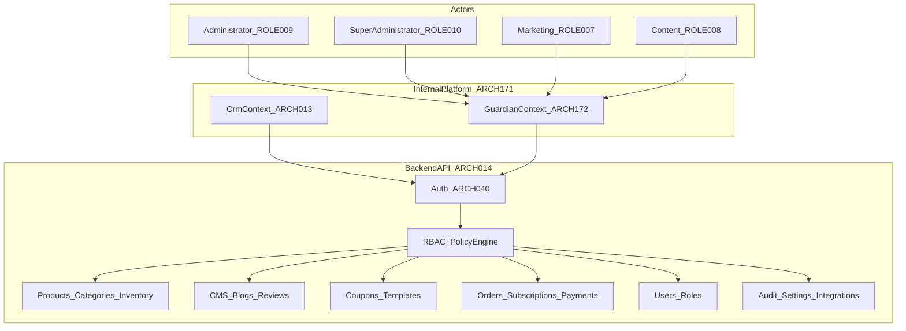

# 25 — Guardian

| Field | Value |
| --- | --- |
| Document | Guardian Architecture — Internal Platform administrative context |
| Product | Clinexa |
| Version | 1.0 |
| Status | Draft for review |
| Primary market | United States |
| Audience | Solution architects, platform architects, frontend architects, backend engineers, security, QA, product, operations leadership |
| Source of truth | [00 — Product Requirements Document](00-product-requirements-document.md) |
| Related docs | [03 — Functional requirements](03-functional-requirements.md), [05 — System architecture](05-system-architecture.md), [06 — User personas](06-user-personas.md), [08 — Role permissions](08-role-permissions.md), [09 — Feature roadmap](09-feature-roadmap.md), [10 — Database design](10-database-design.md), [11 — API design](11-api-design.md), [12 — Authentication flow](12-authentication-flow.md), [13 — Security](13-security.md), [16 — Store architecture](16-store-architecture.md), [17 — Patient portal](17-patient-portal.md), [18 — CRM](18-crm.md), [20 — UI design system](20-ui-design-system.md), [21 — Development guidelines](21-development-guidelines.md), [22 — Testing strategy](22-testing-strategy.md), [26 — Implementation tracker](26-implementation-tracker.md), [27 — Module registry](27-module-registry.md), [28 — Ownership matrix](28-ownership-matrix.md), [29 — Navigation blueprint](29-navigation-blueprint.md) |

**Guardian** is the master platform management context of the **Clinexa Internal Platform** (`ARCH-172` within `ARCH-171`). It is the administrative peer of [18 — CRM](18-crm.md): CRM owns the **operational lifecycle**, Guardian owns the **administrative lifecycle**.

> **Guardian is not a settings panel.** It is the platform's administrative control plane: catalog and content authorship, marketing configuration, platform settings and integrations, the full user administrative lifecycle, order and subscription administration, governance surfaces, and the **sole** exposure of destructive operations.

> **One platform, two contexts.** Guardian and CRM share authentication, sessions, RBAC, backend, database, APIs, design system, theme, application shell, components, layouts, tables, forms, dialogs, and common services. Only modules, workflows, and permissions differ. Guardian is served under `/guardian/*`, CRM under `/crm/*`. Switching contexts is navigation—never a second login (`ARCH-163`, `ARCH-153`).

> **Guardian owns no backend module.** Every backend module is a **platform module** owned by the Backend API and consumed by authorized clients (`ARCH-160`, `ARCH-161`). Guardian consumes them with administrative permissions.

> **Naming:** “Guardian” is the official and only name for this context. Labels such as “Business Management System”, “BMS”, or “Business” must not appear in product, code, or documentation.

> **Implementation independence:** `GRD-*` IDs are logical architecture controls. Framework choice, rendering runtime, component structure, styling, and state libraries are out of scope for this document.

---

## Table of contents

1. [Introduction](#1-introduction)
2. [Guardian Overview](#2-guardian-overview)
3. [Guardian Modules](#3-guardian-modules)
4. [Navigation Architecture](#4-navigation-architecture)
5. [Routing Architecture](#5-routing-architecture)
6. [CRUD Responsibilities](#6-crud-responsibilities)
7. [Destructive Operations](#7-destructive-operations)
8. [Application Shell](#8-application-shell)
9. [State Management](#9-state-management)
10. [API Integration](#10-api-integration)
11. [Performance Strategy](#11-performance-strategy)
12. [Accessibility](#12-accessibility)
13. [Guardian Security](#13-guardian-security)
14. [Future Security Area](#14-future-security-area)
15. [Store and Patient Portal Dependencies](#15-store-and-patient-portal-dependencies)
16. [Migration](#16-migration)
17. [Traceability Matrix](#17-traceability-matrix)
18. [Revision History](#18-revision-history)

---

## 1. Introduction

### 1.1 Purpose

Define the Guardian context so that:

- Administrative work has one deliberate home instead of leaking into operational screens (`ARCH-164`).
- Destructive operations exist in exactly one surface, behind one permission class, enforced server-side (`ARCH-165`, `ARCH-152`).
- The Internal Platform still feels like **one product** to staff (`ARCH-166`).
- Guardian can grow with Store, Patient Portal, and future application requirements through Module Registry entries and navigation groups—not new backends (`ARCH-162`).

### 1.2 Scope

#### In scope

| Area | Coverage |
| --- | --- |
| Guardian context | Administrative context of the Internal Platform, served under `/guardian/*` |
| Modules | Dashboard, catalog (products, categories, variants, pricing, media, inventory policy), content (pages, blogs, homepage, FAQs, review moderation), marketing (coupons, campaigns, templates), users (full administrative lifecycle), orders (administration, financial corrections, overrides), subscriptions (plans and administrative lifecycle), questionnaires and workflow configuration, platform settings, feature flags, taxes, shipping, payment providers, webhooks, integrations, API keys, audit/activity/system logs, administrative analytics and reports |
| Navigation | Grouped enterprise navigation, nesting, fly-outs, permission filtering |
| Routing | `/guardian/*` prefix and the module page hierarchy |
| Governance rules | CRUD responsibilities, destructive-operation ownership and enforcement |
| Qualities | Performance, accessibility, security posture for administrative surfaces |
| Traceability | Business → functional → Guardian module → API → permission → database |

#### Out of scope

| Area | Deferred to / note |
| --- | --- |
| Clinical decisions (consult approval, prescribing, pharmacy review) | [18 — CRM](18-crm.md); clinical separation of duties is preserved (`RBAC-020`–`028`) |
| Operational fulfillment execution, support triage, clinical queues | [18 — CRM](18-crm.md) |
| Public storefront rendering | [16 — Store architecture](16-store-architecture.md) |
| Patient self-service | [17 — Patient portal](17-patient-portal.md) |
| Backend module ownership | Backend API owns all platform modules (`ARCH-161`) |
| Store and Patient Portal design or implementation | Out of scope for this phase; dependencies acknowledged in §15 |
| Vendor management, multi-vendor switching | Future phase (§14, [24 — Future features](24-future-features.md)) |
| Named frameworks, component libraries, styling systems | Implementation |

### 1.3 Audience

| Audience | Use of this document |
| --- | --- |
| Solution / platform architects | Context boundaries, ownership, extensibility |
| Frontend architects and engineers | Shell reuse, navigation groups, routing, module composition |
| Backend engineers | Administrative and destructive endpoint permission requirements |
| Security | Destructive-operation enforcement, audit, least privilege |
| QA | Context routing, RBAC boundary, destructive-operation test design |
| Product / operations leadership | What Guardian governs and how it grows |

### 1.4 References

| Document | Relevance |
| --- | --- |
| [00 — PRD](00-product-requirements-document.md) | §7.4.2 Guardian context; §14 architecture; terminology |
| [05 — System architecture](05-system-architecture.md) | `ARCH-160`–`ARCH-173`; §3.5–3.7; §4.4 |
| [08 — Role permissions](08-role-permissions.md) | `PERM-GRD-001`, destructive permission class, role grants |
| [11 — API design](11-api-design.md) | Consumer-agnostic zones; administrative and destructive endpoints |
| [13 — Security](13-security.md) | Destructive-operation ownership, audit, retention |
| [18 — CRM](18-crm.md) | Peer operational context; §2.8 relocation table |
| [27 — Module registry](27-module-registry.md) | Module catalog, contexts, consumers, blueprint standard |
| [28 — Ownership matrix](28-ownership-matrix.md) | Per-entity action ownership across applications |
| [29 — Navigation blueprint](29-navigation-blueprint.md) | Sidebar, groups, breadcrumbs, context switching |

### 1.5 Guardian architecture principles

| ID | Principle | Implication |
| --- | --- | --- |
| GRD-001 | Administrative lifecycle owner | Provisioning, master data, governance, corrections, and overrides belong to Guardian (`ARCH-164`) |
| GRD-002 | Sole destructive surface | Delete, archive, restore, financial corrections, administrative overrides, bulk cleanup, and hard delete appear only in Guardian (`ARCH-165`) |
| GRD-003 | Thin administrative client | Guardian embeds no divergent business rules; the API validates and enforces every administrative mutation (`ARCH-004`, `ARCH-140`) |
| GRD-004 | Server-side authorization truth | Every administrative and destructive action is re-authorized by the API against the principal's permissions, independent of the calling surface (`ARCH-160`, `NFR-045`) |
| GRD-005 | One platform, two contexts | Guardian reuses the CRM shell, tokens, and component patterns; a context switch is navigation only (`ARCH-163`, `ARCH-166`) |
| GRD-006 | Platform modules are consumed | Guardian owns no backend module; it consumes platform modules with administrative permissions (`ARCH-161`) |
| GRD-007 | Retention-first destruction | Soft delete, archive, unpublish, and terminal status are preferred; hard delete is a documented, permissioned exception ([10](10-database-design.md)) |
| GRD-008 | Clinical separation preserved | Administrative power never grants clinical authority; Guardian cannot approve consults, prescribe, or perform pharmacy review (`RBAC-028`) |
| GRD-009 | Everything administrative is audited | Administrative and destructive actions are attributable and appended to the audit trail (`FR-ADM-004`, `SEC-036`) |
| GRD-010 | Grouped enterprise navigation | Guardian navigation is organized into functional groups, not a flat module list ([29](29-navigation-blueprint.md)) |
| GRD-011 | Modules are mini applications | Each module owns a consistent page hierarchy under its route (§5.3) |
| GRD-012 | Inspiration, not imitation | WordPress admin and similar consoles are inspiration only; every module is justified on Clinexa's own requirements and must never become a one-to-one clone |
| GRD-013 | Growth by configuration | New Guardian modules arrive via Module Registry entries, navigation groups, and permissions—not architectural redesign (`ARCH-162`) |
| GRD-014 | Escalation target | Guardian is where operational staff escalate for administrative or destructive action; CRM never reimplements it (`CRM-165`, `CRM-167`) |
| GRD-015 | Fail closed | Any uncertainty in authorization, validation, or destructive scope denies the action (`SEC-005`) |

---

## 2. Guardian Overview

### 2.1 Guardian responsibilities

| Responsibility | Guardian owns (UX) | Server owns (truth) |
| --- | --- | --- |
| Administrative dashboard | Platform KPIs, governance shortcuts, system signals | Aggregates and AuthZ (`PERM-GRD-001`) |
| Catalog | Products, categories, variants, pricing, images, DIN/dosage attributes, media, inventory policy | Publish safety validation and bindings (`FR-PRD-002`, `FR-CAT-002`, `OR-14`) |
| Content | Pages, blogs, homepage, FAQs, review moderation, SEO fields | Draft/publish enforcement; moderation before public display (`FR-CMS-*`, `FR-BLG-*`, `FR-REV-003`) |
| Marketing | Coupons, campaigns, notification templates | Coupon validation and template usage (`FR-CPN-*`, `FR-NTF-002`) |
| Users | Full administrative lifecycle: create, edit administrative fields, role assignment, delete, archive, restore | Users/RBAC persistence, last-admin safeguard, audit (`FR-ADM-001`, `FR-ADM-002`) |
| Orders (administrative) | Administrative detail, exports, reconciliation, refunds as corrections, overrides, delete/archive/restore | Lifecycle, payment integrity, idempotency, audit (`FR-ORD-*`, `FR-PAY-003`) |
| Subscriptions (administrative) | Plan configuration, administrative lifecycle, delete/archive/restore | Renewal, dunning, and clinical reassessment rules (`FR-SUB-*`) |
| Questionnaires and workflows | Definitions, versions, bindings, consultation workflow configuration | Versioning immutability and binding validation (`FR-QST-001`/`002`, `FR-CRM-007`) |
| Platform | Settings, feature flags, taxes, shipping, payment providers and keys, webhooks, integrations, API keys | Server-applied settings; secrets never returned to clients (`FR-SET-*`, `SEC-*`) |
| Governance | Audit trail, activity, system logs, administrative reports and exports | Append-only audit; export AuthZ and PHI minimization (`FR-ADM-004`, `FR-RPT-*`) |
| Destructive operations | The only UI that renders them | Guardian-owned permission enforcement on every call (§7) |

**GRD-016** — Guardian is a presentation and administration client. All durable identity, catalog, commerce, content, and configuration decisions are enforced by the Backend API.

### 2.2 Relationship with CRM

| Aspect | Guardian (`/guardian/*`) | CRM (`/crm/*`) |
| --- | --- | --- |
| Lifecycle | Administrative | Operational |
| Shared entities | Administrative fields, lifecycle state, corrections | Operational, clinical, and support fields |
| Destructive operations | Sole exposure | Never exposed |
| Navigation | Grouped enterprise navigation | Role-scoped operational queues |
| Clinical authority | None | Doctor/Pharmacist gates |
| Shell, session, tokens | Shared | Shared |

**GRD-017** — Both contexts may update many fields of the same entity when permissions allow; the *purpose* differs. Neither context is a superset of the other.

### 2.3 Relationship with Store

| Aspect | Guardian | Store |
| --- | --- | --- |
| Catalog, content, coupons, SEO | Author, configure, publish | Consume published state only |
| Reviews | Moderate approve/reject | Display approved |
| Merchandising, search configuration (future) | Configure | Render |
| Access | Staff only (`PERM-GRD-001`) | Guest/Patient; never Guardian |

**GRD-018** — Guardian is the configuration and administration plane for Store-facing data (`ARCH-133`). Store never mutates administrative truth and never exposes platform destructive operations.

### 2.4 Relationship with Patient Portal

| Aspect | Guardian | Patient Portal |
| --- | --- | --- |
| Orders, subscriptions, documents | Administrative lifecycle and corrections | Own-record visibility and policy-scoped self-service |
| Questionnaires | Definitions and bindings | Patient submission and status |
| Access | Staff only | Patient only |

**GRD-019** — Patient-facing surfaces never receive administrative or destructive affordances, regardless of the underlying platform module.

### 2.5 Relationship with the Backend API

| Aspect | Architecture rule |
| --- | --- |
| Protocol | HTTPS to the Backend API only (`ARCH-014`, `SEC-019`) |
| Domain authority | API owns identity, catalog, content, commerce, configuration, audit; Guardian owns none of it |
| Consumer neutrality | The API does not distinguish Guardian from any other caller; it evaluates the principal's permissions (`ARCH-160`) |
| Forbidden | Direct database access; PSP secrets in the client; client-side bypass of validation, publish safety, or destructive-permission checks |

### 2.6 Relationship with Authentication

| Aspect | Rule |
| --- | --- |
| Identity | Same staff identity and session as CRM (`AUTH-027`); staff are Guardian-provisioned, never self-registered |
| Context access | `/guardian/*` requires `PERM-GRD-001`; absence denies routes and hides the switcher entry |
| Switching | Context switch reuses the existing session; no re-authentication, no theme reset |
| Session | Idle ≤ 30 min; absolute ≤ 12 h; password reset invalidates all sessions (`NFR-044`) |
| Step-up authentication | Not required in V1; the architecture must not preclude step-up (or MFA) for destructive operations (§14) |

### 2.7 Architecture diagram

### 2.8 Explicit non-ownership summary

| ID | Guardian must not |
| --- | --- |
| GRD-020 | Approve or decline consults, prescribe, or perform pharmacy review |
| GRD-021 | Own or duplicate a backend module |
| GRD-022 | Render public storefront or patient self-service UX |
| GRD-023 | Admit Guest or Patient principals |
| GRD-024 | Expose destructive operations to principals lacking the specific Guardian destructive permission |
| GRD-025 | Bypass publish safety, validation, or clinical gates through an “administrative override” that is not itself an audited, permissioned operation |
| GRD-026 | Diverge visually or behaviorally from the shared Internal Platform shell |

---

## 3. Guardian Modules

### 3.1 Module map

Modules marked **Shared** are dual-mounted with CRM under different action sets (see [18](18-crm.md) §2.8). Every entry is also recorded in [27 — Module registry](27-module-registry.md).

| ID | Module | Navigation group | Shared with CRM | Primary FRs | Destructive operations |
| --- | --- | --- | --- | --- | --- |
| GRD-030 | Dashboard | Dashboard | Shared (context-specific content) | `FR-ANL-*` | — |
| GRD-031 | Products | Commerce | No | `FR-PRD-002`, `FR-CRM-007` | Delete, archive, restore |
| GRD-032 | Categories | Commerce | No | `FR-CAT-002` | Delete, archive, restore |
| GRD-033 | Inventory policy | Commerce | Shared (CRM owns operational balances) | `FR-INV-*`, `FR-SET-002` | Bulk adjustment cleanup |
| GRD-034 | Orders (administration) | Commerce | Shared | `FR-ORD-*`, `FR-PAY-003` | Delete, archive, restore, financial correction, override |
| GRD-035 | Subscriptions (administration) | Commerce | Shared | `FR-SUB-*` | Delete, archive, restore |
| GRD-036 | Pricing, taxes, shipping | Commerce | No | `FR-SET-*` | Delete configuration entries |
| GRD-037 | Pages | Content | No | `FR-CMS-*` | Delete, archive, restore |
| GRD-038 | Blogs | Content | No | `FR-BLG-*` | Delete, archive, restore |
| GRD-039 | Media library | Content | No | `FR-DOC-*` (media metadata), `FR-PRD-002` | Delete media assets |
| GRD-040 | Homepage and FAQs | Content | No | `FR-CMS-*` | Delete blocks |
| GRD-041 | Review moderation | Content | No | `FR-REV-003` | Delete reviews |
| GRD-042 | Users (administration) | Users | Shared | `FR-ADM-001`, `FR-ADM-002` | Delete, archive, restore |
| GRD-043 | Roles and permissions | Users | No | `FR-ADM-002` | Delete custom role assignments |
| GRD-044 | Coupons | Marketing | No | `FR-CPN-001` | Delete, archive |
| GRD-045 | Campaigns and templates | Marketing | No | `FR-NTF-002` | Delete templates |
| GRD-046 | Questionnaires and workflows | Platform | Shared (CRM owns clinician case view) | `FR-QST-001`/`002`, `FR-CRM-007` | Delete unbound definitions only |
| GRD-047 | Settings | Platform | No | `FR-SET-001`–`004` | — (changes are audited, not destructive) |
| GRD-048 | Feature flags | Platform | No | `FR-SET-*`; `ARCH-149` | Delete flags |
| GRD-049 | Payment providers | Platform | No | `FR-PAY-*` | Rotate/delete credentials |
| GRD-050 | Integrations | Platform | No | `FR-SET-*` | Delete integrations |
| GRD-051 | API keys | Developer | No | `FR-SET-*` | Revoke/delete keys |
| GRD-052 | Webhooks | Developer | No | `FR-PAY-*`, `FR-SET-*` | Delete endpoints |
| GRD-053 | Audit log | Platform | No | `FR-ADM-004` | None — append-only |
| GRD-054 | Activity log | Platform | No | `FR-ADM-004` | None |
| GRD-055 | System logs | Platform | No | `NFR-074`–`082` | Retention-policy purge only |
| GRD-056 | Administrative reports and exports | Analytics | Shared (CRM owns operational reports) | `FR-RPT-*`, `FR-ANL-*` | Report-job artifact cleanup |
| GRD-057 | Appointment types and slots | Platform | Shared (CRM owns staff scheduling views) | `FR-APT-002`/`003` | Delete types |
| GRD-058 | Security (future) | Security | No | Deferred (§14) | Session revocation, device removal |
| GRD-059 | Vendor management (future) | Platform | No | Deferred | Deferred |
| GRD-060 | Data cleanup and maintenance | Platform | No | [10](10-database-design.md) hard-delete procedures | Bulk cleanup, hard delete |

### 3.2 Module notes

| Module | Boundary notes |
| --- | --- |
| Products / Categories (`GRD-031`/`032`) | Unsafe Rx configurations are blocked at publish (`OR-14`); Store shows published state only |
| Orders administration (`GRD-034`) | Operational refund assist and policy cancel remain in CRM under existing support FRs; **financial corrections, administrative overrides, archive, delete, and restore are Guardian-only** |
| Users administration (`GRD-042`) | Last-admin safeguard applies; role changes bump session/token version; deletion is soft by default (`GRD-007`) |
| Questionnaires (`GRD-046`) | Versions bound to submitted answers are immutable and never deletable |
| Audit / activity logs (`GRD-053`/`054`) | Guardian can query but never mutate; retention ≥ 1 year (`SEC-036`) |
| Data cleanup (`GRD-060`) | Highest-risk module: requires the strongest permission grant, explicit confirmation, and audit; scope is always bounded and previewable before execution |
| Security (`GRD-058`) | Deferred (§14); architecture must not preclude it |

---

## 4. Navigation Architecture

Guardian navigation uses **grouped enterprise navigation**. Full behavior—nesting, fly-outs, breadcrumbs, permission filtering, responsive rules, and future search/pins/favorites—is specified in [29 — Navigation blueprint](29-navigation-blueprint.md).

| Group | Intent | Representative modules |
| --- | --- | --- |
| Dashboard | Home and platform KPIs | `GRD-030` |
| Commerce | Catalog and commerce administration | `GRD-031`–`GRD-036` |
| Content | Content and media administration | `GRD-037`–`GRD-041` |
| Users | Identity administration | `GRD-042`, `GRD-043` |
| Marketing | Growth configuration | `GRD-044`, `GRD-045` |
| Platform | Configuration and governance | `GRD-046`–`GRD-050`, `GRD-053`–`GRD-055`, `GRD-057`, `GRD-059`, `GRD-060` |
| Security (future) | Account and session security | `GRD-058` |
| Developer | Programmatic access | `GRD-051`, `GRD-052` |
| Analytics | Administrative reporting | `GRD-056` |
| Support | Administrative visibility into support operations, if required | — (CRM owns triage) |

**GRD-070** — Group membership is metadata on the navigation catalog entry, not a component hierarchy. Adding a module means adding an entry, a page, and a permission gate.

**GRD-071** — Groups render only when the principal can see at least one child module. Empty groups never appear.

---

## 5. Routing Architecture

### 5.1 Context prefix (decided)

| Context | Prefix | Shell permission |
| --- | --- | --- |
| CRM | `/crm/*` | `PERM-CRM-020` |
| Guardian | `/guardian/*` | `PERM-GRD-001` |

**GRD-072** — The context segment is the first path segment after the origin and is authoritative for context resolution, active navigation, breadcrumb roots, and route guards (`ARCH-116`). No other signal (header, cookie, client state) may override it.

**GRD-073** — Default post-login context is **role-based**: principals whose primary duties are clinical or operational land in CRM; principals whose primary duties are administrative land in Guardian. A principal with access to only one context always lands there. A principal with access to neither is denied the shell.

### 5.2 Module as mini application

**GRD-074** — Every major module is a mini application under its context prefix, for example `/guardian/products`, `/guardian/products/new`, `/guardian/products/:id`, `/guardian/products/:id/edit`. The context prefix—not a feature flag or client state—determines whether destructive actions are reachable.

### 5.3 Recommended module page hierarchy (architectural standard)

Not every module implements every page; the hierarchy is the standard shape.

| Page | Route shape | Purpose |
| --- | --- | --- |
| Overview | `/guardian/<module>` | Module landing: summary, key counts, entry points |
| List | `/guardian/<module>/list` or the overview itself | Paginated, filterable index |
| Create | `/guardian/<module>/new` | Creation form |
| View | `/guardian/<module>/:id` | Read-only detail |
| Edit | `/guardian/<module>/:id/edit` | Mutation form |
| History | `/guardian/<module>/:id/history` | Change history for the record |
| Activity | `/guardian/<module>/:id/activity` | Actor-attributed activity stream |
| Logs | `/guardian/<module>/logs` | Module-level system/integration logs |
| Settings | `/guardian/<module>/settings` | Module-scoped configuration |

**GRD-075** — Destructive actions are exposed on View, Edit, or a dedicated confirmation route within the module—never in a list bulk menu unless the corresponding bulk destructive permission is held.

### 5.4 Route guards

| ID | Rule |
| --- | --- |
| GRD-076 | Unauthenticated request to `/guardian/*` redirects to the shared auth entry with no privileged paint |
| GRD-077 | Authenticated principal without `PERM-GRD-001` receives an authorization error; no Guardian navigation is returned |
| GRD-078 | Module route additionally requires the module's view permission; missing permission hides navigation and denies the route |
| GRD-079 | Destructive route or action additionally requires the specific destructive permission; the API re-checks on every call |
| GRD-080 | Patient or Guest session on any `/guardian/*` route is hard-denied (`ERR-AUTHZ-003`) |
| GRD-081 | Role or permission change bumps session/token version; the next shell load reflects current grants |

---

## 6. CRUD Responsibilities

These are **authoritative product rules** for the Internal Platform. Cross-application ownership (including Store, Patient Portal, and future applications) is maintained in [28 — Ownership matrix](28-ownership-matrix.md).

### 6.1 Users

| Action | Guardian | CRM |
| --- | --- | --- |
| Create | Yes | No |
| View | Yes | Yes (staff-scoped) |
| Edit | Yes (administrative fields, roles) | Yes (operational / clinical / support fields as permitted) |
| Delete | Yes | No |
| Archive | Yes | No |
| Restore | Yes | No |

### 6.2 Orders

| Action | Guardian | CRM |
| --- | --- | --- |
| Create | Yes (administrative path if ever needed) | No (commerce creation happens via Store checkout) |
| View | Yes | Yes |
| Edit | Yes (administrative) | Yes (operational workflow) |
| Delete | Yes | No |
| Archive | Yes | No |
| Restore | Yes | No |
| Refunds | Yes (administrative corrections) | Policy-scoped operational assist per existing FRs |
| Financial corrections | Yes | No |
| Administrative overrides | Yes | No |
| Doctor / pharmacy / fulfillment / timeline / documents / internal notes | No (view-only where needed) | Yes |

**Refund taxonomy (`GRD-082`).** Operational refund assist and policy cancel remain in CRM where functional requirements already allow them (`OR-11`, `FR-SUP-005`, `FR-PAY-003`). Financial corrections, administrative overrides, archive, delete, and restore are Guardian-only.

### 6.3 Subscriptions

| Action | Guardian | CRM |
| --- | --- | --- |
| Create | Yes | Yes (operational create/assist where product allows) |
| View | Yes | Yes |
| Edit | Yes (administrative) | Yes (operational) |
| Renew / pause / resume | Administrative path if needed | Yes |
| Delete | Yes | **No — delete remains Guardian-only** |
| Archive / restore | Yes | No |

### 6.4 Reports and other shared modules

- Both contexts may view and run role-scoped reports for their own plane.
- Destructive report-job cleanup and administrative exports follow Guardian permissions.
- Catalog, content, marketing, and platform configuration entities are Guardian-only for all CRUD actions; CRM has no create, edit, or delete path to them.

---

## 7. Destructive Operations

### 7.1 Definition

A **destructive operation** is any action that removes, hides, or financially rewrites durable platform truth, or that overrides a gate or policy. Non-exhaustive catalog:

| Class | Examples |
| --- | --- |
| Removal | Delete, hard delete, bulk delete |
| Concealment | Archive, unpublish-as-retirement, deactivate-with-data-retention |
| Reversal | Restore from archive or soft-deleted state |
| Financial | Refund as correction, adjustment, write-off, reconciliation edit |
| Governance | Administrative override of a policy, gate exemption, forced state transition |
| Maintenance | Bulk data cleanup, report-artifact purge, retention purge |

### 7.2 Ownership rule

**GRD-083** — Destructive operations are exposed **only** in Guardian. CRM, Store, Patient Portal, and future applications must not render them. Changing this requires an explicit architecture revision recorded in [05](05-system-architecture.md) and [26](26-implementation-tracker.md).

### 7.3 Permission model

Destructive permissions form a segregated **Class D** in [08 — Role permissions](08-role-permissions.md). They live in their domain module namespace (so authorization stays domain-shaped) but are tagged Guardian-only.

| Permission | Operation |
| --- | --- |
| `PERM-GRD-001` | Access the Guardian context shell |
| `PERM-ADM-030` / `031` / `032` | Delete / archive / restore user |
| `PERM-ADM-033` | Bulk data cleanup |
| `PERM-ADM-034` | Execute a documented hard-delete procedure |
| `PERM-ORD-010` / `011` / `012` | Delete / archive / restore order |
| `PERM-ORD-013` | Financial correction |
| `PERM-ORD-014` | Administrative override |
| `PERM-SUB-010` / `011` / `012` | Delete / archive / restore subscription |
| `PERM-PRD-010`, `PERM-CAT-010` | Delete product, delete category |
| `PERM-CMS-010`, `PERM-BLG-010` | Delete page, delete blog post |
| `PERM-CPN-010` | Delete coupon |
| `PERM-RPT-010` | Purge report job artifacts |

Holding a module's view or edit permission never implies its destructive permission.

### 7.4 Enforcement

| ID | Control |
| --- | --- |
| GRD-084 | Server-side authorization on every destructive API action, evaluated from the principal's permissions and independent of the calling application (`ARCH-160`) |
| GRD-085 | Destructive endpoints fail closed for any principal lacking the specific Class D permission, including staff who hold broad administrative grants |
| GRD-086 | UI guards are defense-in-depth only; the affordance is absent from non-Guardian catalogs entirely |
| GRD-087 | Every destructive action writes an audit record with actor, target, scope, reason where captured, and timestamp (`FR-ADM-004`) |
| GRD-088 | Bulk and hard-delete operations require bounded scope, an explicit confirmation step, and a preview of the affected set |
| GRD-089 | Restore is itself a destructive-class action because it changes durable visibility, and is audited identically |
| GRD-090 | Soft delete and archive are the default; hard delete follows the documented database procedure and the strongest permission ([10](10-database-design.md)) |

---

## 8. Application Shell

Guardian uses the **same** Internal Platform shell as CRM. The shell contract—sidebar, header slots, Application Switcher, breadcrumbs, theming, icons—is specified in [18 — CRM §4](18-crm.md#4-application-shell) and remains the contributor source of truth for both contexts.

| ID | Guardian-specific shell rule |
| --- | --- |
| GRD-091 | Guardian introduces no alternate chrome, second theme, or parallel component set (`ARCH-166`) |
| GRD-092 | The Application Switcher exposes Guardian only to principals holding `PERM-GRD-001` |
| GRD-093 | Guardian navigation entries carry context `guardian` plus a group; the sidebar renders them through the same components as CRM |
| GRD-094 | Breadcrumbs root at the Guardian context segment and derive from navigation titles |
| GRD-095 | Destructive controls use a consistent, distinct visual treatment defined once in the design system ([20](20-ui-design-system.md))—never ad-hoc per module |

---

## 9. State Management

| ID | Rule |
| --- | --- |
| GRD-100 | Server truth over cached client state after any administrative mutation |
| GRD-101 | Authorization is never inferred from client state; permission claims are UI hints only |
| GRD-102 | Context switching clears context-scoped module state but preserves session, theme, and shell preferences |
| GRD-103 | Destructive results invalidate every related cached domain (lists, counts, dashboards) and re-fetch server truth |
| GRD-104 | Secrets and credentials (payment keys, API keys, webhook signing secrets) are never retained in client state and are displayed once at creation where the API supports it |

---

## 10. API Integration

Guardian consumes documented APIs only ([11](11-api-design.md)); it never invents endpoints or outcomes.

| ID | Rule |
| --- | --- |
| GRD-110 | Consume documented `/v1` administrative endpoints over HTTPS |
| GRD-111 | Every mutation carries attributable staff identity; privileged and destructive actions are re-authorized server-side |
| GRD-112 | Destructive mutations use idempotency keys where the API design mandates them |
| GRD-113 | Large administrative exports use the async job pattern; the shell never blocks on unbounded queries |
| GRD-114 | Guardian never calls patient-scoped self-service paths as a substitute for administrative endpoints |
| GRD-115 | Errors surface API-safe messages: no stack traces, secrets, or unrelated PHI (`SEC-050`) |

### 10.1 Domain API map

| Domain | API IDs | Guardian use |
| --- | --- | --- |
| Auth | `API-004`–`008` | Shared staff session (`AUTH-027`) |
| Users / roles / audit | `API-009`–`015`, `API-168`–`171` | Administrative user lifecycle, role assignment, audit query |
| Products / categories / media | `API-021`–`037` | Catalog authoring and publish |
| Questionnaires / workflows / plans | `API-046`–`052`, `API-095`–`096`, `API-172`–`174` | Definitions, bindings, workflow and plan configuration |
| Orders / refunds / subscriptions | `API-072`–`076`, `API-067`, `API-083`–`087` | Administrative orders, corrections, subscription administration |
| Inventory | `API-105`–`109` | Policy and administrative adjustment |
| Coupons | `API-143`–`147` | Marketing configuration |
| CMS / blogs / reviews | `API-150`–`160`, `API-139`–`141` | Content authoring, publish, moderation |
| Notifications | `API-135`–`136` | Template administration |
| Reports / analytics | `API-161`–`167` | Administrative reports and exports |
| Settings | `API-175`–`176` | Platform settings |
| Appointments | `API-120`–`124` | Types and slot configuration |

New administrative and destructive endpoints are added to [11](11-api-design.md) with their required permission before Guardian consumes them.

---

## 11. Performance Strategy

| ID | Area | Strategy |
| --- | --- | --- |
| GRD-120 | Large administrative lists | Bounded page sizes for catalog, users, orders, audit; no unbounded dumps to the UI (`NFR-020`) |
| GRD-121 | Filtering and sorting | Server-side filters; client filters never bypass authorization |
| GRD-122 | Heavy panels | Defer analytics, log, and history panels until entered |
| GRD-123 | Exports | Async job pattern for large exports (`NFR-012`) |
| GRD-124 | Destructive previews | Affected-set previews are paginated and bounded, never a full-table scan rendered client-side |
| GRD-125 | Dashboards | Administrative dashboard TTI aligns with CRM dashboard targets (`NFR-006`) |
| GRD-126 | Device posture | Optimized for desktop ≥ 1024 px (prefer ≥ 1280), consistent with the Internal Platform (`NFR-100`) |

---

## 12. Accessibility

| ID | Requirement |
| --- | --- |
| GRD-130 | Administrative workflows target WCAG 2.2 Level AA consistent with the Internal Platform goal (`NFR-093`) |
| GRD-131 | Dense administrative tables and forms are fully keyboard-operable with logical focus order (`NFR-092`, `NFR-095`) |
| GRD-132 | Destructive confirmations are keyboard-reachable, focus-trapped, clearly labeled, and never rely on color alone |
| GRD-133 | Validation and authorization errors are announced accessibly; no silent administrative failures |
| GRD-134 | Group navigation and fly-out submenus are operable without a pointer and expose expanded/collapsed state |

---

## 13. Guardian Security

Cross-reference [12](12-authentication-flow.md), [13](13-security.md), and [08](08-role-permissions.md).

| ID | Area | Control |
| --- | --- | --- |
| GRD-140 | Context isolation | `/guardian/*` requires `PERM-GRD-001`; Guest and Patient hard-denied |
| GRD-141 | Least privilege | Administrative grants are minimal per duty; destructive Class D is granted explicitly and narrowly |
| GRD-142 | Separation of duties | Administrative power grants no clinical authority (`RBAC-028`); Guardian access does not grant CRM clinical permissions |
| GRD-143 | Audit | Administrative and destructive actions are audited with actor attribution; retention ≥ 1 year (`SEC-036`) |
| GRD-144 | Secrets | Payment keys, API keys, and webhook secrets are write-mostly: never returned in list responses, masked in the UI, rotation audited |
| GRD-145 | PHI minimization | Administrative screens display the minimum patient data required; clinical notes and full questionnaire answers are not administrative surfaces (`FR-CRM-006`) |
| GRD-146 | Session handling | Same session policy as CRM; expiry clears shell state and requires re-authentication (`NFR-044`) |
| GRD-147 | Fail closed | Authorization, validation, or destructive-scope uncertainty denies the action (`SEC-005`) |
| GRD-148 | Anti-CSRF / XSS | Same protections as CRM (`SEC-041`, `SEC-044`, `SEC-045`); administrative rich-text is sanitized server-side |
| GRD-149 | Last-admin safeguard | The platform must never be left without an administrative principal; user delete/archive respects the safeguard |
| GRD-150 | Feature flags | Flags must not disable clinical or payment gates (`ARCH-149`) |

---

## 14. Future Security Area

Deferred, but architecturally permitted (`GRD-058`):

| Capability | Note |
| --- | --- |
| Two-factor authentication | Enrollment, enforcement policy per role |
| Trusted devices | Registration and revocation |
| Active sessions | Listing and administrative revocation |
| Login history | Successful and failed attempts |
| Recovery codes | Issue and invalidate |
| Security logs | Security-relevant event stream |
| Failed-login monitoring | Threshold alerting |
| Step-up authentication for destructive operations | Re-authentication or MFA challenge before Class D actions |

Nothing in this architecture may preclude these; they arrive as Guardian modules under the Security group with their own permissions.

---

## 15. Store and Patient Portal Dependencies

Store and Patient Portal are **out of scope for design and implementation in this phase**. Their dependencies are pre-declared so their arrival requires configuration and registry updates, not redesign (`ARCH-162`, `ARCH-134`).

### 15.1 Store depends on Guardian-managed modules

Products, pricing, media, blogs, pages, coupons, marketing, SEO, search configuration, homepage content, navigation, and dynamic content. Future Store requirements may introduce new Guardian modules—for example SEO, landing pages, homepage builder, search configuration, product merchandising, catalog management—added as Module Registry entries within existing navigation groups.

### 15.2 Patient Portal interacts with shared platform modules

Orders, subscriptions, questionnaires, prescriptions, documents, messages, notifications, profile, and security. The Portal consumes these with patient-scoped permissions and never receives administrative or destructive affordances.

**GRD-160** — Neither client owns any backend module. Adding either one is a matter of permissions, Module Registry consumer entries, and Ownership Matrix columns.

---

## 16. Migration

Migration mechanics, redirect mapping, verification checks, and required test cases live in [30 — Migration and verification](30-migration-and-verification.md); phase state and ownership live in [26 — Implementation tracker](26-implementation-tracker.md). Summary:

1. Introduce `/crm/*` and `/guardian/*` under `apps/admin`; keep the shared shell.
2. Redirect legacy internal paths to their context-prefixed equivalents.
3. Context-tag the navigation catalog and add group metadata.
4. Add `PERM-GRD-001` and the Class D destructive permissions; grant them narrowly.
5. Gate administrative and destructive API endpoints on the new permissions.
6. Dual-mount shared modules (Users, Orders, Subscriptions, Reports) with distinct action sets per context.
7. Replace the Vendor Switcher placeholder with the Application Switcher.
8. Update the Module Registry consumers and Ownership Matrix columns for Store/Portal readiness.
9. Verify visual unity, context routing, RBAC boundaries, and backend agnosticism.

---

## 17. Traceability Matrix

| Business / architecture | Functional | Guardian module / control | API | Permission | Database |
| --- | --- | --- | --- | --- | --- |
| `ARCH-164`, `ARCH-172` | `FR-ADM-001`/`002` | `GRD-042`, `GRD-043`, `GRD-001` | `API-009`–`015` | `PERM-ADM-001`/`002`, `PERM-ADM-030`–`032` | `DB-001`–`009` |
| `BO-5`, `OR-14` | `FR-PRD-002`, `FR-CAT-002`, `FR-CRM-007` | `GRD-031`, `GRD-032`, `GRD-046` | `API-021`–`037`, `API-046`–`052` | `PERM-PRD-002`, `PERM-CAT-002`, `PERM-QST-004`, `PERM-PRD-010`, `PERM-CAT-010` | `DB-010`–`021` |
| `ARCH-165` | `FR-ORD-*`, `FR-PAY-003` | `GRD-034`, `GRD-082`–`GRD-090` | `API-067`, `API-072`–`076` | `PERM-ORD-010`–`014` | `DB-026`–`029` |
| `OR-10` | `FR-SUB-*` | `GRD-035` | `API-083`–`087` | `PERM-SUB-002`, `PERM-SUB-010`–`012` | `DB-032`–`034` |
| `BP-11`, `OR-13` | `FR-CMS-*`, `FR-BLG-*`, `FR-REV-003` | `GRD-037`–`GRD-041` | `API-139`–`141`, `API-150`–`160` | `PERM-CMS-001`/`002`, `PERM-BLG-001`, `PERM-CMS-010`, `PERM-BLG-010` | `DB-024`–`025`, `DB-050`–`053` |
| Growth | `FR-CPN-001`, `FR-NTF-002` | `GRD-044`, `GRD-045` | `API-135`–`136`, `API-143`–`147` | `PERM-CPN-001`, `PERM-NTF-003`, `PERM-CPN-010` | `DB-054`, coupon tables |
| Governance | `FR-ADM-004`, `FR-SET-001`–`004` | `GRD-047`–`GRD-055`, `GRD-060` | `API-171`, `API-175`–`176` | `PERM-ADM-010`, `PERM-SET-001`/`002`, `PERM-ADM-033`/`034` | `DB-057`–`058` |
| Reporting | `FR-RPT-*`, `FR-ANL-*` | `GRD-056` | `API-161`–`167` | `PERM-RPT-001`/`002`, `PERM-RPT-010` | `DB-060`–`061` |
| Context boundary | `FR-AUTH-004` | `GRD-072`–`GRD-081`, `GRD-140` | `API-004`–`008` | `PERM-GRD-001` | `DB-001`–`009` |

---

## 18. Revision History

| Version | Date | Author | Reviewer | Changes | Status |
| --- | --- | --- | --- | --- | --- |
| 1.0 | 2026-07-27 | Architecture (Clinexa planning) | Pending | Initial Guardian architecture: context boundary, modules (`GRD-030`–`GRD-060`), navigation groups, `/guardian/*` routing and module page hierarchy, CRUD product rules, destructive-operation ownership and enforcement, shared shell rules, security posture, future Security area, Store/Portal dependencies, migration and traceability (`GRD-001`–`GRD-160`) | Draft for review |

---

## Related reading

| Document | Why |
| --- | --- |
| [05 — System architecture](05-system-architecture.md) | Ecosystem, contexts, application-agnostic backend |
| [18 — CRM](18-crm.md) | Peer operational context and shared shell contract |
| [08 — Role permissions](08-role-permissions.md) | `PERM-GRD-001` and the destructive permission class |
| [11 — API design](11-api-design.md) | Administrative and destructive endpoint requirements |
| [13 — Security](13-security.md) | Destructive-operation ownership and audit |
| [26 — Implementation tracker](26-implementation-tracker.md) | Delivery phases and verification |
| [27 — Module registry](27-module-registry.md) | Module catalog, consumers, blueprint standard |
| [28 — Ownership matrix](28-ownership-matrix.md) | Per-entity action ownership across applications |
| [29 — Navigation blueprint](29-navigation-blueprint.md) | Navigation and shell behavior |

---

## Document control

| Item | Value |
| --- | --- |
| Classification | Internal planning |
| Owner | Architecture (Clinexa planning) |
| Source of truth | [00 — Product Requirements Document](00-product-requirements-document.md) |
| Control catalog | `GRD-001` – `GRD-160` |
| Change rule | Changes to destructive-operation ownership or context boundaries require updates to [05](05-system-architecture.md), [08](08-role-permissions.md), [11](11-api-design.md), [13](13-security.md), and [28](28-ownership-matrix.md) in the same change |
| Next review | After stakeholder approval of Draft for review |

---

*End of 25 — Guardian.*
