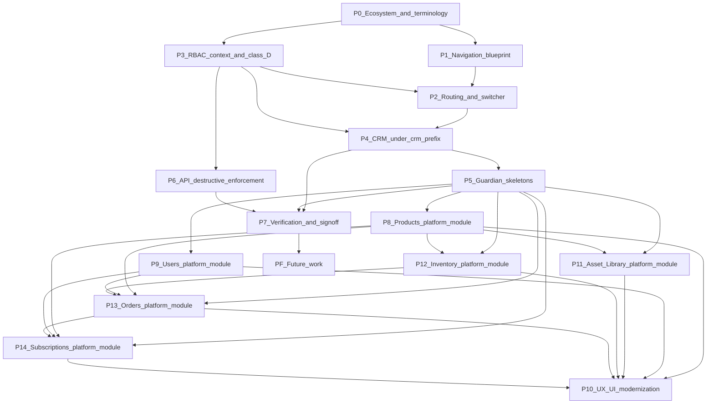

# 26 — Implementation Tracker

| Field | Value |
| --- | --- |
| Document | Implementation Tracker — Ecosystem and Internal Platform |
| Product | Clinexa |
| Version | 1.0 |
| Status | Draft for review |
| Audience | Engineering leadership, architects, engineers, product, QA |
| Source of truth | [00 — Product Requirements Document](00-product-requirements-document.md) |
| Related docs | [05 — System architecture](05-system-architecture.md), [08 — Role permissions](08-role-permissions.md), [09 — Feature roadmap](09-feature-roadmap.md), [11 — API design](11-api-design.md), [18 — CRM](18-crm.md), [21 — Development guidelines](21-development-guidelines.md), [25 — Guardian](25-guardian.md), [27 — Module registry](27-module-registry.md), [28 — Ownership matrix](28-ownership-matrix.md), [29 — Navigation blueprint](29-navigation-blueprint.md), [30 — Migration and verification](30-migration-and-verification.md), [31 — Products module](31-products-module.md), [32 — Users module](32-users-module.md), [35 — Orders module](35-orders-module.md), [36 — Subscriptions module](36-subscriptions-module.md), [37 — Promotions module](37-promotions-module.md) |

This document is the **governance record** for delivering the Clinexa ecosystem architecture: the Internal Platform with its CRM and Guardian contexts, the application-agnostic backend, and the extension points for future clients.

It answers three questions for every phase: what is being delivered, what state is it in, and how do we know it is done. It does **not** restate architecture. Design intent lives in [05](05-system-architecture.md), [18](18-crm.md), [25](25-guardian.md), and [29](29-navigation-blueprint.md); scope sequencing lives in [09 — Feature roadmap](09-feature-roadmap.md). This tracker records delivery state against that design.

> **Relationship to the roadmap.** [09](09-feature-roadmap.md) answers *what ships in which milestone, and why*. This tracker answers *what is in flight right now, on which branch, blocked by what*. When the two disagree about scope, the roadmap wins and this tracker is corrected.

---

## Table of contents

1. [How to use this tracker](#1-how-to-use-this-tracker)
2. [Field definitions](#2-field-definitions)
3. [Status model](#3-status-model)
4. [Phase overview](#4-phase-overview)
5. [Phase records](#5-phase-records)
6. [Dependency graph](#6-dependency-graph)
7. [Architecture decision log](#7-architecture-decision-log)
8. [Open decisions](#8-open-decisions)
9. [Risk register](#9-risk-register)
10. [Definition of done](#10-definition-of-done)
11. [Revision History](#11-revision-history)

---

## 1. How to use this tracker

| Rule | Statement |
| --- | --- |
| TRK-001 | Every phase has exactly one record in §5. A phase is not started until its record exists with dependencies resolved or explicitly waived |
| TRK-002 | Status changes are recorded here first, then reflected in standups and boards. This document is the durable record; boards are ephemeral |
| TRK-003 | A phase moves to **Complete** only when every verification item in its record passes. Partial verification is **In review**, not complete |
| TRK-004 | Architecture changes discovered mid-phase are logged in §7 and reflected in the owning architecture document in the same pull request. A code change that contradicts a document is a defect |
| TRK-005 | Documentation updates are deliverables, not follow-ups. A phase whose docs lag its code is not complete |
| TRK-006 | A blocked phase records the blocking phase or decision ID in **Notes**; silent stalls are not acceptable |
| TRK-007 | Branch and PR fields are filled when work starts, not retroactively, so that reviewers can locate in-flight work from this document alone |

---

## 2. Field definitions

Every phase record in §5 carries these fields.

| Field | Meaning |
| --- | --- |
| **Phase** | Sequential identifier and short name |
| **Objective** | The single outcome the phase delivers, in one sentence |
| **Status** | One value from §3 |
| **Owner** | Accountable engineer or team |
| **Branch** | Git branch carrying the work (`—` until started) |
| **PR** | Pull request reference (`—` until opened) |
| **Dependencies** | Phase IDs, decision IDs, or external prerequisites that must land first |
| **Scope** | Concrete deliverables in this phase |
| **Architecture changes** | New or amended `ARCH-*`, `CRM-*`, `GRD-*`, `NAV-*`, `RBAC-*`, `API-*` controls |
| **Documentation updates** | Documents that must change in the same pull request |
| **Notes** | Decisions taken, deviations, blockers, follow-ups |
| **Verification** | The checks that must pass before **Complete** |

---

## 3. Status model

| Status | Meaning | Exit condition |
| --- | --- | --- |
| **Not started** | Recorded and scoped; no work begun | Dependencies satisfied and owner assigned |
| **Blocked** | Cannot proceed; blocker recorded in Notes | Blocker cleared |
| **In progress** | Branch exists and work is active | Deliverables implemented |
| **In review** | Pull request open; verification partially or fully executed | All verification items pass and review approved |
| **Complete** | Merged, verified, documentation aligned | — |
| **Deferred** | Consciously postponed with a recorded reason | Re-planned into a future phase |

---

## 4. Phase overview

| Phase | Objective | Status | Depends on |
| --- | --- | --- | --- |
| **P0** | Ecosystem and terminology established across planning documents | Complete | — |
| **P1** | Navigation Blueprint and context-aware navigation catalog model | Complete (design) | P0 |
| **P2** | Context prefix routing (`/crm/*`, `/guardian/*`) and the Application Switcher | Complete | P1 |
| **P3** | RBAC: Guardian context access and the segregated destructive permission class | Complete (design) | P0 |
| **P4** | CRM relocated under `/crm/*` with operational scope only | Complete (foundation placeholders) | P2, P3 |
| **P5** | Guardian module skeletons under `/guardian/*` | In progress | P2, P3, P4 |
| **P6** | API enforcement for destructive operations | Not started | P3 |
| **P7** | Verification, traceability closure, and tracker sign-off | Not started | P2, P4, P5, P6 |
| **P8** | Products platform module (catalog + Categories + Guardian UI + public reads) | In progress | P5 (shell); P6 patterns for Class D |
| **P9** | Users platform module (identity + Roles admin + Guardian/CRM surfaces + Auth gaps) | In progress | P5 (shell); Auth foundation; P8 patterns recommended; P6 for Class D |
| **P9+** | Subsequent business modules (CMS depth, …) — Orders extracted to P13; Subscriptions extracted to P14 | Not started | P9 (or parallel after P8 where independent) |
| **P11** | Asset Library platform module (reusable business assets + storage resolution) | In progress | P5 (shell); P8 opaque asset ID pattern; P6 for Class D |
| **P12** | Inventory platform module (ledger SoT, Guardian admin, service-only Orders/CRM consume) | In progress | P5 (shell); P8 Products variants; P6 for Class D; Orders depth for P12f (via P13e) |
| **P13** | Orders platform module (shared domain; CRM ops + Guardian admin/Class D; Inventory/Payments boundaries) | In progress (P13a–P13e complete; **P13f partial via P14e**; P13g not started) | P5 shell; P8 Products; P9 Users; P12 Inventory services; P6 Class D patterns |
| **P14** | Subscriptions platform module (lifecycle + in-module renewal orchestration; CRM ops + Guardian admin/Class D; no Renewals module) | **Complete** (P14a–h; verification freeze on `feature/subscriptions-p14h-freeze`) | P5 shell; P8 Products; P9 Users; P13 Orders; P12/P13e Inventory via Orders; P6 Class D patterns |
| **P15** | Payments Phase 2 + Promotions / Coupons (Guardian payments UI, staff refunds, coupon pricing boundary; no Stripe) | In progress (`feature/payments-phase2`) | P14 complete; P13 Orders |
| **P10** | Internal Platform UX/UI Modernization (Guardian + CRM) | Deferred | Major functional modules complete |
| **PF** | Future work: Security area, Store and Portal clients, navigation conveniences, additional consumers | Deferred | P7 |

> **Design versus code.** P0, P1, and P3 are documentation phases and are complete as *design*. Their code counterparts land inside P2, P4, P5, and P6; each of those phases verifies the design it implements.

---

## 5. Phase records

### P0 — Ecosystem and terminology

| Field | Value |
| --- | --- |
| **Objective** | Establish the Clinexa ecosystem, the Internal Platform with CRM and Guardian contexts, and the application-agnostic backend as authoritative terminology across planning documents |
| **Status** | Complete |
| **Owner** | Platform architecture |
| **Branch** | `docs/ecosystem-internal-platform` |
| **PR** | — |
| **Dependencies** | — |
| **Scope** | Ecosystem model and future application ports in [05](05-system-architecture.md); terminology alignment in [00](00-product-requirements-document.md) and [README](../README.md); CRM re-scoped to the operational context in [18](18-crm.md); new Guardian architecture in [25](25-guardian.md); destructive ownership in [13](13-security.md) and [10](10-database-design.md); roadmap and persona alignment in [09](09-feature-roadmap.md) and [06](06-user-personas.md); Store and Portal cross-links in [16](16-store-architecture.md) and [17](17-patient-portal.md) |
| **Architecture changes** | `ARCH-160`–`166` (application-agnostic backend, platform module consumption, future flexibility, two contexts, lifecycle ownership, destructive ownership, visual unity); `ARCH-170`–`173` (ecosystem, Internal Platform, Guardian, future application port); `ARCH-113`–`116` decisions; `CRM-160`–`166`; `GRD-001`–`015`; `SEC-020a`–`020c`; `UI-011`–`012` |
| **Documentation updates** | [00](00-product-requirements-document.md), [05](05-system-architecture.md), [06](06-user-personas.md), [09](09-feature-roadmap.md), [10](10-database-design.md), [13](13-security.md), [16](16-store-architecture.md), [17](17-patient-portal.md), [18](18-crm.md), [20](20-ui-design-system.md), [21](21-development-guidelines.md), [25](25-guardian.md), [README](../README.md) |
| **Notes** | "Business Management System" is retired as an official name; **Guardian** is the only sanctioned term. Store and Patient Portal are cross-linked as consumers but not designed here |
| **Verification** | Zero occurrences of the retired name as an official term; no document assigns a backend module to a frontend application; CRM documents no destructive operation; ecosystem diagram shows Internal Platform, Store, Portal, and shared Backend API |

### P1 — Navigation Blueprint and catalog model

| Field | Value |
| --- | --- |
| **Objective** | Define navigation philosophy, context-aware catalog structure, sidebar capabilities, breadcrumbs, and context switching before any navigation code changes |
| **Status** | Complete (design) |
| **Owner** | Frontend architecture |
| **Branch** | `docs/ecosystem-internal-platform` |
| **PR** | — |
| **Dependencies** | P0 |
| **Scope** | [29 — Navigation blueprint](29-navigation-blueprint.md); catalog fields for context, group, and parent; sidebar capability set including nesting, expandable groups, fly-outs, and permission filtering; Guardian navigation groups; CRM operational navigation; breadcrumb rules; deferred conveniences |
| **Architecture changes** | `NAV-001`–`131` |
| **Documentation updates** | [29](29-navigation-blueprint.md); shell section of [18 §4](18-crm.md#4-application-shell); navigation section of [25 §4](25-guardian.md) |
| **Notes** | Catalog shape is designed, not yet implemented. `apps/admin/src/components/layout/nav-config.ts` gains `context`, `group`, and `parent` during P2 |
| **Verification** | Every sidebar capability in the plan has a rule; breadcrumbs derive from the pathname; no destructive action appears as a navigation entry; anti-patterns recorded |

### P2 — Context routing and Application Switcher

| Field | Value |
| --- | --- |
| **Objective** | Introduce `/crm/*` and `/guardian/*` as first-class route prefixes and replace the Vendor Switcher placeholder with a permission-aware Application Switcher |
| **Status** | Complete |
| **Owner** | Platform Engineering |
| **Branch** | `feature/guardian-foundation` |
| **PR** | — |
| **Dependencies** | P1; open decision `DEC-001` (default post-login context) |
| **Scope** | Route groups for both prefixes in `apps/admin`; context resolution from pathname; `nav-config` context tagging; legacy path redirects per [29 §2.3](29-navigation-blueprint.md); Application Switcher in the header; context-scoped breadcrumb roots; route guards for `PERM-CRM-020` and `PERM-GRD-001` |
| **Architecture changes** | Implements `ARCH-116`, `GRD-072`–`074`, `NAV-010`–`021`, `NAV-100`–`110` |
| **Documentation updates** | [26](26-implementation-tracker.md) (this record); `apps/admin/README.md` structure |
| **Notes** | Foundation delivered on `feature/guardian-foundation`. Default landing follows `DEC-001` recommendation (role-based: admin/marketing/content → Guardian; clinical/ops → CRM). `PERM-GRD-001` added to API permission dictionary and granted to Marketing, Content, Administrator, and Super Administrator — re-seed required after merge. Vendor Switcher removed; Application Switcher is the header control. Module bodies remain placeholders (`ModuleComingSoon`). |
| **Verification** | Legacy paths redirect once via `next.config` redirects; context layouts refuse `/crm/*` without `PERM-CRM-020` and `/guardian/*` without `PERM-GRD-001`; switcher lists only accessible contexts; `/` resolves to role-based default landing; typecheck and lint pass |

### P3 — RBAC: context access and destructive class

| Field | Value |
| --- | --- |
| **Objective** | Define Guardian context access and a segregated destructive permission class, and record them in the permission dictionary and matrices |
| **Status** | Complete (design) |
| **Owner** | Security / IAM |
| **Branch** | `docs/ecosystem-internal-platform` |
| **PR** | — |
| **Dependencies** | P0 |
| **Scope** | `PERM-GRD-001`; Class D dictionary entries `PERM-ADM-030`–`034`, `PERM-ORD-010`–`014`, `PERM-SUB-010`–`012`, `PERM-PRD-010`, `PERM-CAT-010`, `PERM-CMS-010`, `PERM-BLG-010`, `PERM-CPN-010`, `PERM-RPT-010`; context and Class D sections in [08 §4](08-role-permissions.md); context ownership of CRUD in [08 §6.1](08-role-permissions.md); separation-of-duties rules; hard-deny rows; surface responsibility in [03 §11.1](03-functional-requirements.md); destructive endpoint rules in [11 §3.2a](11-api-design.md) |
| **Architecture changes** | `RBAC-009`–`011`, `RBAC-031`–`036`, `API-020`–`026` |
| **Documentation updates** | [03](03-functional-requirements.md), [08](08-role-permissions.md), [11](11-api-design.md), [13](13-security.md), [25](25-guardian.md) |
| **Notes** | Naming resolved: `PERM-GRD-001` for context access; destructive codes stay in their owning module family with a Class D tag, so a reader sees at a glance which module an operation belongs to |
| **Verification** | No Class D permission is implied by a view, edit, manage, or publish grant; every destructive operation in [25 §3.1](25-guardian.md) maps to a dictionary entry; bulk cleanup and hard delete are Super Administrator only; financial correction is distinct from operational refund |

### P4 — CRM under `/crm/*`

| Field | Value |
| --- | --- |
| **Objective** | Relocate CRM screens under the CRM context prefix and remove administrative and destructive affordances from them |
| **Status** | Complete (foundation placeholders) |
| **Owner** | Platform Engineering |
| **Branch** | `feature/guardian-foundation` |
| **PR** | — |
| **Dependencies** | P2, P3 |
| **Scope** | Move existing operational screens; retain operational actions only; replace administrative affordances with escalation links into Guardian per [29 §9.2](29-navigation-blueprint.md); update catalog entries; update in-app links and tests |
| **Architecture changes** | Implements `CRM-160`–`166`, `NAV-070`–`073` (foundation subset) |
| **Documentation updates** | [26](26-implementation-tracker.md) (this record) |
| **Notes** | Foundation placeholders relocated: CRM hosts Dashboard, Orders, Prescriptions, Questionnaires (case view), Reports. Administrative surfaces (Users, Settings, Administration, Activity Log, questionnaire config, order admin) live under `/guardian/*`. Escalation links and destructive-absence audits apply when real module UIs ship. |
| **Verification** | No CRM placeholder renders delete/archive/restore; legacy `/orders` etc. redirect to CRM or Guardian targets; typecheck and lint pass |

### P5 — Guardian skeletons under `/guardian/*`

| Field | Value |
| --- | --- |
| **Objective** | Stand up Guardian navigation groups and module shells so administrative modules have a home to grow into |
| **Status** | In progress |
| **Owner** | Platform Engineering |
| **Branch** | `feature/guardian-foundation` |
| **PR** | — |
| **Dependencies** | P2, P3, P4 |
| **Scope** | Guardian dashboard; navigation groups per [29 §5](29-navigation-blueprint.md); module shells following the page hierarchy in [25 §5.3](25-guardian.md); destructive action treatment per [20 §2.1](20-ui-design-system.md) `UI-012`; confirmation patterns for destructive operations |
| **Architecture changes** | Implements `GRD-070`–`075`, `GRD-091`–`095`, `NAV-060`–`063` (foundation subset) |
| **Documentation updates** | [26](26-implementation-tracker.md) (this record) |
| **Notes** | Foundation tranche delivered with P2. **Nav correction (v1.4):** shared modules Users, Orders, Subscriptions only. **CRM-only:** Prescriptions, Questionnaires, Reports (Analytics/Reports removed from Guardian nav). Guardian Commerce/Content/Users/Platform placeholders. Destructive actions documented as Guardian-only in placeholders; no Class D UI yet. |
| **Verification** | Guardian and CRM share one shell and tokens; empty groups do not render; typecheck and lint pass |

### P6 — API enforcement for destructive operations

| Field | Value |
| --- | --- |
| **Objective** | Enforce Class D permissions server-side on every destructive endpoint, independent of the calling application |
| **Status** | Not started |
| **Owner** | TBD |
| **Branch** | — |
| **PR** | — |
| **Dependencies** | P3 |
| **Scope** | Permission gates on every destructive endpoint; fail-closed defaults; audit emission with actor, target, and scope; bounded selectors for bulk operations; last-admin safeguard; documented hard-delete procedure under `PERM-ADM-034` |
| **Architecture changes** | Implements `API-020`–`026`, `GRD-084`–`090`, `SEC-020a`–`020c` |
| **Documentation updates** | [11](11-api-design.md) endpoint catalog as endpoints are added; [13](13-security.md) if controls change |
| **Notes** | This is the phase that makes the Guardian-only rule real. Until it lands, UI absence is the only protection, which is not protection |
| **Verification** | A destructive call succeeds with the grant and returns 403 without it, regardless of origin, headers, or client; forging an application or context claim changes nothing; unbounded bulk scope is rejected; every success and every denial is audited; removing the last administrator is refused |

### P7 — Verification and sign-off

| Field | Value |
| --- | --- |
| **Objective** | Prove the delivered system matches the architecture and close the traceability chain |
| **Status** | Not started |
| **Owner** | TBD |
| **Branch** | — |
| **PR** | — |
| **Dependencies** | P2, P4, P5, P6 |
| **Scope** | Execute the verification strategy in [30 §3](30-migration-and-verification.md#3-verification-strategy); reconcile [27](27-module-registry.md) and [28](28-ownership-matrix.md) with delivered reality; close open decisions; update this tracker to Complete |
| **Architecture changes** | None expected; any discovered change is logged in §7 |
| **Documentation updates** | [26](26-implementation-tracker.md) (this document), [27](27-module-registry.md), [28](28-ownership-matrix.md), [30](30-migration-and-verification.md) |
| **Notes** | A phase that cannot be verified is not complete, however finished it looks |
| **Verification** | Every check in [30](30-migration-and-verification.md) passes; registry and matrix reflect delivered state; no open decision blocks a shipped surface |

### P8 — Products Platform Module

| Field | Value |
| --- | --- |
| **Objective** | Deliver Products and Categories as the first major business platform module: schema, domain services, admin and public catalog APIs, Class D delete, Guardian mini-apps, demo seed |
| **Status** | In progress |
| **Owner** | Platform Engineering |
| **Branch** | `feature/products-platform-module` |
| **PR** | — |
| **Dependencies** | P5 shell; Class D codes and server gates (align with P6); blueprint [31](31-products-module.md) |
| **Scope** | Prisma `DB-010`–`014` + hierarchy/merchandising fields + lifecycle; Nest `products`/`categories`; `PERM-PRD-010`/`PERM-CAT-010`; public published reads; Guardian catalog list/editor UX (status tabs, hover actions, shared create/edit); seed four demo categories; media attach only (no upload ownership); inventory summary stub only |
| **Architecture changes** | Implements `GRD-031`/`032`, `FR-PRD-*`, `FR-CAT-*`, `API-018`–`037` + archive/restore/delete/duplicate/featured/bulk-delete |
| **Documentation updates** | [31](31-products-module.md), [27](27-module-registry.md), [26](26-implementation-tracker.md) (this record), [11](11-api-design.md) admin wording as endpoints land |
| **Notes** | Products never owns Inventory mutations, Media upload, or Store presentation. Product Settings, AI, Brands entity module, and Phase 10 platform-wide UX remain out of scope. Bounded list bulk/archive and catalog editor UX are in P8. |
| **Verification** | Class D delete denied without grant; published-only public APIs; `OR-14` blocks unsafe Rx publish; seed categories present; typecheck/lint/unit tests pass |

### P9 — Users Platform Module

| Field | Value |
| --- | --- |
| **Objective** | Deliver Users and Roles as the dual-context identity platform module: lifecycle schema, domain services, Auth register/reset completion, Class D user ops, Guardian index/editor, CRM operational surface |
| **Status** | In progress |
| **Owner** | Platform Engineering |
| **Branch** | `feature/users-platform-module` |
| **PR** | — |
| **Dependencies** | P5 shell; Auth/RBAC foundation; Class D codes and server gates (align with P6); blueprint [32](32-users-module.md); P8 patterns recommended for admin list/editor UX |
| **Scope** | Expand `UserStatus` lifecycle; Prisma DB-007–009; Nest `users` module + Auth gaps (register/reset/verify); Roles admin APIs; `PERM-ADM-030`–`034` seeded; Guardian Users index + tabbed editor (General/Roles minimum); CRM operational Users (no Class D); profile API; opaque avatar media ref; seed staff/patients |
| **Architecture changes** | Implements `GRD-042`/`043`, `CRM-031`, `FR-ADM-001`/`004`, `FR-AUTH-001`–`006`, `API-003`–`017`, `API-168`–`170`, Class D user lifecycle |
| **Documentation updates** | [32](32-users-module.md), [27](27-module-registry.md), [26](26-implementation-tracker.md) (this record), [10](10-database-design.md) §7.1, [28](28-ownership-matrix.md), [12](12-authentication-flow.md), [11](11-api-design.md) as endpoints land |
| **Notes** | Implementation on `feature/users-platform-module`. Users owns identity/profile/lifecycle/role assignments/preferences; Authentication owns login/register/sessions/tokens/MFA/reset/verify. Soft delete default under healthcare retention. Bulk lifecycle, Merge, AI, Address module, and Security area (`GRD-058`) remain explicit future reserves. Orders reference `user_id` — no parallel customer identity store. Class D user ops gated server-side; last-admin safeguard enforced on suspend/deactivate/archive/delete/role-strip. |
| **Verification** | Class D user delete/archive/restore denied without grant from any client including CRM; last-admin safeguard; register creates Patient only; profile allowlist blocks role self-escalation; password reset from editor calls Auth; typecheck/lint/unit tests pass |

### P11 — Asset Library Platform Module

| Field | Value |
| --- | --- |
| **Objective** | Deliver Asset Library as the reusable business-asset platform module: metadata SoR, shared StorageProvider, Guardian upload/lifecycle UI, ID-only consumer refs, Class D archive/restore/delete |
| **Status** | In progress (implementation) |
| **Owner** | Platform Engineering |
| **Branch** | `feature/asset-library-platform-module` |
| **PR** | — |
| **Dependencies** | P5 shell; Class D codes and server gates (align with P6); blueprint [33](33-asset-library-module.md); P8 opaque asset ID pattern on Products |
| **Scope** | Assets schema (`DB-062`); Local `StorageProvider`; admin APIs `API-177`–`186`; Guardian UI (`/guardian/assets`); upload finalize → Active; Class D archive/restore/delete + bulk; picker foundation; Folders/Tags/Collections remain reserved per blueprint |
| **Architecture changes** | Implements `GRD-039`, `FR-AST-001`–`004`, `PERM-AST-001`/`002`/`010`/`011`, `API-177`–`186`, `DB-062`; reusable-asset boundary vs Document Management / User Media; business modules own relationships; never provider URLs on consumers |
| **Documentation updates** | [33](33-asset-library-module.md), [27](27-module-registry.md), [26](26-implementation-tracker.md) (this record), [28](28-ownership-matrix.md), [29](29-navigation-blueprint.md), [25](25-guardian.md), [11](11-api-design.md), [10](10-database-design.md), [08](08-role-permissions.md) |
| **Notes** | Asset Library owns reusable business assets only. CRM never becomes Asset Manager (select-only via `PERM-AST-001` + picker). Lifecycle: Uploaded → Active → Archived → Deleted (auto-Active on successful finalize). Search/Tags/Folders/Collections/AI reserved. `/guardian/media` redirects to `/guardian/assets`. |
| **Verification** | API typecheck/lint/build; admin typecheck/lint; unit tests for permissions, lifecycle, LocalStorageProvider; migrate + seed required before runtime |

### P12 — Inventory Platform Module

| Field | Value |
| --- | --- |
| **Objective** | Deliver Inventory as the authoritative stock and reservation platform module: append-only movement ledger as SoT, warehouse-keyed schema (V1 single default), Guardian-only administration, Orders/CRM via Reserve/Release/Commit/Restock services only |
| **Status** | In progress (implementation) |
| **Owner** | Platform Engineering |
| **Branch** | `feature/inventory-platform-blueprint-refinement` |
| **PR** | — |
| **Dependencies** | P5 shell; P8 Products (variants / fulfillable / product type); Class D gates (align with P6); blueprint [34](34-inventory-module.md); Orders depth for reservation integration (P12f) |
| **Scope** | Schema `DB-042`–`043`, `DB-063`–`066`; ledger services; admin APIs `API-187`–`197`; domain APIs `API-198`–`203`; Guardian UI; Products availability wire-up; CRM consume-only (no CRM admin); seed + tests |
| **Architecture changes** | `GRD-033` full Inventory admin (supersedes policy-only); `CRM-037` consume-only; ledger-first SoT; warehouse FKs from day one; platform-wide INV policies; Orders never write inventory tables |
| **Documentation updates** | [34](34-inventory-module.md), [27](27-module-registry.md), [28](28-ownership-matrix.md), [25](25-guardian.md), [29](29-navigation-blueprint.md), [18](18-crm.md), [10](10-database-design.md), [11](11-api-design.md), [08](08-role-permissions.md), [31](31-products-module.md), [03](03-functional-requirements.md), [05](05-system-architecture.md), this record |
| **Notes** | Implementation on `feature/inventory-platform-blueprint-refinement`. Guardian-only admin. Movements SoT; balances projections. Low-stock emit-only. Digital products skip tracking. Multi-WH/FEFO/FIFO/serials reserved. |
| **Verification** | API/admin typecheck + lint; inventory unit tests; nest build; migrate + seed (default warehouse, policies, demo stock) |

### P13 — Orders Platform Module

| Field | Value |
| --- | --- |
| **Objective** | Deliver Orders as the shared platform commerce aggregate: canonical lifecycle, immutable line/customer snapshots, server-computed totals, CRM operational workflows, Guardian administrative Create/Edit and Class D, Inventory orchestration via services only, Payments reference/reaction boundary |
| **Status** | In progress (P13a–P13e complete; **P13f partial** via P14e Payments hooks; P13g not started) |
| **Owner** | Platform Engineering |
| **Branch** | `feature/inventory-orchestration` (P13e); prior P13d on `feature/orders-guardian`; Payments reactions on `feature/subscriptions-renewal-payments` (P13f partial) |
| **PR** | — |
| **Dependencies** | P5 shell; P8 Products; P9 Users; P12 Inventory (P12f closed by P13e); Class D gates; blueprint [35](35-orders-module.md) |
| **Scope** | **P13a–c (complete on `dev`).** **P13d (complete):** Guardian `/v1/admin/orders` (API-204–212) + `/guardian/orders` UI. **P13e (complete):** in-txn Inventory Reserve/Release/Commit/Restock via `OrderInventoryOrchestrator`; unique `StockReservation.orderId`; Rx renewal retry guard; seed real reservations. **P13f (partial via P14e):** `createOrderFromSnapshots` + `Order.idempotencyKey`; payment hooks wire capture/void to Nest `PaymentsModule` (simulated); opaque payment refs only. **Not started:** full P13f Store/checkout intents; P13g verification |
| **Architecture changes** | Shared domain; CRM thin + Guardian thin; override bypasses normal graph with required reason; Platform Audit (`GRD-053`) deferred (activity metadata marks `platformAuditDeferred`) |
| **Documentation updates** | [35](35-orders-module.md), [34](34-inventory-module.md), [10](10-database-design.md), [36](36-subscriptions-module.md), this record |
| **Notes** | CRM Create still locked. Corrections do not execute Payments refund HTTP. P13e closes P12f. **P14f** reconciles non-Rx capture-before-Reserve: period advances only after CAPTURED + successful Reserve; `ERR-INV-001` → attempt `FAILED` (hold capture). P14e advances P13f only for renewal Order create + authorize/capture/void reactions. |
| **Verification** | API typecheck/lint/Orders + Inventory orchestration tests; admin typecheck/lint/build |

### P14 — Subscriptions Platform Module

| Field | Value |
| --- | --- |
| **Objective** | Deliver Subscriptions as the shared platform aggregate for recurring commitments: canonical lifecycle (separate from payment/renewal/clinical dimensions), in-module renewal orchestration, CRM operational surface, Guardian admin/plans/Class D — without a standalone Renewals module |
| **Status** | **Complete** (P14 blueprint + **P14a–h complete**) |
| **Owner** | Platform Engineering |
| **Branch** | `feature/subscriptions-p14h-freeze` (P14h); prior P14g on `feature/subscriptions-clinical-integration`; P14f on `feature/subscriptions-inventory-policy`; P14e on `feature/subscriptions-renewal-payments`; P14a–d on `feature/subscriptions-foundation` / `dev` |
| **PR** | — |
| **Dependencies** | P5 shell; P8 Products; P9 Users; P13 Orders (`orderType` / `subscriptionId`); Inventory via Orders (P13e + P14f); Payments boundary (P14e); Class D patterns; blueprint [36](36-subscriptions-module.md) |
| **Scope** | **P14a–d (complete):** schema, domain, CRM, Guardian. **P14e (complete):** Nest `PaymentsModule`; renewal processor; Internal worker; webhook. **P14f (complete):** `ERR-INV-001` attempt `FAILED` policy; hold captured money; payment-aware resume of Reserve transition; period only after CAPTURED + Reserve-committed Order. **P14g (complete):** Clinical refs/events adapter — CRM API-090/091 on opaque `consultationId`; domain-guard clinical transitions; `DECLINED_HOLD` worker short-circuit; single decline reaction; no clinical authoring / Consultation Prisma models. **P14h (complete):** RBAC seed/guard verification; §20 regression suite; documentation freeze. **Deferred (not P14):** Store/Portal, Stripe, questionnaire authoring, reassessment cadence evaluation. **No Renewals phase.** |
| **Architecture changes** | Shared domain; CRM no Create/Class D; four-way status split; `SubscriptionsRenewalService` + processor inside SUB; Order owns the renewal transaction; Payments owns money tables; pause skips missed cycles; Clinical module is integration adapter (not clinical SoT) |
| **Documentation updates** | [36](36-subscriptions-module.md), [15](15-payment-flow.md), [10](10-database-design.md), [11](11-api-design.md), [35](35-orders-module.md), [27](27-module-registry.md), this record |
| **Notes** | CRM Create locked No. Clinical decline → `DECLINED_HOLD` (not PAST_DUE / not auto-cancel). Period advances after capture **and** Reserve (P14f). Inventory-only failure does not mark `PAST_DUE` (OD-SUB-04). Optional `RENEWAL_CRON_ENABLED` local cron (default false); production uses Internal HTTP job. **P14g open:** plan reassessment cadence math (`requiresReassessment` / `reassessmentIntervalCycles`) still unresolved — not invented in P14g. Approve does not auto-clear `clinicalRequirement`. |
| **Verification** | API typecheck/lint/tests including Payments + renewal processor + P14f inventory-failure matrix + P14g clinical outcomes/boundaries/permissions + CRM/Guardian Subscription specs; Orders clinical-source guard + Inventory orchestration tests |

### P15 — Payments Phase 2 + Promotions / Coupons

| Field | Value |
| --- | --- |
| **Objective** | Establish a durable payment + promotion architecture: Guardian payment administration (UI-only), PromotionsModule for coupons/pricing, staff refund APIs with cumulative partial-refund + Idempotency-Key, without Stripe or changing P14 renewal behavior |
| **Status** | In progress |
| **Owner** | Platform Engineering |
| **Branch** | `feature/payments-phase2` |
| **PR** | — |
| **Dependencies** | P14 complete (`dev` @ P14h); P13 Orders; RBAC dictionary `PERM-PAY-003`, `PERM-ORD-001`, `PERM-CPN-001`/`002`/`010`, `PERM-SET-002` |
| **Scope** | Payments admin list/detail/refund (API-067) + CRM refund assist; ProviderRegistry read-only metadata; saved-method ownership (`ERR-PAY-005`); PromotionsModule (validation ≠ pricing ≠ redemption); coupon CRUD + API-147 redemptions; Orders `couponCode` → pricing snapshot; capture-success atomic redemption; Guardian Payments/Coupons/providers UI (thin client); webhook simulated event expansion |
| **Architecture changes** | Money boundary unchanged; Promotions is the pricing boundary; Guardian UI-only; no Stripe adapter |
| **Documentation updates** | [37](37-promotions-module.md), [26](26-implementation-tracker.md) (this record), [27](27-module-registry.md), [10](10-database-design.md), [11](11-api-design.md), [15](15-payment-flow.md), [35](35-orders-module.md), [36](36-subscriptions-module.md), [25](25-guardian.md), [08](08-role-permissions.md) |
| **Notes** | Renewals remain coupon-free. `PERM-CPN-010` seeded. Capture-success redemption failure is an explicit audit outcome (no payment rollback). |
| **Verification** | Payments refund/idempotency/ownership/webhook tests; Promotions validation/pricing/redemption tests; static module-boundary specs (admin/Orders/Subscriptions/Payments/Promotions); P13e/P14e–g regression green |

### P10 — Internal Platform UX/UI Modernization

| Field | Value |
| --- | --- |
| **Objective** | Modernize the complete Guardian and CRM user experience after major functional modules are complete |
| **Status** | Deferred |
| **Owner** | Platform architecture / Frontend |
| **Branch** | — |
| **PR** | — |
| **Dependencies** | Major Guardian and CRM functional modules delivered (not gated on P8 alone) |
| **Scope** | Navigation improvements, dashboard redesign, table/form polish, global search, favorites, pinned modules, keyboard shortcuts, responsive, accessibility, design polish, animations, loading states, usability — **no detailed UI plan in P8** |
| **Architecture changes** | Additive UX only; must not fork the shared shell (`UI-011`) |
| **Documentation updates** | Tracker status when started; design-system notes as needed |
| **Notes** | Completely independent from Products functional delivery. Products must not invent custom UX patterns that conflict with the shared platform |
| **Verification** | Shared shell remains one product; no module-private design systems |

### PF — Future work

| Field | Value |
| --- | --- |
| **Objective** | Hold deferred scope so it is neither forgotten nor allowed to leak into current phases |
| **Status** | Deferred |
| **Owner** | Platform architecture |
| **Branch** | — |
| **PR** | — |
| **Dependencies** | P7 |
| **Scope** | Guardian Security area (two-factor authentication, trusted devices, active sessions, login history, recovery codes, security logs) per [25 §14](25-guardian.md); Store and Patient Portal clients; navigation conveniences (global search, pinned modules, favorites, recent) — note P10 may absorb some UX conveniences; vendor switching; additional consumers (mobile, admin mobile, vendor portal, partner portal, public APIs) |
| **Architecture changes** | Must be additive. Any future client that requires redesign of the ecosystem model is a violation of `ARCH-162` |
| **Documentation updates** | [27](27-module-registry.md) consumers, [28](28-ownership-matrix.md) columns, [29 §11](29-navigation-blueprint.md) |
| **Notes** | Deferred scope is designed for, not designed now. The architecture must not preclude any item listed here. UX modernization is tracked as **P10**, not only under PF |
| **Verification** | Adding a future consumer requires new configuration, permissions, and documentation rows only—no change to module ownership or business rules |

---

## 6. Dependency graph

---

## 7. Architecture decision log

Decisions taken while planning this work. Full architectural decision records live in [05 §14](05-system-architecture.md); this log is the delivery-facing index.

| ID | Decision | Rationale | Recorded in |
| --- | --- | --- | --- |
| `ARCH-113` | One Internal Platform hosting two contexts, not two applications | Staff move between administrative and operational work continuously; two applications would duplicate authentication, shell, and design system while fragmenting the experience | [05 §14](05-system-architecture.md), [25 §1](25-guardian.md) |
| `ARCH-114` | Guardian is the sole exposure point for destructive operations | Concentrating irreversible power in one audited context makes it reviewable; scattering it across surfaces makes it unreviewable | [05 §14](05-system-architecture.md), [08 §4.2](08-role-permissions.md) |
| `ARCH-115` | The backend is application-agnostic | Business rules that live in a client fork per client; rules in the API stay singular as consumers multiply | [05 §14](05-system-architecture.md), [21](21-development-guidelines.md) |
| `ARCH-116` | Context prefix routing (`/crm/*`, `/guardian/*`) | The URL is the cheapest unambiguous context signal, and it makes context legible in links, logs, and guards | [05 §14](05-system-architecture.md), [29 §2.1](29-navigation-blueprint.md) |
| `RBAC-010` | Destructive permissions form a segregated Class D | An operator who may edit a record must not gain the power to erase it by default | [08 §4.2](08-role-permissions.md) |
| `NAV-006` | WordPress and similar consoles are inspiration only | Clinexa's module catalog derives from Clinexa's requirements; cloning another product's menu imports its assumptions | [29 §1](29-navigation-blueprint.md) |

---

## 8. Open decisions

Non-blocking for design; each must be resolved before the phase that consumes it.

| ID | Decision | Recommendation | Needed by |
| --- | --- | --- | --- |
| `DEC-001` | Default post-login Internal Platform context | **Resolved for foundation:** role-based — clinical and operational roles land in CRM; administrative roles (Administrator, Super Administrator, Marketing, Content) land in Guardian; deep links always win ([29 §9.3](29-navigation-blueprint.md)). Implemented in `resolveDefaultLanding`. | P2 |
| `DEC-002` | Whether operational refund assist remains in CRM under existing support requirements | Yes. Policy-scoped refund assist is operational; financial correction is administrative and stays in Guardian ([08 §6.1](08-role-permissions.md)) | P4 |
| `DEC-003` | Which Class D permissions Administrator holds by default versus by explicit grant | Administrator holds delete, archive, and restore for commerce and content; bulk cleanup and hard delete remain Super Administrator only | P6 |
| `DEC-004` | Whether Guardian gets its own dashboard metrics or reuses CRM analytics widgets | Guardian dashboard shows administrative health (publish state, pending governance, recent administrative activity) rather than clinical throughput | P5 |

---

## 9. Risk register

| Risk | Impact | Mitigation | Owning phase |
| --- | --- | --- | --- |
| UI hides destructive operations while the API leaves them open | Irreversible data loss by an under-privileged actor | Server-side Class D gates plus negative authorization tests | P6 |
| A backend module acquires a dependency on one client | Rules fork as consumers multiply | Application-agnostic principle in review criteria; no client name in domain code | P6 |
| Shared modules confuse contributors about which context owns an action | Duplicated or contradictory affordances | [27](27-module-registry.md) consumers and [28](28-ownership-matrix.md) actions | P4, P5 |
| Operational refunds misclassified as financial corrections | Support blocked, or corrections performed without oversight | Explicit taxonomy in [08 §6.1](08-role-permissions.md) | P4 |
| CRM and Guardian drift into two products | Users experience a seam; shell code forks | Shared shell, shared tokens, `UI-011` review check | P5 |
| Store or Portal work forces a redesign | Rework of ownership and registry structure | Consumers and matrix columns pre-declared | PF |
| Guardian catalog grows into a clone of another admin console | Modules with no requirement behind them | Inspiration-only rule (`NAV-006`, `GRD-012`); registry entry requires a requirement reference | P5 |
| PHI or private docs land in Asset Library | Wrong ACL surface; audit gap | Reusable-asset boundary; Document Management owns private docs ([33](33-asset-library-module.md)) | P11 |
| Balance row treated as inventory SoT | Drift; unauditable stock | Append-only movements as SoT; projection rebuild ([34](34-inventory-module.md)) | P12 |
| CRM or Orders mutate stock tables directly | Split truth; oversell | Guardian-only admin; Orders/CRM service-only Reserve/Release/Commit/Restock | P12 |

---

## 10. Definition of done

A phase is complete when all of the following hold.

| Check | Statement |
| --- | --- |
| Scope delivered | Every item in the phase's Scope is implemented or explicitly deferred with a recorded reason |
| Verification passed | Every item in the phase's Verification list passes, including negative authorization cases |
| Documentation aligned | Every document in Documentation updates reflects the delivered state, in the same pull request |
| Controls traced | New behavior maps to a control ID, and each new control ID appears in its owning document |
| No architectural contradiction | Nothing delivered contradicts `ARCH-160`–`166`, and no backend module is owned by a client |
| Destructive containment | No destructive affordance exists outside Guardian, and none is reachable on the API without a Class D grant |
| Tracker updated | This document records the final status, branch, pull request, and notes |

---

## 11. Revision History

| Version | Date | Author | Changes |
| --- | --- | --- | --- |
| 1.0 | 2026-07-27 | Platform Engineering | Initial Implementation Tracker: usage rules `TRK-001`–`007`, field definitions, status model, phase overview and records P0–P7 and PF, dependency graph, architecture decision log, open decisions `DEC-001`–`004`, risk register, definition of done |
| 1.1 | 2026-07-28 | Platform Engineering | Mark P2 Complete, P4 Complete (foundation placeholders), and P5 In progress for Guardian Foundation (`feature/guardian-foundation`); resolve `DEC-001` role-based default landing |
| 1.2 | 2026-07-28 | Platform Engineering | Foundation nav correction: shared modules in both contexts; CRM Users + Activity Log + Subscriptions; Guardian Clinical/Content/Commerce placeholders; Questionnaires under Clinical |
| 1.3 | 2026-07-28 | Platform Engineering | Prescriptions and Questionnaires are CRM-only — removed from Guardian nav/pages; aligned CRM, Guardian, Module Registry, Ownership Matrix, Navigation Blueprint, RBAC context note |
| 1.4 | 2026-07-29 | Platform Engineering | P8 Products platform module in progress; P10 Internal Platform UX/UI Modernization reserved; blueprint [31](31-products-module.md) |
| 1.5 | 2026-08-02 | Platform Engineering | P9 Users platform module recorded (blueprint complete); blueprint [32](32-users-module.md); dependency graph updated |
| 1.6 | 2026-08-02 | Platform Engineering | P9 In progress on `feature/users-platform-module`: lifecycle schema, Users/Roles APIs, Auth register/reset, Guardian/CRM UI |
| 1.7 | 2026-08-03 | Platform Engineering | P11 Asset Library planning complete; blueprint [33](33-asset-library-module.md); dependency graph updated |
| 1.8 | 2026-08-03 | Platform Engineering | P11 In progress on `feature/asset-library-platform-module`: schema, Local storage, APIs, Guardian UI |
| 1.9 | 2026-08-03 | Platform Engineering | P12 Inventory planning complete; blueprint [34](34-inventory-module.md); Guardian-only admin; ledger-first SoT; Inventory removed from P9+ catch-all |
| 2.0 | 2026-08-03 | Platform Engineering | P12 In progress: Prisma inventory schema, Nest module, Guardian UI, seed, APIs `API-187`–`203` |
| 2.1 | 2026-08-20 | Platform Engineering | P13 Orders blueprint on `feature/orders-platform-blueprint`; [35](35-orders-module.md); Orders removed from P9+ catch-all; Reserve-at-auth; CRM no Create/Class D |
| 2.2 | 2026-08-20 | Platform Engineering | P13a Orders DB foundation: Prisma models + migration `20260820120000_orders_platform_module_foundation`; money in cents |
| 2.3 | 2026-08-20 | Platform Engineering | P13b Orders domain services on `OrdersModule` (lifecycle/totals/snapshots/edit policy); no controllers |
| 2.4 | 2026-08-20 | Platform Engineering | P13c CRM Orders: `/v1/crm/orders` APIs + CRM list/detail/edit UI; ORD_EDIT/Class D codes seeded; no CRM create |
| 2.5 | 2026-08-20 | Platform Engineering | P13d Guardian Orders on `feature/orders-guardian`: `/v1/admin/orders` + `/guardian/orders` UI; Class D, Correct, Override |
| 2.6 | 2026-08-24 | Platform Engineering | P14 Subscriptions blueprint on `feature/subscriptions-platform-blueprint`; [36](36-subscriptions-module.md); Subscriptions removed from P9+ catch-all; CRM no Create; no Renewals module |
| 2.7 | 2026-08-24 | Platform Engineering | P14a Subscriptions DB foundation on `feature/subscriptions-foundation`: Prisma models + migration `20260824120000_subscriptions_platform_module_foundation`; Order FK; approved SUB permissions seeded |
| 2.8 | 2026-08-24 | Platform Engineering | P14b Subscriptions domain services on `feature/subscriptions-foundation`: NestJS `SubscriptionsModule` (no controllers); lifecycle/snapshots/schedule/renewal idempotency/Class D primitives; domain tests |
| 2.9 | 2026-08-24 | Platform Engineering | P14c CRM Subscriptions: `/v1/crm/subscriptions` + `/crm/subscriptions` UI; no create/Class D; optional SUB-SEED dataset |
| 2.10 | 2026-08-24 | Platform Engineering | P14d Guardian Subscriptions: `/v1/admin/subscriptions` + `/v1/admin/subscription-plans` + `/guardian/subscriptions` UI (create/Class D/plans); CRM still no create/Class D |
| 2.11 | 2026-08-24 | Platform Engineering | P14e on `feature/subscriptions-renewal-payments`: Payments Nest module (simulated), renewal Order+authorize/capture, Internal worker + webhook; P13f recorded partial |
| 2.12 | 2026-08-25 | Platform Engineering | P13e on `feature/inventory-orchestration`: Order→Inventory in-txn orchestration closes P12f; Rx renewal retry guard; P14f still pending for stock-out attempt policy |
| 2.13 | 2026-08-25 | Platform Engineering | P14f on `feature/subscriptions-inventory-policy`: `ERR-INV-001` → attempt FAILED; hold capture; payment-aware Reserve retry; period only after CAPTURED + Reserve |
| 2.14 | 2026-08-25 | Platform Engineering | P14g on `feature/subscriptions-clinical-integration`: Clinical refs/events adapter (API-090/091); clinical-source Order guard; DECLINED_HOLD short-circuit; single decline path; reassessment cadence still open |
| 2.15 | 2026-08-25 | Platform Engineering | P14h on `feature/subscriptions-p14h-freeze`: verification/regression freeze; RBAC seed/guards confirmed; §20 matrix satisfied; tracker/registry/blueprint aligned; **P14 Complete** |

---

## Document control

| Field | Value |
| --- | --- |
| Owner | Engineering leadership with Platform architecture |
| Change rule | Update as phases change state; never retro-fit a status without recording the reason in Notes |
| Update cadence | On every status change, and reviewed at each milestone boundary in [09](09-feature-roadmap.md) |

*End of 26 — Implementation Tracker.*
