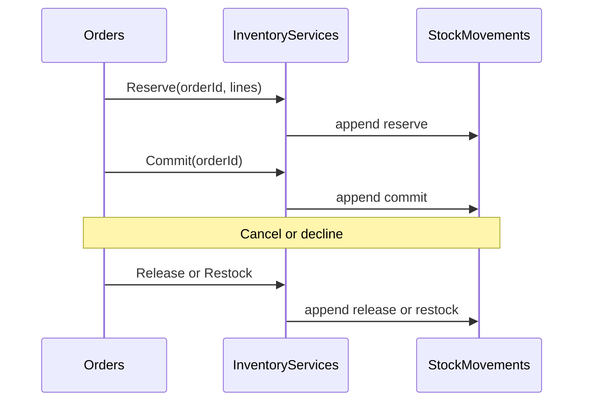

# 34 — Inventory Module

| Field | Value |
| --- | --- |
| Document | Inventory Module — Platform blueprint instance |
| Product | Clinexa |
| Version | 1.0 |
| Status | In delivery (P12 implementation) |
| Audience | Architects, backend, frontend, QA, product, operations, security |
| Source of truth | [00 — Product Requirements Document](00-product-requirements-document.md) |
| Related docs | [03](03-functional-requirements.md), [05](05-system-architecture.md), [08](08-role-permissions.md), [10](10-database-design.md), [11](11-api-design.md), [18](18-crm.md), [25](25-guardian.md), [26](26-implementation-tracker.md), [27](27-module-registry.md), [28](28-ownership-matrix.md), [29](29-navigation-blueprint.md), [31](31-products-module.md) |

This document is the durable **Module Blueprint** instance for Inventory (`GRD-033`, `CRM-037` consume-only). It follows [27 §6](27-module-registry.md#6-module-blueprint).

> Delivery phase: **P12 — Inventory Platform Module** ([26](26-implementation-tracker.md)). Documentation on `feature/inventory-platform-blueprint-refinement`. **No application code in this pass.**

> **Supersession.** This blueprint replaces the prior CRM-ops / Guardian-policy-only split. Guardian is the only Inventory Administration surface. CRM is not an Inventory Management System. Legacy `/crm/inventory` adjust endpoints (`API-105`–`109` as previously specified) are superseded by `/admin/inventory…` admin APIs and domain reservation services.

---

## 1. Purpose

Inventory is the **authoritative stock and reservation platform module**. It owns warehouses, stock truth (as an append-only ledger), reservations, availability, receiving, adjustments, policies, and inventory observability so Orders, CRM, Products, Store, Portal, and workers consume one truth through Inventory services.

**Requirements:** `FR-INV-001`–`005`, `OR-12`, `AC-BR-03`, `ARCH-064`, `ROAD-014`; fulfillment coupling `FR-ORD-003`, restock `FR-INV-005` / `OR-11`.

**Not its job:** Product catalog identity or pricing; Order lifecycle state machine; Store/Portal UX; Notifications delivery content; Payment capture; clinical gates; Supplier/PO/manufacturing execution (future extension points only).

### 1.1 Ledger invariant (source of truth)

Inventory is designed as an **append-only ledger**.

| Rule | Statement |
| --- | --- |
| **SoT** | **Stock Movements** are the source of truth for quantity history |
| **Projection** | **Inventory Balances** are a derived/materialized projection for practical reads — not independently authoritative |
| **Write path** | Every stock-affecting operation **must** append a movement: Adjust, Receive, Reserve, Release, Commit, Restock (and future Transfer, Cycle Count, etc.) |
| **Forbidden** | Domains must not treat “update `quantity_on_hand`” as the primary write path |
| **Rebuild** | Balance rows may be rebuilt from the movement ledger if a projection is corrupted |

### 1.2 Owns vs does not own

| Owns | Does not own |
| --- | --- |
| Warehouses (V1: single default; schema multi-ready) | Product catalog, variants, prices, identity |
| Stock movements (ledger SoT) | Order status transitions |
| Balance projections (`on_hand`, `reserved`) | Direct CRM stock administration UI |
| Reservations (pending / committed / released / expired) | Notification templates and dispatch |
| Availability computation | Store merchandising UX |
| Receiving, adjustments (Guardian) | Clinical approval / pharmacy review |
| Platform-wide inventory policies | Payment / refund money movement (Orders/Payments own money; Inventory owns restock ledger side) |
| Low-stock **domain events** (emit only) | How consumers react to low-stock |
| Inventory History / Activity (entity UX) | Platform Audit Log (`GRD-053`) |

### 1.3 Products vs Inventory

| Owns | Products | Inventory |
| --- | --- | --- |
| Catalog, variants, pricing, identity, Rx, SEO, lifecycle | **Yes** | No |
| Stock, reservations, availability, movements, warehouses | No | **Yes** |
| Read-only stock summary on product record | May **display** via Inventory services | Source of truth |
| Product-module writes to inventory tables | **Never** | Only Inventory services write |

Products **consume Inventory only through Inventory services** (e.g. availability summary). Product types that disable tracking (§15) receive a no-op / “not tracked” response.

### 1.4 Orders vs Inventory

**Strict rule: Orders never update stock.** Orders only call Inventory services:

| Service | When (examples) |
| --- | --- |
| `Reserve()` | **V1 primary:** on successful payment authorization when order leaves `payment_pending` ([35 §10](35-orders-module.md)) |
| `Release()` | Cancel, clinical decline, reservation expiry, pre-fulfill refund |
| `Commit()` | Successful fulfillment |
| `Restock()` | Refund/cancel when unfulfilled/returned stock rules apply (`FR-INV-005`) |

Orders **never** write inventory tables or repositories directly. Same-transaction coupling with order transitions is orchestration through Inventory APIs/services, not Orders owning the ledger ([10 §10.6](10-database-design.md)).



### 1.5 Guardian vs CRM

| Concern | Guardian | CRM |
| --- | --- | --- |
| Inventory Administration | **Owns** (sole surface) | **Never** |
| Warehouses / locations / policies | Yes | No |
| Adjust / receive / transfer / cycle count / reconcile | Yes | No |
| View availability / reserved / summaries | Yes | Yes (consume) |
| Reserve / Release / Commit via Inventory services | Via admin tools if needed | Yes (order workflows) |
| Order-relevant movement history | Yes | Yes (scoped) |
| Class D inventory ops | Yes | No |
| Low-stock reaction UI | May subscribe | May observe signals; Inventory only emits |

CRM is **not** an Inventory Management System. Escalation to Guardian Inventory when admin work is required (`NAV-105`).

### 1.6 Store / Portal vs Inventory

Store and Portal may consume availability for purchase UX and may later react to low-stock events. They never mutate inventory truth (`STORE-017`).

---

## 2. Owner, context, consumers

| Field | Value |
| --- | --- |
| Owner | Backend Platform Module (`ARCH-160`/`161`) |
| Application context | **Guardian** for administration |
| Consumers | `GRD` (admin); `CRM` (consume + order service calls); `SYS` (reserve/commit/expiry/low-stock emit); later `STO` / `PRT` (availability); later `MOB` / `API` |
| CRM rule | View and service-driven Reserve/Release/Commit only — never warehouse/adjust/receive/policy/Class D |

---

## 3. Navigation (Guardian Commerce)

```text
Commerce
├── Products
├── Categories
├── Inventory          ← this module
│   ├── Dashboard
│   ├── Stock
│   ├── Warehouses
│   ├── Adjustments
│   ├── Receiving
│   ├── Movements
│   └── Policies
├── Orders (admin)
└── Subscriptions (admin)
```

**V1 routes:**

```text
/guardian/inventory
/guardian/inventory/stock
/guardian/inventory/stock/:variantId
/guardian/inventory/stock/:variantId/history
/guardian/inventory/stock/:variantId/activity
/guardian/inventory/warehouses
/guardian/inventory/warehouses/:id
/guardian/inventory/receiving
/guardian/inventory/movements
/guardian/inventory/policies
```

**CRM:** no Inventory administration navigation. Availability widgets and order-scoped movement snippets live inside Orders/fulfillment screens. Escalation link to `/guardian/inventory` when the principal holds Guardian INV grants.

**Deferred pages** (reserved; no empty nav chrome required): Transfers, Cycle Counts, Inventory Audits, Locations hierarchy UI, Batch/Lot, Expiry, Suppliers, Purchase Orders, Multi-warehouse transfers.

---

## 4. Pages (V1)

| Page | Route | Permission |
| --- | --- | --- |
| Inventory dashboard | `/guardian/inventory` | `PERM-INV-001` |
| Stock list | `/guardian/inventory/stock` | `PERM-INV-001` |
| Stock detail | `/guardian/inventory/stock/:variantId` | `PERM-INV-001` |
| Adjust | action / sheet on stock | `PERM-INV-004` |
| Receiving | `/guardian/inventory/receiving` | `PERM-INV-004` |
| Warehouses | `/guardian/inventory/warehouses` | `PERM-INV-005` |
| Warehouse detail | `/guardian/inventory/warehouses/:id` | `PERM-INV-005` |
| Movements ledger | `/guardian/inventory/movements` | `PERM-INV-001` |
| Policies | `/guardian/inventory/policies` | `PERM-INV-005` |
| History | under stock / warehouse record | `PERM-INV-001` |
| Activity | under stock / warehouse record | `PERM-INV-001` |
| Class D purge / bulk cleanup | action | `PERM-INV-010` |

**List UX (V1):** balance projection columns (on hand, reserved, available), warehouse (default), low-stock indicator, updated time; filters applied on Filter/Search with URL persistence (same Guardian list contract as Products).

---

## 5. Permissions

| Code | Meaning | Typical holders | Surface |
| --- | --- | --- | --- |
| `PERM-INV-001` | View stock / availability / movements (read) | Ops, Pharmacist (coord), Admin | Guardian + CRM consume |
| `PERM-INV-002` | Reserve / release / commit (service ops) | Ops, System, Admin scoped | Orders/CRM/SYS — **not** adjust |
| `PERM-INV-003` | Subscribe / receive low-stock **signals** (consumer-side) | Ops | Consumer modules; Inventory only emits |
| `PERM-INV-004` | Adjust / receive (Guardian admin ledger writes) | Ops with Guardian access, Admin | **Guardian only** |
| `PERM-INV-005` | Manage warehouses / locations / **policies** | Admin (+ Ops if granted) | **Guardian only** |
| `PERM-INV-010` | Class D archive / purge / bulk cleanup | Super Admin / Admin Class D | **Guardian only** |

Class D is never implied by manage or by `PERM-INV-002`. CRM must not receive `PERM-INV-004`, `005`, or `010`.

> **Permission rewrite.** Legacy `PERM-INV-002` “Adjust/reserve/decrement” is split: service ops stay on `002`; admin adjust/receive move to `004`.

---

## 6. History, Activity, Audit

| Concept | Responsibility | Not |
| --- | --- | --- |
| **Inventory History** | Field/state / projection diffs for one stock or warehouse record (what changed) | Not the full movement ledger dump by default; not platform Audit Log |
| **Inventory Activity** | User/system interactions on that record (view, open receiving, admin adjust action) | Not Class D platform audit; not movement SoT |
| **Audit Log** (`GRD-053`) | Platform-wide privileged / Class D actions | Not duplicated as an Inventory tab that reimplements Audit |
| **Stock Movements** | Append-only **ledger SoT** for quantity truth | Not the same as History/Activity UX tabs |

History and Activity are UX/observability projections. They must not compete with Stock Movements as quantity truth.

---

## 7. Database models

### 7.1 Ledger and projection

#### DB-043 StockMovements (source of truth)

| Field | Detail |
| --- | --- |
| Purpose | Append-only inventory ledger |
| Primary key | `id` |
| Notable columns | `warehouse_id` FK, `product_variant_id` FK, `movement_type` (`reserve` \| `release` \| `commit` \| `restock` \| `adjust` \| `receive` \| …), `quantity_delta`, optional `order_id`, optional `reservation_id`, optional `actor_user_id`, `reason`, `created_at` |
| Business rules | Immutable after insert; every stock-affecting op appends one or more rows; warehouse required |
| Retention | Retain for reports and rebuild |
| Trace | `FR-INV-002`/`005`, `OR-12` |

#### DB-042 InventoryBalances (derived projection)

| Field | Detail |
| --- | --- |
| Purpose | Materialized current stock projection per fulfillable SKU per warehouse |
| Primary key | `id` |
| Relationships | Unique (`warehouse_id`, `product_variant_id`); 1:N movements by those keys |
| Notable columns | `warehouse_id` FK, `product_variant_id` FK, `quantity_on_hand`, `quantity_reserved` |
| Business rules | Updated only as a consequence of appending movements in the same transaction; rebuildable from ledger; oversell/negative rules from policies |
| Retention | Current projection |
| Trace | `FR-INV-001`–`005`, `ARCH-064` |

### 7.2 Warehouses and reservations

#### DB-063 Warehouses

| Field | Detail |
| --- | --- |
| Purpose | Warehouse master; V1 seeds one default |
| Notable columns | `code`, `name`, `status` (`active` \| `inactive`), `is_default`, timestamps |
| Business rules | Exactly one default in V1; cannot delete default while balances exist; Class D archive later |
| Trace | `ROAD-014` multi-WH future |

#### DB-064 StockReservations

| Field | Detail |
| --- | --- |
| Purpose | Reservation header |
| Notable columns | `order_id` (or external ref), `status` (`pending` \| `committed` \| `released` \| `expired`), `expires_at`, timestamps |
| Trace | `FR-INV-002`, `OR-12` |

#### DB-065 StockReservationLines

| Field | Detail |
| --- | --- |
| Purpose | Reservation line quantities |
| Notable columns | `reservation_id` FK, `warehouse_id` FK, `product_variant_id` FK, `quantity` |
| Business rules | Warehouse required on every line (multi-WH ready) |

#### DB-066 InventoryPolicies

| Field | Detail |
| --- | --- |
| Purpose | Platform-wide inventory administrative configuration (or INV-namespaced PlatformSettings keys) |
| Notable columns / keys | Oversell mode, reservation timeout, low-stock threshold, negative stock rules, warehouse defaults, future FEFO/FIFO strategy selector |
| Business rules | Guardian-only mutation (`PERM-INV-005`); not per-order overrides |

### 7.3 Warehouse reference rule

**Every inventory entity carries `warehouse_id` from day one** (balances, movements, reservation lines; future locations/transfers). V1 uses the single default warehouse. Multi-warehouse must not require schema redesign — only new warehouse rows, allocation rules, and UI.

### 7.4 Reserved (not V1 schema commitment)

WarehouseLocations, StockTransfers, TransferLines, CycleCounts, InventoryAudits, Batches/Lots, Expiry, Serials, Suppliers, PurchaseOrders, VendorInventory, MarketplaceInventory, Forecast snapshots, Cold-storage attributes, Controlled-drug flags, Recall records — named only.

---

## 8. Inventory policies

Policies are **platform-wide administrative configuration** only (Guardian). Examples:

| Policy | Purpose |
| --- | --- |
| Oversell policy | Allow / prevent oversell (`FR-INV-003`) |
| Reservation timeout | Expiry for pending reservations |
| Low-stock threshold | Threshold that triggers low-stock **event** emit |
| Negative stock rules | Whether projection may go negative under allow-oversell |
| Warehouse defaults | Default warehouse for V1 operations |
| Future FEFO / FIFO strategy | Selector reserved; not implemented in V1 |

CRM never configures inventory policies.

---

## 9. Services and APIs

Backend module: `inventory` under `apps/api/src/modules/` (name at implementation).

| Service | Responsibility |
| --- | --- |
| InventoryLedgerService | Append-only movement writes; updates balance projection in-transaction |
| InventoryBalanceQueryService | Read projection / rebuild from ledger |
| InventoryReservationService | `Reserve`, `Release`, `Commit`, expire |
| InventoryAdjustmentService | Manual adjust (Guardian) → movement |
| InventoryReceivingService | Inbound receive (Guardian) → movement |
| InventoryRestockService | Restock path for Orders/refunds → movement |
| WarehouseService | Warehouse CRUD (Guardian; V1 seed/default) |
| InventoryPolicyService | Platform-wide policy read/write (Guardian write) |
| InventoryAvailabilityService | Availability for Products/CRM/Store; digital no-track short-circuit |
| InventoryMovementQueryService | Ledger queries; order-scoped history |
| LowStockEventEmitter | Evaluate threshold; **emit** `inventory.low_stock` only |

**Invariant:** Product and Order modules never access inventory repositories. All writes go through ledger-writing services.

### 9.1 Endpoint groups (API-187+)

Admin (Guardian) — supersedes prior CRM adjust catalog:

| ID | Method | Path | Purpose | Perm | Notes |
| --- | --- | --- | --- | --- | --- |
| API-187 | GET | `/admin/inventory/balances` | List balance projections | `PERM-INV-001` | Warehouse filter |
| API-188 | GET | `/admin/inventory/balances/{variantId}` | Balance for SKU (default WH or query) | `PERM-INV-001` | |
| API-189 | POST | `/admin/inventory/adjustments` | Manual adjust | `PERM-INV-004` | Appends movement |
| API-190 | POST | `/admin/inventory/receiving` | Receive inbound | `PERM-INV-004` | Appends movement |
| API-191 | GET | `/admin/inventory/movements` | Ledger query | `PERM-INV-001` | |
| API-192 | GET | `/admin/inventory/warehouses` | List warehouses | `PERM-INV-005` | |
| API-193 | POST | `/admin/inventory/warehouses` | Create warehouse | `PERM-INV-005` | V1 may restrict |
| API-194 | PATCH | `/admin/inventory/warehouses/{id}` | Update warehouse | `PERM-INV-005` | |
| API-195 | GET | `/admin/inventory/policies` | Get policies | `PERM-INV-005` | |
| API-196 | PATCH | `/admin/inventory/policies` | Update policies | `PERM-INV-005` | Audit |
| API-197 | POST | `/admin/inventory/purge` | Bounded Class D cleanup | `PERM-INV-010` | Class D |

Domain (Orders / CRM / SYS) — service ops, not admin UI:

| ID | Method | Path | Purpose | Perm | Notes |
| --- | --- | --- | --- | --- | --- |
| API-198 | POST | `/inventory/reservations` | Reserve | `PERM-INV-002` | Appends reserve movement |
| API-199 | POST | `/inventory/reservations/{id}/release` | Release | `PERM-INV-002` | |
| API-200 | POST | `/inventory/reservations/{id}/commit` | Commit | `PERM-INV-002` | Fulfill path |
| API-201 | POST | `/inventory/restock` | Restock | `PERM-INV-002` | Refund/cancel rules |
| API-202 | GET | `/inventory/availability` | Availability / summary | `PERM-INV-001` | Products/CRM/Store |
| API-203 | GET | `/inventory/movements` | Order-scoped or filtered ledger read | `PERM-INV-001` | CRM consume |

Product read-through remains association-only: `GET /admin/products/{id}/inventory` delegates to `InventoryAvailabilityService`.

**Legacy:** Prior `API-105`–`109` under `/crm/inventory` (list/adjust as CRM admin) are **superseded**. Do not implement CRM adjust routes.

---

## 10. Validation and business rules

| Rule | Detail |
| --- | --- |
| Ledger append | Every mutation path must append movement(s) before/with projection update |
| Warehouse required | Reject writes missing `warehouse_id` |
| Oversell | Enforce `FR-INV-003` / policy; available = f(on_hand, reserved, policy) |
| Concurrent reserve | Transactional; `FOR UPDATE` on `inventory_balances` after upsert-zero row (P13e); safe win/lose under PREVENT |
| Idempotency | Commit/release keyed by reservation/order id; unique nullable `stock_reservations.order_id` (P13e) |
| Digital / non-tracked | No ledger rows; availability returns not-tracked |
| Adjust reason | Required for Guardian adjustments |
| Orders isolation | Reject any Orders/Products path that attempts direct balance UPDATE |

---

## 11. Destructive operations

| Operation | Permission | Confirmation | Audit |
| --- | --- | --- | --- |
| Warehouse archive / deactivate | `PERM-INV-005` / Class D as designed | Yes | Yes |
| Bulk projection cleanup / purge-adjacent | `PERM-INV-010` | Yes; bounded | Yes (`GRD-053`) |

Hard-delete of movement history is not a casual UI action — retention and rebuild policy only. Soft constraints prefer archive over destroy.

---

## 12. Lifecycles

### 12.1 Reservation

```text
Pending → Committed
Pending → Released
Pending → Expired
```

| From | To | Trigger |
| --- | --- | --- |
| — | Pending | `Reserve()` |
| Pending | Committed | `Commit()` on fulfill |
| Pending | Released | `Release()` on cancel/decline |
| Pending | Expired | Worker after reservation timeout policy |

Each transition appends the corresponding movement type.

### 12.2 Warehouse

```text
Active → Inactive
```

Cannot remove the sole default warehouse while balances exist. Multi-WH activation is future.

### 12.3 Balance projection

Always non-negative under prevent-oversell. Under allow-oversell, negative rules follow policy. Projection is never the write SoT.

---

## 13. Low stock (event)

Inventory evaluates thresholds after ledger writes that affect available quantity and **emits** a domain event (e.g. `inventory.low_stock`).

| Rule | Statement |
| --- | --- |
| Inventory owns | Detection + emit |
| Inventory does not own | How consumers react |

**Future consumers (react as designed later):** Guardian, CRM, Notifications, workers, Store, Patient Portal.

---

## 14. Digital and non-tracked product types

Inventory tracking can be **disabled per product type** (Products catalog type / flag):

- Digital products
- Services
- Memberships
- Other non-fulfillable / non-stocked types

No balances, reservations, or movements for those SKUs. Checkout/Orders skip Inventory service calls or receive an explicit no-op. Aligns with FR-INV non-tracked digital edge case and `is_fulfillable`.

---

## 15. Future enhancements (explicitly out of V1)

| Reserve | Notes |
| --- | --- |
| Multi-warehouse / transfers / location hierarchy | Schema ready via `warehouse_id`; UI/rules later |
| Cycle counts / inventory audits | Named only |
| Batch / Lot / Expiry | Named only |
| FEFO / FIFO | Policy selector reserved; algorithms later |
| Serial numbers | Named only |
| Cold storage | Named only |
| Controlled drugs | Named only |
| Recall management | Named only |
| Suppliers / Purchase Orders / Manufacturing | Named only |
| Vendor inventory / Marketplace inventory | Named only |
| Forecasting / AI demand forecasting | Named only |

---

## 16. Performance (future read models)

- Movement ledger remains source of truth.
- V1 already materializes balance projections for reads.
- Additional caching or materialized read summaries (availability lists, product inventory tab, low-stock lists) may be added later.
- **Do not** redesign dual-write or full CQRS in V1 beyond the balance projection.

---

## 17. Dependencies

| Dependency | Why |
| --- | --- |
| Products (P8) | Variant / fulfillable / product-type flags; availability consume |
| Guardian shell (P5) | Admin UI mount |
| RBAC / Class D (P3/P6) | `PERM-INV-*` gates |
| Orders (depth) | Reserve/Release/Commit/Restock callers (P12f) |
| Settings / Audit | Policy storage patterns; Class D audit |
| Notifications (later) | Low-stock event consumer |

---

## 18. Migration strategy

- Greenfield inventory tables with warehouse FK and default warehouse seed
- No WordPress stock import required in V1
- Balance projection seeded empty or from agreed initial receive adjustments (Guardian)
- Rebuild job reserved for projection repair from movements
- Document Management / Asset Library unrelated; no shared tables

---

## 19. Testing

- Authorization positives: Guardian adjust/receive/policy/Class D; CRM view + reserve service denied adjust
- Authorization negatives: CRM denied `PERM-INV-004`/`005`/`010`; missing grants 403
- Ledger: every adjust/receive/reserve/release/commit/restock appends movement; projection matches
- Rebuild: projection rebuild from movements equals live projection
- Orders boundary: no direct inventory table writes from Orders module
- Products boundary: availability only via InventoryAvailabilityService; digital no-track
- Oversell and concurrent reserve races
- Low-stock emit without requiring NTF implementation
- Warehouse required on all writes
- Legacy `/crm/inventory` adjust routes not present

---

## 20. Verification strategy

| Check | Pass criteria |
| --- | --- |
| Docs consistency | Registry, ownership, Guardian, nav, CRM, DB, API, permissions agree with this blueprint |
| Ledger SoT | Spec and future tests treat movements as authoritative |
| Guardian-only admin | No CRM inventory admin nav or adjust API |
| Service-only Orders | Reserve/Release/Commit/Restock documented as sole stock API |

---

## 21. Definition of done

**This documentation pass:** Blueprint complete with refinements (ledger, policies, warehouse FKs, History/Activity/Audit, low-stock events, digital no-track, future extensions, read-model note); tracker P12, registry, ownership, Guardian, nav, CRM, DB, API, permissions, Products/FR/architecture light-touch aligned; no application code; branch `feature/inventory-platform-blueprint-refinement`.

**Later implementation (P12):** Schema + ledger services + admin APIs + Guardian UI + Products/CRM consume + Orders hooks + low-stock emit + verification pack per roadmap.

---

## 22. Implementation roadmap (P12a–P12g)

| Slice | Scope |
| --- | --- |
| **P12a** | Schema: Warehouses + warehouse FKs; Movements (SoT); Balance projection; Reservations |
| **P12b** | Ledger services: adjust, receive, reserve/release/commit/restock; availability; digital no-track |
| **P12c** | Admin APIs `/admin/inventory…` + policies + Class D |
| **P12d** | Guardian UI: dashboard, stock, adjust, receiving, warehouses (lean), policies, history/activity stubs |
| **P12e** | Products summary wire-up; CRM consume widgets (no CRM admin) |
| **P12f** | Orders integration (service-only) + transactional coupling | **Closed by P13e** on `feature/inventory-orchestration` |
| **P12g** | Low-stock event emit; reservation expiry worker; verification; future read-model note only | Not started |

---

## 23. Risks

| Risk | Mitigation |
| --- | --- |
| Treating balance row as SoT in code | LedgerService-only writes; rebuild path; negative tests |
| Docs drift vs legacy CRM inventory admin | Supersession notes in 18/27/28/11; this blueprint |
| Ops expects CRM adjust UI | Guardian Inventory + escalation; Ops Guardian INV grants |
| Premature multi-WH / FEFO / controlled drugs | Named extensions; warehouse FKs ready |
| Orders writing tables | Strict service boundary + tests |
| Low-stock logic duplicated in CRM/NTF | Emit-only; consumers subscribe |
| Dual SoT (History vs Movements) | §6 three concepts + ledger primacy |
| Permission conflation (adjust vs reserve) | Split `PERM-INV-002` vs `004` |

---

## Revision History

| Version | Date | Author | Changes |
| --- | --- | --- | --- |
| 1.0 | 2026-08-03 | Platform Engineering | Initial Inventory Module Blueprint (`GRD-033` / `CRM-037` consume-only): Guardian-only admin; ledger-first SoT; warehouse FKs from day one; platform policies; Orders service-only; History/Activity/Audit split; low-stock events; digital no-track; P12a–g roadmap |
| 1.1 | 2026-08-03 | Platform Engineering | P12 implementation in progress: Prisma `DB-042`/`043`/`063`–`066`, Nest inventory module, Guardian `/guardian/inventory` UI, domain reservation APIs |
| 1.2 | 2026-08-25 | Platform Engineering | P12f closed by P13e: Orders in-txn Reserve/Release/Commit/Restock; unique `order_id` on reservations; `FOR UPDATE` balance locks; P12g still open |
| 1.3 | 2026-08-25 | Platform Engineering | Pointer: subscription renewal `ERR-INV-001` attempt policy is P14f ([36](36-subscriptions-module.md)); Inventory APIs unchanged; P12g expiry worker still open |

*End of 34 — Inventory Module.*
