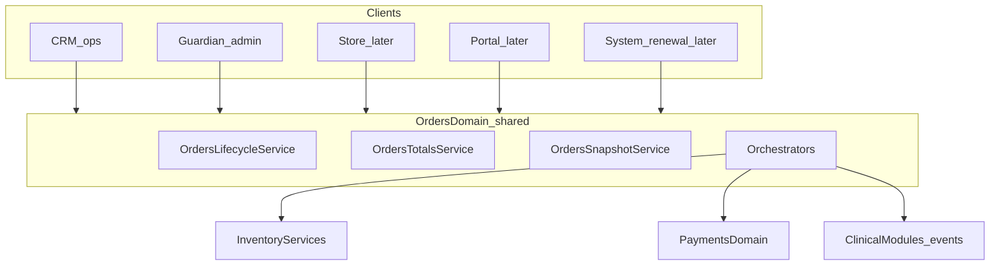
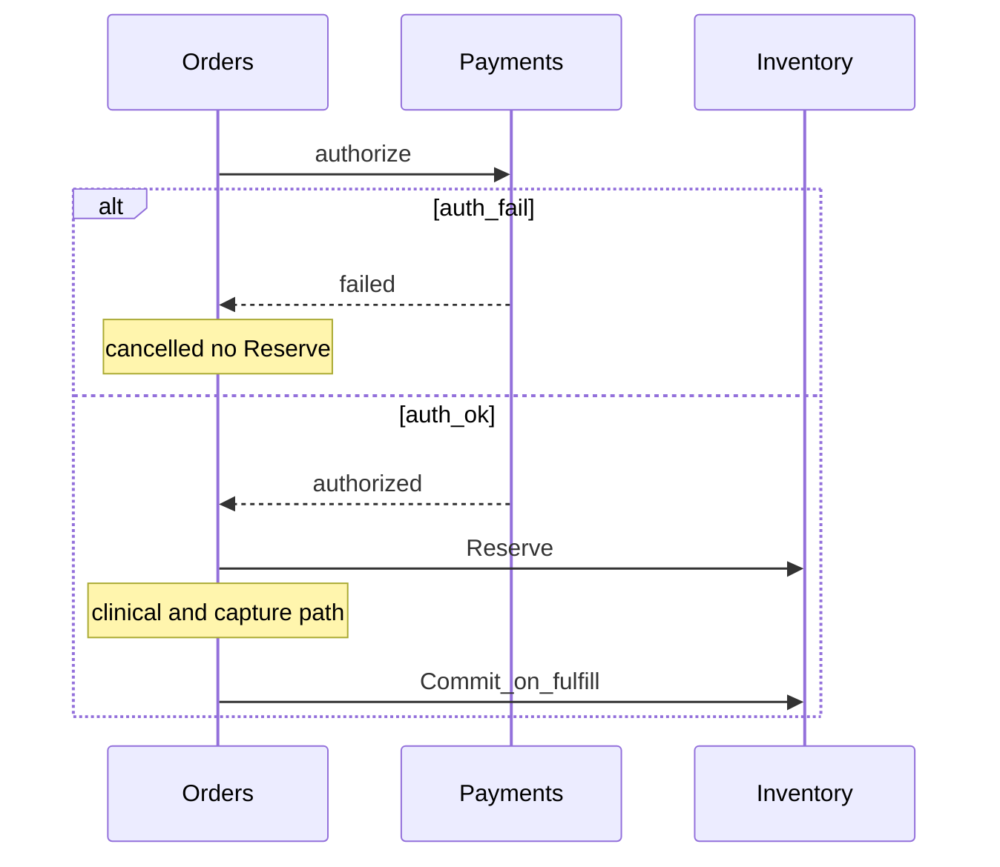

# 35 — Orders Module

| Field | Value |
| --- | --- |
| Document | Orders Module — Platform blueprint instance |
| Product | Clinexa |
| Version | 1.0 |
| Status | In delivery — P13a–P13e complete (CRM + Guardian + Inventory orchestration); P13f partial via P14e; P13g not started |
| Audience | Architects, backend, frontend, QA, product, operations, security |
| Source of truth | [00 — Product Requirements Document](00-product-requirements-document.md) |
| Related docs | [03](03-functional-requirements.md), [08](08-role-permissions.md), [10](10-database-design.md), [11](11-api-design.md), [15](15-payment-flow.md), [18](18-crm.md), [25](25-guardian.md), [26](26-implementation-tracker.md), [27](27-module-registry.md), [28](28-ownership-matrix.md), [29](29-navigation-blueprint.md), [31](31-products-module.md), [32](32-users-module.md), [33](33-asset-library-module.md), [34](34-inventory-module.md), [36](36-subscriptions-module.md) |

This document is the durable **Module Blueprint** instance for Orders (`GRD-034`, `CRM-033`). It follows [27 §6](27-module-registry.md#6-module-blueprint).

> Delivery phase: **P13 — Orders Platform Module** ([26](26-implementation-tracker.md)). Implementation on `feature/orders-platform-blueprint`.

> **Primary SoT.** This blueprint is the detailed source of truth for Orders architecture. Sibling docs ([08](08-role-permissions.md), [10](10-database-design.md), [11](11-api-design.md), [28](28-ownership-matrix.md), [29](29-navigation-blueprint.md)) carry synchronized summaries and pointers here.

---

## 1. Purpose

Orders is the **authoritative commerce order aggregate**. It owns order records, line-item snapshots, server-computed totals, lifecycle state machine, operational notes, entity history/activity, and orchestration to Inventory and Payments so Guardian, CRM, Store, Portal, and System workers share one truth through shared domain services.

**Requirements:** `FR-ORD-001`–`006`, `OR-03`–`05`, `OR-08`, `OR-09`, `OR-11`, `OR-12`; payment timing [15](15-payment-flow.md); inventory coupling [34](34-inventory-module.md).

**Not its job:** Payment authorize/capture/refund execution or PSP secrets; Coupon rule inspection or discount calculation (Orders passes opaque `couponCode` to Promotions only); Inventory ledger writes; Product catalog authorship; User identity store; Clinical authoring (consultations, prescriptions, questionnaire definitions/answers); Subscription renewal logic; Document/file storage; Notification template delivery; Store/Portal UX shells.

### 1.1 Owns vs does not own

| Owns | Does not own |
| --- | --- |
| Order aggregate and status machine | Payment transaction records (`DB-028`/`029`) |
| OrderItems with immutable catalog/price snapshots | Live Product/Variant mutability |
| Customer / shipping / billing **snapshots** | Live User profile / address book SoT |
| Server-computed money totals on the order | PSP communication, payment secrets, and coupon/discount calculation |
| Order notes, history, activity (entity UX) | Platform Audit Log (`GRD-053`) |
| Opaque refs to payment / clinical / questionnaire / subscription / reservation | Clinical approve/decline workflows |
| Orchestration requests to Inventory services | Direct inventory table mutations |
| Administrative Class D order ops (Guardian) | Asset Library / Document binary storage |

### 1.2 Guardian vs CRM

| Concern | Guardian | CRM V1 |
| --- | --- | --- |
| View orders | Yes | Yes (role-scoped) |
| Create orders | **Yes** (admin path) | **No** — no route, permission, UI, or API |
| Edit operational fields | Yes | **Yes** (allowlist only) |
| Edit administrative fields | **Yes** | **No** |
| Fulfill / policy cancel / refund assist | Escalate / admin path | **Yes** where permitted |
| Internal notes / history / activity | Yes | Yes |
| Direct financial totals rewrite | Class D Correct only | **No** |
| Direct inventory table writes | **No** | **No** |
| Clinical approve / decline | **No** | **No** (Consultations) |
| Delete / Archive / Restore | **Yes Class D** | **Never** |
| Financial Correct / Administrative Override | **Yes Class D** | **Never** |

**CRM Order Create is not available in V1.** Future staff-assisted create requires an explicit product decision. Store checkout finalize and System renewal create remain later create paths — not CRM.

### 1.3 One domain, two surfaces

Guardian and CRM are **not** two Order systems. Both consume the same Orders domain services. Controllers and UI action chrome differ by context and permission; lifecycle, totals, snapshots, and orchestration live once in shared domain services.



### 1.4 Store / Portal / System (future consumers)

| Consumer | Role |
| --- | --- |
| Store / FE | Create/finalize orders via checkout APIs; never Order SoT |
| Patient Portal | View own orders/status/history within policy; cancel request where permitted |
| System | Renewal order create; payment/clinical event-driven transitions |

Neither future FE nor Portal becomes an Order source of truth.

---

## 2. Owner, context, consumers

| Field | Value |
| --- | --- |
| Owner | Backend Platform Module (`ARCH-160`/`161`) |
| Application context | **Both** — CRM operational; Guardian administrative + Class D |
| Consumers | `GRD`, `CRM`, later `STO`, `PRT`, `SYS`, `MOB` |
| CRM rule | View, operational edit allowlist, permitted transitions, notes — never Create, Class D, Correct, Override, inventory table writes, or clinical decisions |
| Guardian rule | Admin create/edit, Class D, Correct (via Payments when money), Override; not clinical SoT |

---

## 3. Navigation

### 3.1 CRM

```text
CRM
└── Orders                    ← operational queue
    ├── (list)
    ├── :id                   ← detail (ops actions)
    ├── :id/edit              ← operational fields only
    ├── :id/history
    ├── :id/activity
    └── :id/notes
```

**No** `/crm/orders/new`. Legacy `/orders` → `/crm/orders` ([29](29-navigation-blueprint.md)).

### 3.2 Guardian

```text
Commerce
├── Products
├── Categories
├── Inventory
├── Orders (admin)            ← this module admin
│   ├── (list)
│   ├── new                   ← admin create
│   ├── :id
│   ├── :id/edit
│   ├── :id/history
│   ├── :id/activity
│   └── :id/notes
└── Subscriptions (admin)
```

Escalation from CRM: `/guardian/orders/:id` when Class D/admin work is required (`NAV-105`).

---

## 4. Pages (V1)

| Page | CRM route | Guardian route | Permission |
| --- | --- | --- | --- |
| Orders list | `/crm/orders` | `/guardian/orders` | `PERM-ORD-001` |
| Order detail | `/crm/orders/:id` | `/guardian/orders/:id` | `PERM-ORD-001` |
| Create | — | `/guardian/orders/new` | `PERM-ORD-004` |
| Edit | `/crm/orders/:id/edit` (ops fields) | `/guardian/orders/:id/edit` | `PERM-ORD-005` |
| History | `/crm/orders/:id/history` | `/guardian/orders/:id/history` | `PERM-ORD-001` |
| Activity | `/crm/orders/:id/activity` | `/guardian/orders/:id/activity` | `PERM-ORD-001` |
| Notes | `/crm/orders/:id/notes` | `/guardian/orders/:id/notes` | `PERM-ORD-001` (+ edit note with `005` or note write rule) |
| Fulfill / cancel | actions on CRM detail | view / escalate | `PERM-ORD-003` / `002` |
| Class D delete/archive/restore | — | actions on Guardian detail | `PERM-ORD-010`–`012` |
| Financial Correct | — | Guardian action | `PERM-ORD-013` |
| Administrative Override | — | Guardian action | `PERM-ORD-014` |

### 4.1 Detail surface differences (same Order)

| CRM Order Detail | Guardian Order Detail |
| --- | --- |
| Operational status and workflow | Administrative controls |
| Fulfill / policy cancel / refund assist | Class D, Correct, Override |
| Customer + order snapshots (read) | Broader admin metadata |
| Notes, history, activity | Notes, history, activity + deeper audit links |
| Clinical / inventory **read** refs | Same reads + admin tools |
| Escalation link to Guardian when permitted | Full admin chrome |

Shared presentational components are encouraged. Do not fork two Order domains.

### 4.2 Page ownership vs other modules

| Concern | Orders module? | Owner if not |
| --- | --- | --- |
| Index / detail / edit / notes / history / activity | Yes | — |
| Admin create | Yes (Guardian only) | — |
| Payment execution UI | No | Payments |
| Clinical approve/decline UI | No | Consultations |
| Questionnaire authoring | No | Questionnaires |
| Inventory adjust/receive | No | Inventory Guardian |
| Invoices / packing slips binaries | No | Future Document Management |

---

## 5. Permissions

| Code | Meaning | CRM | Guardian | Typical holders |
| --- | --- | --- | --- | --- |
| `PERM-ORD-001` | View orders | Yes | Yes | Patient (own); Doctor, Pharmacist, Support, Ops, Admin (scoped) |
| `PERM-ORD-002` | Policy cancel | Yes | Yes | Support, Ops, Admin scoped; Patient own scoped |
| `PERM-ORD-003` | Fulfill / ship | Yes | Scoped | Operations |
| `PERM-ORD-004` | **Admin Create** | **Never granted** | Yes | Admin |
| `PERM-ORD-005` | Edit (context field allowlist) | Ops fields only | Admin + ops fields | Ops, Support (ops); Admin (admin) |
| `PERM-ORD-010` | Soft-delete (Class D) | **Never** | Yes | Admin as granted, Super Admin |
| `PERM-ORD-011` | Archive (Class D) | **Never** | Yes | Admin as granted, Super Admin |
| `PERM-ORD-012` | Restore (Class D) | **Never** | Yes | Admin as granted, Super Admin |
| `PERM-ORD-013` | Financial correction (Class D) | **Never** | Yes | Admin as granted, Super Admin |
| `PERM-ORD-014` | Administrative override (Class D) | **Never** | Yes | Super Administrator |

Policy refund **assist** remains `PERM-PAY-003` (not ORD). History/Activity/Notes view use `PERM-ORD-001`. Marketing/Content default deny staff order lists (existing SoD).

`PERM-ORD-005` is **not** unlimited edit: the server enforces CRM vs Guardian field allowlists (§7).

---

## 6. History, Activity, Notes, Audit

| Concept | Purpose | Must not |
| --- | --- | --- |
| **Order History** | State transitions and field-change diffs for one order | Store free-text note bodies |
| **Order Activity** | Operational workflow events and staff actions | Duplicate full note text or Class D payloads |
| **Order Notes** | Human-authored internal notes | Serve as compliance audit SoT |
| **Platform Audit** (`GRD-053`) | Security-sensitive / Class D / compliance events | Duplicate routine field history |

Activity may emit a lightweight `note_added` event referencing note id without copying note text. Class D always writes Platform Audit.

---

## 7. Editability matrix

### 7.1 Field classes

| Class | Meaning | Who may change |
| --- | --- | --- |
| **Immutable historical** | Locked after write for historical correctness | Not via normal edit; Correct/Override only where explicitly allowed and audited |
| **System-owned** | Server-computed or transition-driven | Lifecycle / totals / payment-reaction services |
| **CRM-operational** | Day-to-day ops | CRM + Guardian with `PERM-ORD-005` ops scope |
| **Guardian-administrative** | Platform admin metadata | Guardian with `PERM-ORD-005` admin scope |
| **Class D Correct / Override** | Controlled rewrite / forced transition | Guardian Class D only — **not** normal editing |

### 7.2 Immutable / never free-edit (examples)

- Order `id`, display order number
- OrderItem snapshots: product ID, variant ID, name, SKU, product type, unit price, sale price, Rx/catalog snapshot metadata
- Captured payment amount summaries (money SoT in Payments; order money fields immutable after capture except Correct + Payment refund reactions)
- Completed `OrderStatusHistory` rows; Platform Audit rows
- `subscriptionId` / `orderType` after create (set at create by system/admin path; no CRM rewrite)

### 7.3 Concrete field allowlists (V1 proposal)

| Field / group | Class | CRM | Guardian normal edit |
| --- | --- | --- | --- |
| `status` | System-owned | Via Transition endpoints only | Via Transition; Override = Class D |
| Money totals (subtotal, discount, shipping, tax, total) | System-owned | No | No (Correct = Class D) |
| Line qty / prices / snapshots | Immutable after finalize | No | No (Correct path only if ever justified) |
| Customer snapshot (name, email, phone) | Immutable after finalize | No | Admin Correct path only if justified |
| Shipping / billing address snapshots | Immutable after finalize; limited ops assist pre-ship | Limited shipping contact assist if policy allows before ship | Admin metadata / Correct if justified |
| `trackingNumber`, carrier, shippedAt | CRM-operational | Yes in `awaiting_fulfillment` / fulfill flow | Yes |
| Internal ops flags / fulfillment notes flags | CRM-operational | Yes while non-terminal | Yes |
| Admin internal tags / reconciliation flags | Guardian-administrative | No | Yes |
| Payment ref / payment status summary | System-owned (from Payments events) | No | No |
| Clinical / questionnaire / prescription refs | System-owned (from clinical events) | No | No |
| `subscriptionId`, `orderType` | System-owned at create | No | No after create |
| Soft-delete / archive flags | Class D | No | Class D only |

Product may refine CRM-operational field names at UI build (`OD-ORD-04`); classes and Deny rules stay locked.

### 7.4 Lifecycle × editability

| Phase | CRM-operational | Guardian-admin | Financial Correct |
| --- | --- | --- | --- |
| `draft` (admin path) | N/A (CRM no create) | Create/edit draft lines, addresses, patient link; server totals | N/A |
| After auth (`awaiting_clinical_review` / non-Rx `awaiting_fulfillment`) | Notes; limited shipping contact assist; **no** line price/qty rewrite | Limited admin metadata; **no** silent money rewrite | Class D only |
| During clinical review | Notes; view clinical refs; **no** clinical decision fields | Same + escalate | Class D only |
| After clinical approval → capture | Notes; ops prep metadata | Admin metadata | Class D only |
| `awaiting_fulfillment` | Fulfill; tracking/shipment fields; notes; cancel if permitted | Admin metadata; Override = Class D | Class D only |
| After `fulfilled` | Notes; post-fulfill refund **assist** (Payments) | Admin; Correct/Override Class D | Class D + Payments |
| After `cancelled` / `refunded` | Notes only (read-mostly) | Admin metadata; Correct if needed | Class D + Payments |

---

## 8. Database models (Orders-owned)

Aligns with [10](10-database-design.md) `DB-026`/`027` and extends precision for implementation (P13a).

### 8.1 Order (`DB-026`)

| Area | Logical fields |
| --- | --- |
| Identity | `id` (UUID), unique `orderNumber`, `createdAt`, `updatedAt` |
| Patient | `patientUserId` FK → `users.id` (`onDelete: Restrict`) |
| Lifecycle | `status` (`OrderStatus` enum — OR-08) |
| Order type | `orderType` (`ONE_TIME` \| `SUBSCRIPTION_INITIAL` \| `SUBSCRIPTION_RENEWAL`), nullable opaque `subscriptionId` |
| Money (server-computed, **cents** — catalog convention) | `subtotalCents`, `discountTotalCents`, `shippingTotalCents`, `taxTotalCents`, `totalCents`, `adjustmentTotalCents`, `refundedTotalCents`, `currency` |
| Customer snapshot | `customerFirstName`, `customerLastName`, `customerEmail`, `customerPhone` |
| Addresses | Related `OrderAddress` rows (`SHIPPING` / `BILLING`) — not live User addresses |
| Payment refs | Opaque `paymentIntentId`, `latestPaymentId`, `paymentStatusSummary` (no Payment table) |
| Inventory refs | Opaque `reservationId` (no FK to `StockReservation`) |
| Clinical refs | Opaque `consultationId`, `prescriptionId`, `questionnaireResponseId`, `questionnaireVersionId` |
| Flags | `requiresClinicalReview`, `isRxOrder` |
| Ops / admin | `trackingNumber`, `carrier`, `shippedAt`, `adminTags`, `reconciliationFlags` |
| Class D | `deletedAt`, `archivedAt` |

**Prisma (P13a):** models live in `apps/api/prisma/schema.prisma`; migration `20260820120000_orders_platform_module_foundation`.

**Do not** create Payment, Refund, Prescription, Questionnaire, Subscription, or Document binary tables in the Orders module.

### 8.2 OrderItem (`DB-027`)

Immutable snapshots at finalize (minimum):

- `productId`, `variantId` (FKs with `onDelete: Restrict`)
- `productName`, `sku`, `productType` (string snapshot), `isRxEligible`, optional `catalogMetadata` JSON
- `quantity`
- `unitPriceCents`, `salePriceCents`, `taxCents`, `discountCents`
- `lineSubtotalCents`, `lineTotalCents`
- Optional `fulfillmentMetadata` JSON (not Inventory SoT)

Historical order rendering **must not** depend on live Product rows.

### 8.3 Supporting entities (Orders-owned)

| Entity | Purpose |
| --- | --- |
| `OrderStatusHistory` | Append-only status transitions (`fromStatus`, `toStatus`, `actorUserId`, `source`, `reason`, `metadata`) |
| `OrderActivity` | Operational interaction events (`kind`, `summary`, `metadata`) |
| `OrderNote` | Human-authored internal notes (`authorUserId`, `body`) |
| `OrderAdjustment` | Administrative/financial adjustments (`OrderAdjustmentKind`, signed `amountCents`, distinct from Payment refunds) |
| `OrderAddress` | Shipping + billing historical snapshots (`OrderAddressKind`, unique per order+kind) |

### 8.4 References only

Payments (`DB-028`/`029`) owned by Payments module when built. Inventory reservations already key optional `orderId`. Future Document Management may receive opaque document refs — **not** V1 schema commitment; not Asset Library.

---

## 9. Lifecycle

### 9.1 Canonical statuses (OR-08)

| Status | Meaning |
| --- | --- |
| `draft` | Not finalized |
| `payment_pending` | Awaiting PSP confirmation |
| `awaiting_clinical_review` | Authorized; doctor review (Rx) |
| `clinical_approved` | Doctor approved |
| `clinical_declined` | Doctor declined |
| `awaiting_fulfillment` | Cleared for ops/pharmacy fulfillment |
| `fulfilled` | Shipped/dispensed/complete |
| `cancelled` | Cancelled before fulfillment (or fail-safe abort) |
| `refunded` | Refund outcome recorded |

Non-Rx: after payment success → `awaiting_fulfillment` (OR-09). Terminal: `fulfilled` | `cancelled` | `refunded`.

Merchant timing ([15](15-payment-flow.md)): **Authorize → Clinical → Capture → Fulfill**. Payment success ≠ dispensing (`OR-03`).

### 9.2 Allowed / forbidden transitions

Authoritative tables remain in [10 §15.1](10-database-design.md#151-order-state-machine-db-026) and [03 §6.1](03-functional-requirements.md). Domain services enforce them. Forbidden examples: `draft`→`fulfilled`; `awaiting_clinical_review`→`awaiting_fulfillment` without doctor approve; `clinical_declined`→`fulfilled`; re-entry to `draft`.

### 9.3 Clinical boundary

Orders **react** to clinical module outcomes (approve/decline/pharmacy ready). Orders must **not**:

- Treat order status as clinical status SoT
- Approve/decline prescriptions
- Mutate questionnaire responses

**P14g:** Transitions to `CLINICAL_APPROVED` / `CLINICAL_DECLINED` via `transitionOrder` require `source === 'clinical'` (Clinical decision path). Guardian/CRM generic Order transitions must not clinical-decide. Class D `overrideOrder` remains available with reason + `PERM-ORD-014` and is unchanged. Opaque clinical refs (`consultationId`, etc.) are attached by the Clinical adapter — Orders stores them only.

---

## 10. Inventory interaction policy (locked V1)

**Primary policy: Reserve on successful payment authorization** — when the order leaves `payment_pending` into `awaiting_clinical_review` (Rx) or the non-Rx fulfillment path after auth success.

Rationale: OR-12; prevent oversell; clinical decline expects Release if reserved; `PAY-009` auth success is first durable commerce commitment. Checkout may soft-read availability without Reserve. Digital/non-tracked SKUs: Inventory **no-op** ([34 §14](34-inventory-module.md)).

Orders **never** update balances, insert movements, or mutate reservation rows — only Inventory service APIs: `Reserve`, `Release`, `Commit`, `Restock`.

| Event | Order effect | Inventory | Payments |
| --- | --- | --- | --- |
| Checkout submit | → `payment_pending` | No Reserve | Intent / authorize (Payments) |
| Authorization fails | → `cancelled` / fail-safe abort | No Reserve | Failed / void |
| Authorization succeeds (Rx) | → `awaiting_clinical_review` | **`Reserve(orderId, lines)`** | Authorized |
| Authorization succeeds (non-Rx) | → `awaiting_fulfillment` (capture-before-fulfill per PAY-013/014) | **`Reserve`** | Capture before fulfill |
| Clinical decline | → `clinical_declined` then `refunded`/`cancelled` | **`Release`** | Void auth or refund captured (`PAY-019`) |
| Clinical approve → pharmacy → fulfillment | → `clinical_approved` → `awaiting_fulfillment` | Reservation remains Pending | **Capture** before fulfill gate |
| Cancel before fulfill | → `cancelled` | **`Release`** | Void or refund per capture state |
| Reservation expiry | Cancel/fail path per policy | Expire → Released; Orders reacts | Money reversal as needed |
| Fulfill success | → `fulfilled` | **`Commit`** | Already captured |
| Fulfill fails (stock/ops) | Stay `awaiting_fulfillment`; no Commit | Reservation stays Pending; block if insufficient | No auto-refund unless cancel |

**Renewal Reserve failure (`ERR-INV-001`):** When Subscriptions renewals leave `payment_pending` and P13e Reserve fails, the Order transition rolls back (status stays `payment_pending`). Subscriptions attempt policy for that stock-out is owned by **P14f** ([36 §13](36-subscriptions-module.md)) — attempt `FAILED`, hold already-captured money, retry Reserve on the same Order. Later fulfill Commit failure remains Orders/ops policy above (no auto-refund unless cancel); it is **not** a P14f renewal-period event.
| Refund pre-fulfill | → `refunded` | **`Release`** if Pending | Payments refund/void |
| Refund post-fulfill | → `refunded` (or keep terminal + payment summary; see OD-ORD-03) | **`Restock`** when return rules apply (`FR-INV-005`) | Payments refund |
| Class D Correct with money | Adjustment on Order | Restock via Inventory only if Correct implies it | **Must call Payments** |



---

## 11. Payment boundary

| Concern | Payments | Orders |
| --- | --- | --- |
| Authorize / capture / refund execution | **Owns** | No |
| PSP communication, secrets, methods | **Owns** | No |
| Payment / Refund transaction records | **Owns** (`DB-028`/`029`) | Opaque refs + status summary |
| Order state reactions to payment events | Emits / confirms | **Orchestrates** status |
| Guardian Correct when money involved | Executes money | Records Correct; **calls Payments** |

Orders MUST NOT execute Stripe/PSP operations or hold payment secrets.

---

## 12. Totals ownership

Server-side only: subtotal, discounts, shipping, tax, total, adjustments, refunded summaries. Clients may propose line inputs; **OrdersTotalsService** recalculates and persists. Frontend is never money SoT. Post-capture immutability except Payment refunds or Guardian Correct (`PERM-ORD-013`).

---

## 13. Services and APIs

### 13.1 Shared domain services

**P13b Nest implementation** (`apps/api/src/modules/orders/`):

| Service | Responsibility |
| --- | --- |
| `OrdersService` | Facade: create, `createOrderFromSnapshots`, transition, field updates, notes, adjustments, Class D primitives; honors `idempotencyKey` replay |
| `OrderLifecycleService` | Legal OR-08 transitions; inventory/payment **hook intents** |
| `OrderTotalsService` | Deterministic integer-cents line/order totals |
| `OrderSnapshotService` | Product/variant + customer + address snapshots |
| `OrderEditPolicyService` | CRM vs Guardian field allowlists by status |
| `OrderSideEffectHooks` | Injectable hooks: **P13f partial** — `onPayment` wired to Nest `PaymentsModule` (capture/void); **P13e** inventory mutations run **in-txn** via `OrderInventoryOrchestrator` (Reserve/Release/Commit/Restock). Optional `onInventory` is observability-only. |

**P13e delivered:** Inventory Reserve/Release/Commit/Restock execution inside `OrdersService.transitionOrder` / reservation-state-gated `overrideOrder` via `OrderInventoryOrchestrator` → Inventory Nest services (same Prisma transaction; `FOR UPDATE` on balances). Digital/non-tracked lines skipped. Unique `StockReservation.orderId`. **P13f partial (via P14e):** snapshot renewal Order create + payment capture/void reactions; Store checkout intents (`API-062`) deferred. Platform Audit writer (`GRD-053`) still deferred — Class D currently records Order History/Activity with `platformAuditDeferred: true`.

**P13c delivered:** `CrmOrdersController` at `/v1/crm/orders` (`API-072`–`076d`) — list/detail/items/notes/history/activity, operational PATCH, cancel, fulfill. Thin controllers call `OrdersService`. CRM UI: `/crm/orders`, `/crm/orders/:id`, `/crm/orders/:id/edit`. **No** CRM create, **no** Class D endpoints.

**P13d delivered:** `AdminOrdersController` at `/v1/admin/orders` (`API-204`–`212`) — list/detail/create/edit, Class D delete/archive/restore, corrections, overrides, notes/history/activity, normal transitions. Guardian UI: `/guardian/orders`, `/new`, `/:id`, `/:id/edit`.

### 13.2 Endpoint families

| Surface | Paths | Scope |
| --- | --- | --- |
| Portal (later) | `API-069`–`071` `/orders…` | Own list/detail/cancel request |
| CRM | `API-072`–`076` `/crm/orders…` + notes/history/activity | List/detail/cancel/fulfill/items; **no create; no Class D** |
| Guardian | `/admin/orders…` | Admin create/edit; Class D delete/archive/restore; Correct; Override |
| Store (later) | Checkout finalize | Create via checkout, not CRM |

### 13.3 Guardian / Class D API catalog (planning IDs)

| ID | Method | Path | Action | Permission |
| --- | --- | --- | --- | --- |
| API-204 | GET | `/admin/orders` | Admin list | `PERM-ORD-001` |
| API-205 | GET | `/admin/orders/{id}` | Admin detail | `PERM-ORD-001` |
| API-206 | POST | `/admin/orders` | Admin create | `PERM-ORD-004` |
| API-207 | PATCH | `/admin/orders/{id}` | Admin edit | `PERM-ORD-005` |
| API-208 | POST | `/admin/orders/{id}/delete` | Soft-delete | `PERM-ORD-010` |
| API-209 | POST | `/admin/orders/{id}/archive` | Archive | `PERM-ORD-011` |
| API-210 | POST | `/admin/orders/{id}/restore` | Restore | `PERM-ORD-012` |
| API-211 | POST | `/admin/orders/{id}/corrections` | Financial correction | `PERM-ORD-013` |
| API-212 | POST | `/admin/orders/{id}/overrides` | Administrative override | `PERM-ORD-014` |

CRM extended (non-duplicative) endpoints for notes/history/activity should reuse shared services (catalog in [11](11-api-design.md) when implemented). Fail-closed 403; Class D audited (`API-020`–`026` patterns).

---

## 14. Destructive operations (Class D)

Class D ≠ normal Order editing.

| Operation | Permission | Confirmation | Audit |
| --- | --- | --- | --- |
| Soft-delete | `PERM-ORD-010` | Yes | Platform Audit |
| Archive | `PERM-ORD-011` | Yes | Platform Audit |
| Restore | `PERM-ORD-012` | Yes | Platform Audit |
| Financial correction | `PERM-ORD-013` | Yes; Payments call when money | Platform Audit |
| Administrative override | `PERM-ORD-014` | Yes; never silent clinical/payment bypass | Platform Audit |

Guardian-only UI and API in V1. Prefer terminal statuses for paid/clinical history; Class D soft-delete/archive for admin retention cases while preserving traceability. No hard-delete of paid clinical orders as normal path.

---

## 15. Subscription relationship

Subscriptions produce Orders. Orders do **not** own renewal, grace, pause, or plan logic. Canonical Subscriptions architecture: [36](36-subscriptions-module.md).

| Concern | Owner |
| --- | --- |
| Recurring commitment, lifecycle, schedule, attempt idempotency | Subscriptions |
| Renewal/initial **transaction** (totals, lines, order lifecycle) | Orders |
| Payments / Inventory / Clinical coordination for that transaction | Orders |
| `subscriptionId` on Order | Set at order create; immutable; FK when Subscriptions tables exist (`onDelete: Restrict`) |
| `orderType` | `ONE_TIME` \| `SUBSCRIPTION_INITIAL` \| `SUBSCRIPTION_RENEWAL` — set at create |

```text
Subscription  →  decides a renewal is due
Subscription  →  requests a renewal Order through the Orders domain
Orders        →  owns the transaction and coordinates Payments / Inventory / Clinical
Subscription  →  records attempt + order + payment-status snapshot
```

Do **not** implement a Renewals module inside Orders. Do **not** duplicate OrderItems or totals onto Subscriptions.

---

## 16. Order documents

Orders does **not** own file storage. Do **not** use Asset Library as an order-document repository ([33 §1.5](33-asset-library-module.md)). Future Document Management may own invoices, packing slips, clinical docs, order packets. Orders may later hold opaque document refs. Not implemented in this phase.

---

## 17. Dependencies

| Dependency | Why |
| --- | --- |
| Products (P8) | Variants, pricing, Rx flags for snapshots |
| Users (P9) | Patient identity FK + snapshot source |
| Inventory (P12) | Reserve/Release/Commit/Restock services (P12f closed by P13e) |
| RBAC / Class D (P3/P6 patterns) | Permission enforcement |
| Payments ([15](15-payment-flow.md)) | Money execution — **P13f partial** via P14e Nest `PaymentsModule` (simulated); Store/Portal intents deferred |
| Clinical / QST / Documents / Notifications / Store / Portal | Later consumers; refs and events only |
| Subscriptions (P14) | Consumes Orders for initial and renewal transactions ([36](36-subscriptions-module.md)) |

---

## 18. Testing and verification

### 18.1 Required matrix (before Complete)

| Area | Cases |
| --- | --- |
| CRM negatives | Cannot create; cannot delete/archive/restore; cannot Class D; cannot financial correction; cannot direct inventory mutation; cannot clinical approve/decline |
| Guardian positives | Admin create/edit; approved Class D; Correct calls Payments when money |
| AuthZ | Unauthorized roles → 403; fail-closed Class D |
| Lifecycle | Legal transitions pass; illegal rejected |
| Snapshots | Historical integrity after Product/User changes |
| Totals | Server recalculation; clients not SoT |
| Inventory | Reserve-at-auth; Release/Commit/Restock per §10; no direct table writes |
| Payments | No PSP from Orders module |
| Clinical | No approve/decline via Orders APIs |
| Subscription | `orderType` / `subscriptionId`; Orders owns the transaction produced by Subscriptions ([36](36-subscriptions-module.md)) |
| Audit | Class D generates Platform Audit |
| History/Activity/Notes | Separation preserved; no unnecessary duplication |

---

## 19. Definition of done (implementation)

- Shared domain services enforce lifecycle, totals, snapshots, allowlists
- CRM and Guardian UIs use one domain with distinct actions
- CRM has no create/Class D surfaces
- Inventory and Payments boundaries held
- Permissions seeded including `PERM-ORD-004`/`005`; CRM never receives `004`/`010`–`014`
- Verification matrix §18 passes
- Docs remain aligned with this blueprint

---

## 20. Implementation roadmap

| Slice | Scope | Status |
| --- | --- | --- |
| **P13a** | Prisma Order, OrderItem, History, Activity, Notes, Adjustments, addresses/snapshots, enums | **Complete** |
| **P13b** | Shared domain: snapshots, totals, lifecycle, edit allowlists, notes/activity/adjustments/Class D primitives | **Complete** |
| **P13c** | CRM operational APIs + UI (`/crm/orders…`; no create; no Class D) | **Complete** |
| **P13d** | Guardian admin APIs + UI + Class D (`/admin/orders…`, `/guardian/orders…`) | **Complete** |
| **P13e** | Inventory orchestration (closes P12f) | **Complete** on `feature/inventory-orchestration` |
| **P13f** | Payment integration hooks (refs + reactions; Payments may still be stub) | **Partial** (via P14e): `createOrderFromSnapshots` + `Order.idempotencyKey`; `onPayment` capture/void; Store intents deferred |
| **P13g** | RBAC seed, verification, documentation freeze | Not started |
| **P15 (adjacent)** | Guardian create-order `couponCode` → Promotions `evaluatePricing` → persist `appliedCouponId` + `pricingSnapshotJson`; Payments charges `order.totalCents` only | **In progress** on `feature/payments-phase2` — see [37](37-promotions-module.md) |

Order rationale: schema → shared logic → CRM ops value → Guardian/Class D → inventory wiring → payment hooks → verification. Do not put CRM create anywhere. Do not put Class D before shared domain.

---

## 21. Risks and open decisions

| ID | Topic | Status |
| --- | --- | --- |
| OD-ORD-01 | Staff-assisted / CRM Order Create | **Deferred** — V1 locked No |
| OD-ORD-02 | Soft-delete/archive retention SLA for paid clinical orders | Terminal-status-first preferred; compliance SLA at implementation |
| OD-ORD-03 | Partial refund labeling (`fulfilled` + payment summary vs dedicated state) | Prefer terminal commerce status + payment/refund refs; confirm with Payments module |
| OD-ORD-04 | Exact CRM-operational field list naming | §7.3 proposal; product may tweak at UI build |

**Not open:** CRM Create; Class D Guardian-only; Reserve-at-authorization; Payment/Inventory/Clinical/Document boundaries; shared domain services.

---

## Revision History

| Version | Date | Author | Notes |
| --- | --- | --- | --- |
| 1.0 | 2026-08-20 | Platform Engineering | Initial Orders blueprint: dual-surface CRM/Guardian, editability matrix, locked Reserve-at-auth, payment/inventory/clinical boundaries, P13 slices; docs-only on `feature/orders-platform-blueprint` |
| 1.1 | 2026-08-20 | Platform Engineering | P13a: Prisma Orders foundation (cents money, `OrderAddress`, enums, migration `20260820120000_orders_platform_module_foundation`) |
| 1.2 | 2026-08-20 | Platform Engineering | P13b: Nest `OrdersModule` domain services (lifecycle, totals, snapshots, edit policy, create/transition/notes/adjustments/Class D primitives); no HTTP controllers |
| 1.3 | 2026-08-24 | Platform Engineering | §15 Subscription relationship (not forward-compat-only); pointer to [36](36-subscriptions-module.md) |
| 1.4 | 2026-08-24 | Platform Engineering | P14e / P13f partial: `createOrderFromSnapshots` + `idempotencyKey`; payment capture/void hooks; inventory still NOOP |
| 1.5 | 2026-08-25 | Platform Engineering | P13e: in-txn `OrderInventoryOrchestrator` Reserve/Release/Commit/Restock; unique `StockReservation.orderId`; Rx renewal retry guard; seed real reservations |
| 1.6 | 2026-08-25 | Platform Engineering | Pointer: renewal Reserve `ERR-INV-001` attempt policy is P14f; later fulfill Commit failure still no auto-refund |
| 1.7 | 2026-08-25 | Platform Engineering | P14g: clinical transitions require `source=clinical`; Class D override unchanged; opaque clinical refs via Clinical adapter |
| 1.8 | 2026-08-26 | Platform Engineering | P15: create-order coupon boundary (`couponCode` only); persist pricing snapshot; Promotions owns validation/pricing ([37](37-promotions-module.md)) |
