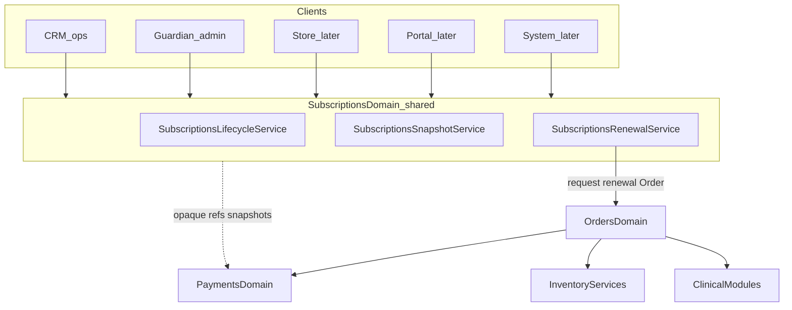

# 36 — Subscriptions Module

| Field | Value |
| --- | --- |
| Document | Subscriptions Module — Platform blueprint instance |
| Product | Clinexa |
| Version | 1.0 |
| Status | **P14 Complete** — P14a–h complete |
| Audience | Architects, backend, frontend, QA, product, operations, security |
| Source of truth | [00 — Product Requirements Document](00-product-requirements-document.md) |
| Related docs | [03](03-functional-requirements.md), [08](08-role-permissions.md), [10](10-database-design.md), [11](11-api-design.md), [15](15-payment-flow.md), [18](18-crm.md), [25](25-guardian.md), [26](26-implementation-tracker.md), [27](27-module-registry.md), [28](28-ownership-matrix.md), [29](29-navigation-blueprint.md), [31](31-products-module.md), [32](32-users-module.md), [33](33-asset-library-module.md), [34](34-inventory-module.md), [35](35-orders-module.md) |

This document is the durable **Module Blueprint** instance for Subscriptions (`GRD-035`, `CRM-042`). It follows [27 §6](27-module-registry.md#6-module-blueprint).

> Delivery phase: **P14 — Subscriptions Platform Module** ([26](26-implementation-tracker.md)). **P14 Complete (P14a–h).** **P13e** wires Inventory through Orders; **P14f** owns renewal stock-out attempt policy; **P14g** owns clinical refs/events (approve/decline) — **not** questionnaire/clinical authoring. **P14h** verified RBAC seed/guards, §20 regression, and documentation freeze. **Deferred:** Store/Portal, Stripe/real PSP, reassessment cadence evaluation.

> **Primary SoT.** This blueprint is the detailed source of truth for Subscriptions architecture. Sibling docs carry synchronized summaries and pointers here.

---

## 1. Purpose

Subscriptions is the **authoritative platform aggregate for recurring customer commitments and subscription lifecycle state**. It owns subscription identity, billing/renewal schedule, lifecycle standing, pause/resume/cancel, product/customer snapshots required for historical correctness, renewal attempt state, and idempotency so Guardian, CRM, future Store/Portal, and System workers share one truth through shared domain services.

**Requirements:** `FR-SUB-001`–`005`, `OR-10`, `AC-BR-11`, `FR-PAY-004`, `FR-PRT-004`; payment timing [15](15-payment-flow.md); order coupling [35](35-orders-module.md).

**Not its job:** Individual order transactions; Payment authorize/capture/refund execution or PSP secrets; Inventory ledger writes; Product catalog authorship; User identity store; Clinical authoring (consultations, prescriptions, questionnaire definitions/answers); Document/file storage; Notification template delivery; Store/Portal UX shells; platform-wide UI modernization (P10); **Phase 2 coupon application on renewals** (renewal Orders are created from snapshots with no `couponCode`).

There is **no standalone Renewals module**, Renewals database domain, Renewals navigation section, or separate ownership boundary. Renewal orchestration is a **child workflow of Subscriptions**.

### 1.1 Owns vs does not own

| Owns | Does not own |
| --- | --- |
| Subscription aggregate and lifecycle status | Order records, totals, OrderItems, order lifecycle ([35](35-orders-module.md)) |
| SubscriptionPlan configuration (`DB-032`) | Live Product / Variant mutability ([31](31-products-module.md)) |
| Immutable product/variant/price **snapshots** on the subscription | Catalog identity (`productId` / `variantId` remain Product-owned) |
| Customer snapshot required for historical correctness | Live User profile / identity ([32](32-users-module.md)) |
| Renewal schedule (`nextRenewalAt`, period bounds, cycle number) | Payment execution, methods, refunds, PSP secrets ([15](15-payment-flow.md)) |
| `SubscriptionRenewalAttempt` child entity and period idempotency | Inventory balances, reservations, movements ([34](34-inventory-module.md)) |
| Opaque payment / provider / order / clinical **references** and snapshots; clinical **decision events** via Clinical adapter (P14g) | Questionnaire / Consultation / Prescription **authoring** and clinical record SoT |
| Notes, status history, change history, activity | Platform Audit Log (`GRD-053`) |
| Administrative Class D subscription ops (Guardian) | Asset Library / Document binary storage |

### 1.2 Guardian vs CRM

| Concern | Guardian | CRM V1 |
| --- | --- | --- |
| View subscriptions | Yes | Yes (role-scoped) |
| Create subscriptions | **Yes** (admin path) | **No** — no route, permission, UI, or API |
| Edit operational fields | Yes | **Yes** (allowlist only) |
| Edit administrative fields | **Yes** | **No** |
| Pause / resume | Yes | **Yes** (permitted lifecycle) |
| Cancel assistance | Yes | **Yes** (policy; not Class D delete) |
| Renewal / retry assistance | Yes | **Yes** where permitted (`PERM-SUB-003` / `008`) |
| Plan configuration / publish | **Yes** | **No** (view published plan context only) |
| Payment / clinical / inventory **visibility** | Yes | Yes (read refs / status only) |
| Execute payments | **No** | **No** |
| Clinical approve / decline | **No** | **No** (Consultations) |
| Direct inventory table writes | **No** | **No** |
| Internal notes / history / activity | Yes | Yes |
| Delete / Archive / Restore | **Yes Class D** | **Never** |
| Administrative correction / override | **Yes Class D** | **Never** |

**CRM Subscription Create is not available in V1.** Future staff-assisted create requires an explicit product decision. Store checkout (later) and Guardian admin create are the create paths — not CRM.

### 1.3 One domain, two Internal Platform surfaces

Guardian and CRM are **not** two Subscription systems. Both consume the same Subscriptions domain services. Controllers and UI chrome differ by context and permission; lifecycle, snapshots, renewal orchestration, and idempotency live once.

This repository hosts the Internal Platform only: NestJS API, Guardian admin, CRM operational surface. **Do not** add Store or Patient Portal UI here. Those repositories are future consumers.

P14 uses the **current** platform shell and established list/detail/edit patterns (Orders/Users). Full Internal Platform UX modernization is **P10** and is **not** a dependency of Subscriptions.



### 1.4 Order ↔ Subscription boundary (locked)

```text
Subscription  →  decides a renewal is due
Subscription  →  creates/requests a renewal Order through the Orders domain
Orders        →  owns the renewal transaction (totals, lines, order lifecycle)
Orders        →  coordinates Payments / Inventory / Clinical boundaries
Subscription  →  records the resulting attempt, order id, and payment-status snapshot
```

Subscriptions **must not** duplicate Order totals, OrderItems, inventory state, payment execution, refunds, or clinical authoring.

### 1.5 Store / Portal / System (future consumers)

| Consumer | Role |
| --- | --- |
| Store / FE (separate repo) | Subscribe during checkout; later manage preferences / cancel via platform APIs |
| Patient Portal (separate repo) | View own subscriptions/status/history; manage allowed actions; update payment method via Payments |
| System | Due detection and renewal processing via Internal worker (`POST /v1/internal/jobs/subscription-renewals`); optional local cron when `RENEWAL_CRON_ENABLED=true` |

Neither Store nor Portal becomes a Subscription source of truth.

---

## 2. Owner, context, consumers

| Field | Value |
| --- | --- |
| Owner | Backend Platform Module (`ARCH-160`/`161`) |
| Application context | **Both** — CRM operational; Guardian administrative + Class D + plans |
| Consumers | `GRD`, `CRM`, later `STO`, `PRT`, `SYS`, `MOB` |
| CRM rule | View, operational edit allowlist, pause/resume, policy cancel assist, renewal assist, notes — never Create, Class D, payment execution, clinical decisions, or inventory table writes |
| Guardian rule | Admin create/edit, plans, Class D, correction, override; not clinical SoT; not Payments execution |

---

## 3. Navigation

### 3.1 CRM

```text
CRM
└── Subscriptions              ← operational queue
    ├── (list)
    ├── :id                    ← detail (ops actions)
    ├── :id/edit               ← operational fields only
    ├── :id/history
    ├── :id/activity
    └── :id/notes
```

**No** `/crm/subscriptions/new`. **No** Renewals nav section.

### 3.2 Guardian

```text
Commerce
├── Products
├── Categories
├── Inventory
├── Orders (admin)
└── Subscriptions (admin)      ← this module admin
    ├── (list)
    ├── new                    ← admin create
    ├── :id
    ├── :id/edit
    ├── :id/history
    ├── :id/activity
    ├── :id/notes
    └── plans                  ← plan configuration (not a separate module)
        ├── (list)
        ├── new
        └── :id/edit
```

Escalation from CRM: `/guardian/subscriptions/:id` when Class D/admin work is required (`NAV-105`).

---

## 4. Pages (V1)

| Page | CRM route | Guardian route | Permission |
| --- | --- | --- | --- |
| Subscriptions list | `/crm/subscriptions` | `/guardian/subscriptions` | `PERM-SUB-004` (staff); `PERM-SUB-001` (own, Portal later) |
| Subscription detail | `/crm/subscriptions/:id` | `/guardian/subscriptions/:id` | `PERM-SUB-004` / `001` |
| Create | — | `/guardian/subscriptions/new` | `PERM-SUB-005` |
| Edit | `/crm/subscriptions/:id/edit` (ops fields) | `/guardian/subscriptions/:id/edit` | `PERM-SUB-006` |
| History | `/crm/subscriptions/:id/history` | `/guardian/subscriptions/:id/history` | `PERM-SUB-004` |
| Activity | `/crm/subscriptions/:id/activity` | `/guardian/subscriptions/:id/activity` | `PERM-SUB-004` |
| Notes | `/crm/subscriptions/:id/notes` | `/guardian/subscriptions/:id/notes` | `PERM-SUB-004` (+ write with `006`) |
| Pause / resume / cancel | actions on CRM detail | actions on Guardian detail | `PERM-SUB-007` |
| Manual renewal / retry | actions on CRM detail | actions on Guardian detail | `PERM-SUB-008` (`003` for assist-only recovery) |
| Plans list / editor | — | `/guardian/subscriptions/plans…` | `PERM-SUB-002` |
| Class D delete/archive/restore | — | actions on Guardian detail | `PERM-SUB-010`–`012` |
| Administrative correction | — | Guardian action | `PERM-SUB-009` |
| Administrative override | — | Guardian action | `PERM-SUB-014` |

### 4.1 Detail surface differences (same Subscription)

| CRM Subscription Detail | Guardian Subscription Detail |
| --- | --- |
| Operational status, schedule, next renewal | Administrative controls + plan binding |
| Pause / resume / policy cancel / renewal assist | Same + Class D, correction, override |
| Customer + product snapshots (read) | Broader admin metadata |
| Linked orders (read) | Same + admin create path |
| Payment / clinical / inventory **read** refs | Same reads + admin tools |
| Notes, history, activity | Notes, history, activity + deeper audit links |
| Escalation link to Guardian when permitted | Full admin chrome |

Shared presentational components are encouraged. Do not fork two Subscription domains. Do not invent a Renewals mini-app.

### 4.2 Page ownership vs other modules

| Concern | Subscriptions module? | Owner if not |
| --- | --- | --- |
| Index / detail / edit / notes / history / activity | Yes | — |
| Admin create / plans | Yes (Guardian only) | — |
| Renewal attempt list on the subscription | Yes (child of Subscription) | — |
| Payment execution UI | No | Payments |
| Clinical approve/decline UI | No | Consultations |
| Questionnaire authoring | No | Questionnaires |
| Inventory adjust/receive | No | Inventory Guardian |
| Renewal invoices / binaries | No | Future Document Management |
| Store checkout / Portal self-service UI | No | Future separate repositories |

---

## 5. Permissions

| Code | Meaning | CRM | Guardian | Typical holders |
| --- | --- | --- | --- | --- |
| `PERM-SUB-001` | Manage own subscription (view/update/cancel scoped) | Assist scoped | — | Patient; Support assist scoped |
| `PERM-SUB-002` | Configure / publish subscription plans | **No** | Yes | Admin |
| `PERM-SUB-003` | Assist renewal (no gate bypass) | Yes | Scoped | Support |
| `PERM-SUB-004` | Staff view | Yes | Yes | Doctor, Pharmacist, Support, Ops, Admin (scoped) |
| `PERM-SUB-005` | **Admin Create** | **Never granted** | Yes | Admin |
| `PERM-SUB-006` | Edit (context field allowlist) | Ops fields only | Admin + ops fields | Support/Ops (ops); Admin (admin) |
| `PERM-SUB-007` | Lifecycle pause / resume / cancel (staff) | Yes | Yes | Support, Ops, Admin scoped |
| `PERM-SUB-008` | Manual renewal / retry | Yes where granted | Yes | Support (with `003`), Ops, Admin |
| `PERM-SUB-009` | Administrative correction (not a Payment refund) | **Never** | Yes | Admin as granted, Super Admin |
| `PERM-SUB-010` | Soft-delete (Class D) | **Never** | Yes | Admin as granted, Super Admin |
| `PERM-SUB-011` | Archive (Class D) | **Never** | Yes | Admin as granted, Super Admin |
| `PERM-SUB-012` | Restore (Class D) | **Never** | Yes | Admin as granted, Super Admin |
| `PERM-SUB-014` | Administrative override (Class D) | **Never** | Yes | Super Administrator |

`PERM-SUB-013` is **intentionally unused** so it is not confused with Orders financial correction (`PERM-ORD-013`). Money movement remains `PERM-PAY-*`.

Payment method update remains `PERM-PAY-002`. Policy refund assist remains `PERM-PAY-003`. Clinical approve/decline remain `PERM-CRM-002`/`003`. Inventory reserve/commit remain `PERM-INV-002`.

Marketing/Content default deny staff subscription operations (existing SoD). Doctor/Pharmacist hold `PERM-SUB-004` for case-context view only.

---

## 6. History, Activity, Notes, Audit

| Concept | Purpose | Must not |
| --- | --- | --- |
| **Subscription Status History** | Lifecycle transitions (`fromStatus` → `toStatus`) | Store free-text note bodies |
| **Subscription Change History** | Field-change diffs (Products/Users pattern) | Duplicate Class D payloads |
| **Subscription Activity** | Operational workflow events and staff actions | Duplicate full note text |
| **Subscription Notes** | Human-authored internal notes | Serve as compliance audit SoT |
| **Platform Audit** (`GRD-053`) | Security-sensitive / Class D / override events | Duplicate routine field history |

Until `GRD-053` exists, Class D writes Status/Change History and Activity with `platformAuditDeferred: true` (same as Orders today).

Activity may emit a lightweight `note_added` event referencing note id without copying note text.

---

## 7. Editability matrix

### 7.1 Field classes

| Class | Meaning | Who may change |
| --- | --- | --- |
| **Immutable historical** | Locked after write for historical correctness | Not via normal edit; Correction/Override only where explicitly allowed and audited |
| **System-owned** | Server-computed or transition-driven | Lifecycle / renewal / payment-reaction services |
| **CRM-operational** | Day-to-day ops | CRM + Guardian with `PERM-SUB-006` ops scope |
| **Guardian-administrative** | Platform admin metadata | Guardian with `PERM-SUB-006` admin scope |
| **Class D Correct / Override** | Controlled rewrite / forced transition | Guardian Class D only — **not** normal editing |

### 7.2 Immutable / never free-edit

- Subscription `id`
- `patientUserId` after create
- SubscriptionItem snapshots: product/variant identity, name, SKU, product type, unit price, Rx/catalog snapshot metadata
- Captured customer snapshot fields after initial bind (Guardian Correction only if justified)
- `initialOrderId` after set
- Completed Status History / Change History / Platform Audit rows
- `billingPeriodKey` on an existing renewal attempt

### 7.3 Concrete field allowlists (V1)

| Field / group | Class | CRM | Guardian normal edit |
| --- | --- | --- | --- |
| `status` | System-owned | Via lifecycle endpoints only | Via lifecycle; Override = Class D |
| Period fields (`currentPeriodStart/End`, `nextRenewalAt`, `cycleNumber`) | System-owned | No | No (Override = Class D) |
| Item snapshots / prices | Immutable after bind | No | No (Correction only if justified) |
| Customer snapshot | Immutable after bind | No | Correction if justified |
| Shipping preference notes / ops flags | CRM-operational | Yes while non-terminal | Yes |
| Admin tags / reconciliation flags | Guardian-administrative | No | Yes |
| Plan binding after first successful cycle | Immutable / Correction | No | Correction + audit |
| Payment method / provider refs / payment status snapshot | System-owned (from Payments events) | No (patient uses Payments APIs) | No |
| Clinical requirement flag | System-owned (from clinical/order events) | No | No (Override never silent bypass) |
| Soft-delete / archive flags | Class D | No | Class D only |

---

## 8. Database models (Subscriptions-owned)

Aligns with [10](10-database-design.md) `DB-032`–`034` and extends precision for implementation (P14a). Supporting tables are part of the Subscription aggregate — **not** a Renewals domain and **not** new ownership.

### 8.1 SubscriptionPlan (`DB-032`)

Configurable offering: interval, pricing, product/variant bindings, grace days, reassessment cadence, publish state. Guardian-authored (`FR-SUB-001`). Active subscriptions keep the plan FK after archive.

**P14a:** Prisma `SubscriptionPlan` stores interval (`billingInterval` + `intervalCount` / `customIntervalDays`), `priceCents`, JSON `productBindings` (`[{ productId, variantId, quantity }]`), `gracePeriodDays`, `requiresReassessment` / `reassessmentIntervalCycles`, `lifecycleStatus`, Class D `deletedAt` / `archivedAt`. Not a Product table. Product types `SIMPLE_SUBSCRIPTION` / `VARIABLE_SUBSCRIPTION` and `limitSubscription` remain catalog flags on Product; Subscriptions **enforce** `limitSubscription` at bind/create time (P14b).

### 8.2 Subscription (`DB-033`)

| Area | Logical fields |
| --- | --- |
| Identity | `id` (UUID), optional human `subscriptionNumber`, `createdAt`, `updatedAt` |
| Patient | `patientUserId` FK → `users.id` (`onDelete: Restrict`) |
| Plan | `planId` FK → SubscriptionPlan (`onDelete: Restrict`) |
| Lifecycle | `status` (`SubscriptionStatus` — §9) |
| Schedule | `currentPeriodStart`, `currentPeriodEnd`, `nextRenewalAt`, `cycleNumber`, optional `endsAt` (finite term) |
| Pause | `pausedAt`, `statusBeforePause` |
| Snapshots | Customer name/email/phone; items via `SubscriptionItem` |
| Payment refs (opaque) | `paymentMethodId`, `providerCustomerRef`, `providerSubscriptionRef`, `latestPaymentId`, `paymentStatusSummary` |
| Order refs | `initialOrderId`, `latestOrderId` FK → Order (`onDelete: Restrict`); Orders hold `subscriptionId` FK (`OrderSubscription`) |
| Clinical | `clinicalRequirement` (`NONE` \| `REASSESSMENT_REQUIRED` \| `DECLINED_HOLD`) |
| Ops / admin | `adminTags`, `reconciliationFlags` |
| Class D | `deletedAt`, `archivedAt` |

**Do not** create Payment, Refund, Inventory, Product master, User identity, Prescription, Questionnaire, or Order transaction tables in this module.

### 8.3 SubscriptionItem

Immutable product/variant/price snapshots at bind (minimum):

- `productId`, `variantId` (FKs with `onDelete: Restrict`)
- `productName`, `sku`, `productType` (string snapshot), `isRxEligible`, optional `catalogMetadata` JSON
- `quantity`
- `unitPriceCents`, `salePriceCents`, `currency`

Historical subscription rendering **must not** depend on live Product rows. Later catalog edits do not rewrite these snapshots. Renewal Orders copy from **this** snapshot (or an explicit re-price policy — V1 copies the subscription snapshot, not live catalog).

### 8.4 SubscriptionRenewalAttempt (`DB-034`) — child of Subscription

Not a module. Not a nav item. Child workflow/entity.

| Area | Logical fields |
| --- | --- |
| Identity | `id`; `subscriptionId` FK |
| Idempotency | `billingPeriodKey` — unique with `subscriptionId` |
| Status | `PENDING` \| `PROCESSING` \| `SUCCEEDED` \| `FAILED` \| `SKIPPED` \| `CANCELLED` |
| Order | `orderId` (at most one per attempt) |
| Payment snapshot | Opaque `paymentId` / `paymentStatusSummary` |
| Retry | `retryCount`, `lastErrorCode`, `lastErrorAt` |
| Actor / source | `actorUserId`, `source` (`system` \| `crm` \| `guardian` \| `portal`) |

### 8.5 Supporting entities

| Entity | Purpose |
| --- | --- |
| `SubscriptionStatusHistory` | Append-only lifecycle transitions |
| `SubscriptionChangeHistory` | Field diffs |
| `SubscriptionActivity` | Operational interaction events |
| `SubscriptionNote` | Human-authored internal notes |

### 8.6 References only

| Target | How Subscriptions sees it |
| --- | --- |
| Users | `patientUserId` FK + customer snapshot |
| Products / Variants | Item FKs + immutable snapshots |
| Orders | `initialOrderId` / `latestOrderId` / attempt `orderId`; Orders holds `subscriptionId` + `orderType` |
| Payments | Opaque method / provider / payment refs + status snapshot |
| Inventory | **None** — only via Orders |
| Clinical / QST | Opaque requirement flag + order-carried clinical refs |
| Documents | Future opaque refs; **not** Asset Library |

---

## 9. Lifecycle (four dimensions — do not collapse)

Do **not** store payment outcome, renewal processing, or clinical requirement in `Subscription.status`.

### 9.1 Subscription lifecycle status

| Status | Meaning |
| --- | --- |
| `PENDING_SETUP` | Created; initial order/payment/clinical setup not complete |
| `ACTIVE` | In good standing; automatic renewals eligible |
| `PAUSED` | Hold; **must not** automatically generate renewal attempts |
| `PAST_DUE` | Grace after payment failure (`FR-SUB-003`) |
| `CANCELLED` | Future renewals stopped (terminal for this record) |
| `EXPIRED` | Term/end date reached without cancel |
| `COMPLETED` | Finite-cycle plan finished all entitled cycles |

Terminal: `CANCELLED` | `EXPIRED` | `COMPLETED`. Resubscribe is a **new** subscription (`PAY-086`).

**Mapping from prior 03/10 vocab:** `renewing` is **not** a lifecycle status — it is attempt=`PROCESSING`. `reassessment_required` is **not** a lifecycle status — it is `clinicalRequirement`. `cancelled` unchanged. `active` / `past_due` retained.

Pause, pending setup, expired, and completed are **platform extensions** of original `FR-SUB-*` (additive, not silent FR rewrites).

### 9.2 Payment status snapshot

Projected from Payments. Vocabulary matches [15](15-payment-flow.md) / `DB-028`: `pending` | `authorized_or_captured` | `failed` | `refunded`. Subscriptions never execute the payment.

### 9.3 Renewal attempt status

`PENDING` | `PROCESSING` | `SUCCEEDED` | `FAILED` | `SKIPPED` | `CANCELLED` on `DB-034` only.

### 9.4 Clinical requirement

`NONE` | `REASSESSMENT_REQUIRED` | `DECLINED_HOLD` on the subscription as a **flag**. Clinical decisions live on Consultations / the renewal Order. Payment success ≠ dispensing (`OR-03`).

### 9.5 Allowed lifecycle transitions

| From | To | Trigger | Actor | Auto vs manual |
| --- | --- | --- | --- | --- |
| (create) | `PENDING_SETUP` | Admin create or future checkout bind | Guardian / System | Auto on create |
| `PENDING_SETUP` | `ACTIVE` | Initial payment success (and setup complete) | System (Payments → Orders → SUB) | Auto |
| `PENDING_SETUP` | `CANCELLED` | Abort before activation | Patient / CRM assist / Guardian | Manual |
| `ACTIVE` | `PAUSED` | Pause | Patient (later) / CRM / Guardian | Manual |
| `PAST_DUE` | `PAUSED` | Pause during grace | CRM / Guardian | Manual |
| `PAUSED` | `ACTIVE` or `PAST_DUE` | Resume restores `statusBeforePause` | CRM / Guardian / Patient later | Manual |
| `ACTIVE` | `PAST_DUE` | Renewal payment failure | System | Auto |
| `PAST_DUE` | `ACTIVE` | Successful recovery payment | System | Auto |
| `ACTIVE` / `PAST_DUE` / `PAUSED` / `PENDING_SETUP` | `CANCELLED` | Cancel (stops future renewals) | Patient / CRM assist / Guardian | Manual |
| `ACTIVE` | `EXPIRED` | `endsAt` reached | System | Auto |
| `ACTIVE` | `COMPLETED` | Last entitled cycle succeeded | System | Auto |

**Forbidden (non-exhaustive):**

| From | To | Why |
| --- | --- | --- |
| `CANCELLED` / `EXPIRED` / `COMPLETED` | `ACTIVE` | Terminal; start a new subscription |
| `ACTIVE` | `PAST_DUE` without a failed attempt | Must come from payment failure on a renewal attempt |
| Any | Clinical approve/decline as a subscription status | Clinical is not lifecycle |
| Any | Silent Rx fulfill bypass | `FR-SUB-005`, `OR-03` |
| `PAUSED` | Auto-create renewal attempt | Pause forbids automatic renewals |

Override (`PERM-SUB-014`) may force a documented exception with required reason; it **must not** silently bypass clinical or payment gates.

### 9.6 Side effects by transition

| Transition | Order | Payments | Inventory | Notifications / events |
| --- | --- | --- | --- | --- |
| Create → `PENDING_SETUP` | Guardian/system create **without** `initialOrderId` creates `SUBSCRIPTION_INITIAL` **DRAFT** via `createOrderFromSnapshots` (`idempotencyKey=initial:{subId}`); provided `initialOrderId` binds only | No execute in SUB | None | — |
| → `ACTIVE` (initial) | Initial order proceeds (activate does **not** mint the order) | Snapshot payment status | Via Orders | `subscription.started` (`NTF-040`) |
| Pause | Open orders follow order rules | No new charges | None | Future pause NTF (optional) |
| Resume | **No** order as a side effect | None | None | Future resume NTF (optional) |
| Renewal due (ACTIVE only) | Request `SUBSCRIPTION_RENEWAL` Order | Orders coordinates Payments | Via Orders | — |
| Payment fail → `PAST_DUE` | Existing renewal order records failure | Payments owns fail | Release via Orders if reserved | `NTF-042` **mandatory** |
| Recovery → `ACTIVE` | Same attempt/order succeeds | Snapshot | Via Orders | `NTF-041` |
| Cancel | Cancels matching open `SUBSCRIPTION_INITIAL` / `SUBSCRIPTION_RENEWAL` orders in `DRAFT` / `PAYMENT_PENDING` via `transitionOrder`; **skips** `PAYMENT_PENDING` when latest payment is `CAPTURED` / `REFUND_PENDING` / `REFUNDED` (P14f — no auto-refund); does not touch bound `ONE_TIME` or mid-flow/terminal orders; no new renewals | Call Payments to cancel provider-side recurring **if** a provider subscription ref exists | Via Orders on cancelled non-draft | `NTF-043` |
| Clinical decline on renewal order | Order clinical_declined / refund path | Payments refund/void via Orders | Release via Orders | `NTF-044` if reassessment; **subscription not auto-cancelled** |

---

## 10. Pause / resume (locked V1)

| Rule | Statement |
| --- | --- |
| **SUB-PAUSE-001** | `PAUSED` subscriptions **must not** automatically generate renewal attempts. Due-detection skips them. |
| **SUB-PAUSE-002** | Pause stores `pausedAt` and `statusBeforePause` (`ACTIVE` or `PAST_DUE`). |
| **SUB-PAUSE-003** | Resume **does not** silently create a renewal attempt, a renewal Order, or a new billing period. |
| **SUB-PAUSE-004** | Resume restores `statusBeforePause`. It does **not** clear `PAST_DUE` (payment failure is not forgiven by pause). |
| **SUB-PAUSE-005** | **Missed cycles while paused are skipped, not billed.** If `nextRenewalAt` is still in the future, keep it. If it is in the past (or was due during pause), set `nextRenewalAt` from **resume timestamp + plan interval**. Do not catch-up charge. |
| **SUB-PAUSE-006** | Immediate charge after pause is **only** via explicit manual renewal (`PERM-SUB-008`), which uses the normal idempotent attempt path. |

This is the deterministic V1 behavior. Changing it to “renew immediately if overdue on resume” is an explicit product revision.

---

## 11. Renewals (inside Subscriptions)

### 11.1 Placement

`SubscriptionsRenewalService` is a thin orchestrator **inside** the Subscriptions module. It is not a Nest Renewals module, not a database domain, not a nav group, and not a P14 implementation phase of its own.

**P14e:** `SubscriptionsRenewalProcessor` runs the money path (attempt → Order → authorize → capture → period advance). Production trigger is the Internal job route; optional flagged local cron (`RENEWAL_CRON_ENABLED`, default false).

**Phase 3 (P3-REN-001):** The same AUTH-015 tick **first** expires `ACTIVE` subscriptions with `endsAt <= now` via `SubscriptionsService.expire()`, then runs due/grace renewal processing. `PAUSED` / `PAST_DUE` / `PENDING_SETUP` are not auto-expired. Auto-`COMPLETED` is not implemented (no cycle-limit column).

### 11.2 Due detection

A subscription is due when **all** hold:

- `status = ACTIVE`
- `nextRenewalAt <= now`
- not archived/soft-deleted
- not terminal
- `clinicalRequirement` does not by itself skip due detection (subscription may still be selected). **P14g:** `DECLINED_HOLD` short-circuits inside `processSubscription` — no new authorize / Order / capture / period advance. `REASSESSMENT_REQUIRED` cadence evaluation remains **pending** (interval math unresolved).

`PAUSED`, `PENDING_SETUP`, `PAST_DUE` (until recovery/retry), and terminal statuses are not auto-due. `PAST_DUE` recovery is retry of the **existing** period attempt, not a new period.

### 11.3 Processing sequence

1. Compute `billingPeriodKey` for the period being billed.
2. Insert or load `SubscriptionRenewalAttempt` (unique `subscriptionId` + `billingPeriodKey`).
3. If attempt already has `orderId`, **reuse that Order** — never create a second order for the period.
4. If no `orderId`, Orders `createOrderFromSnapshots` with `orderType = SUBSCRIPTION_RENEWAL`, `idempotencyKey = renewal:{subId}:{billingPeriodKey}`, copying **subscription item snapshots** (not live catalog). Addresses: latest order → user shipping JSON → fail `ERR-VAL-002` (no placeholders). **Do not pass `couponCode`.** Phase 2 coupons do not apply to renewals.
5. Record `orderId` on the attempt; set `latestOrderId` on the subscription.
6. Payments **authorizes** the saved method (opaque refs only). Rx: clinical review then capture; non-Rx: capture after authorize (ordering unchanged). **P13e** Reserves on Order transition leaving `payment_pending`. **P14f:** on `ERR-INV-001`, attempt=`FAILED` (`lastErrorCode=ERR-INV-001`); lifecycle unchanged (not `PAST_DUE`); no refund/void. Non-Rx may be CAPTURED + `PAYMENT_PENDING` until Reserve succeeds — period does **not** advance until capture **and** Reserve-committed status (`AWAITING_FULFILLMENT` / `FULFILLED`).
7. Subscriptions records payment status snapshot and attempt status from those outcomes.
8. On **capture success and Reserve-committed Order**: advance `currentPeriodStart/End`, `nextRenewalAt`, `cycleNumber`; attempt=`SUCCEEDED`; lifecycle stays `ACTIVE` (or `COMPLETED` if last cycle). Authorize alone does **not** consume the period. Capture alone (Order still `PAYMENT_PENDING`) does **not** consume the period.
9. On authorize failure: attempt=`FAILED`; lifecycle `PAST_DUE`; notify `NTF-042`. Clinical decline: void/refund; `DECLINED_HOLD`; **not** PAST_DUE; **not** auto-cancel.
10. Inventory/clinical failures do **not** invent a second period; they update the same attempt/order. Inventory retries resume the failed Reserve transition only (no second authorize/capture/Order).

### 11.4 Idempotency invariants (locked)

| ID | Invariant |
| --- | --- |
| **SUB-IDEM-001** | At most **one** `SubscriptionRenewalAttempt` row per `(subscriptionId, billingPeriodKey)`. Unique constraint. |
| **SUB-IDEM-002** | An attempt holds at most **one** `orderId`. Worker retry must not create a duplicate renewal Order. |
| **SUB-IDEM-003** | `billingPeriodKey` V1 strategy: `{subscriptionId}:{periodEnd}` where `periodEnd` is `currentPeriodEnd` (ISO date, UTC) of the period whose close is being billed. Manual and automatic renewals for that close share the key. |
| **SUB-IDEM-004** | Retry (worker, CRM, Guardian) loads the existing attempt and continues it (`retryCount++`). Payment/Order failures stay on that attempt/order; they do **not** create a new subscription period. |
| **SUB-IDEM-005** | A new period key is issued only after a **successful** period advance (or an explicit skip recorded as `SKIPPED` on the old key). |
| **SUB-IDEM-006** | Client `Idempotency-Key` on manual renewal/retry APIs is recommended in addition to the period unique constraint ([11](11-api-design.md) worker row already requires period-key idempotency). |

**P14e:** Internal worker `POST /v1/internal/jobs/subscription-renewals` (`AUTH-015`) plus optional flagged local cron (`RENEWAL_CRON_ENABLED`, default false). Duplicate ticks are safe via period/order/payment keys + `FOR UPDATE SKIP LOCKED`.

### 11.5 Manual renewal vs retry vs skip

| Action | When | Effect |
| --- | --- | --- |
| Automatic due processing | `ACTIVE` and due | Same idempotent path |
| Retry | Existing attempt `FAILED` / `PROCESSING` stuck | Same period key; same order; payment-aware resume (CAPTURED+`PAYMENT_PENDING` → Reserve only; Rx AUTHORIZED+`PAYMENT_PENDING` → clinical transition only; auth failure → existing authorize retry) |
| Manual renewal | Staff/patient (later) explicit | Same path; if no open period key, uses current due key; **not** a way to duplicate periods |
| Skip | Explicit policy skip (not auto on stock-out) | attempt=`SKIPPED`; period may advance without a paid cycle **only** via documented policy (V1: skip does **not** advance entitled paid cycles). **P14f does not auto-SKIPPED** on `ERR-INV-001` — stock-out uses retryable `FAILED` |

---

## 12. Payments boundary

| Concern | Payments | Subscriptions |
| --- | --- | --- |
| Authorize / capture / refund / saved methods / PSP | **Owns** | No |
| Provider-side recurring object cancel | **Owns** (called when a provider subscription ref exists) | Stores opaque `providerSubscriptionRef`; **calls Payments** on cancel — does not talk to Stripe itself |
| Payment / Refund tables | **Owns** (`DB-028`/`029`/`030`) | Opaque refs + `paymentStatusSummary` |
| Renewal charge execution | Executes when Orders/Payments path runs | Requests Order; records snapshot |

No Stripe-specific payment execution tables in Subscriptions. Product `stripeGateways` remain catalog presentation prefs.

This **supersedes** [15](15-payment-flow.md) `PAY-023` / `PAY-070` “create renewal order on success only”: V1 creates the renewal Order when the attempt is opened so failure is visible on the Order, then Payments runs. Duplicate prevention is the period key, not “order only after money”.

---

## 13. Inventory boundary

```text
Renewal → Order → Inventory services (Reserve / Release / Commit / Restock)
```

Subscriptions **never** write inventory tables, balances, reservations, or movements.

| Failure | Order / attempt | Subscription lifecycle |
| --- | --- | --- |
| Insufficient stock (`ERR-INV-001`) at Reserve-at-auth | Order stays `PAYMENT_PENDING` (P13e txn rollback); attempt=`FAILED`, `lastErrorCode=ERR-INV-001` | **Unchanged** (`ACTIVE`); **not** `PAST_DUE` (OD-SUB-04) |
| Non-Rx captured + unreserved | Payment stays `CAPTURED` (hold; **no** refund/void); retry Reserve on same Order/payment | Unchanged; period advances only after Reserve succeeds |
| Rx AUTHORIZED + Reserve fail | Payment stays `AUTHORIZED` (no capture); retry clinical transition | Unchanged |
| Digital / not tracked | Inventory no-op on the Order | Unchanged |
| Later fulfill Commit fail | Orders rolls back; **no** auto-refund (docs/35); **not** a P14f renewal-policy event | Unchanged if attempt already `SUCCEEDED` |

**P14f complete** on `feature/subscriptions-inventory-policy`. Subscriptions never call Inventory services or write inventory tables — only `OrdersService.transitionOrder`. Worker rediscovers `ACTIVE` + unadvanced `nextRenewalAt` without marking `PAST_DUE`.

---

## 14. Clinical boundary

| Invariant | Statement |
| --- | --- |
| **SUB-CLIN-001** | Clinical decline or reassessment requirement **does not** automatically delete or silently cancel the Subscription. |
| **SUB-CLIN-002** | Clinical state belongs to the clinical workflow and **order** gating. Subscription stores `clinicalRequirement` as a snapshot flag only. |
| **SUB-CLIN-003** | A subscription may become paused/cancelled only through a **defined subscription lifecycle operation** (patient, CRM assist, Guardian, or system expire/complete) — not as a hidden side effect of doctor decline. |
| **SUB-CLIN-004** | Renewal workflow **must not** bypass questionnaire / consult / pharmacy gates. Money success ≠ dispensing (`OR-03`, `FR-SUB-005`). |
| **SUB-CLIN-005** | When the plan requires fresh review, the renewal **Order** is created with `requiresClinicalReview` / `isRxOrder` from the **subscription item snapshot** (which copied product Rx flags at bind). Consultations own approve/decline. |

`DECLINED_HOLD` means: keep the commitment until staff/patient pause or cancel; do not auto-renew fulfillment; CRM sees the hold; Guardian may override only with `PERM-SUB-014` and never silently. **P14g:** renewal worker / retry short-circuits money paths while this flag is set.

**Reassessment cadence:** Plan fields `requiresReassessment` / `reassessmentIntervalCycles` exist; interval math and when to set `REASSESSMENT_REQUIRED` remain **open** — not evaluated in P14g. Rx clinical path continues to be driven by Order item snapshot flags (`isRxOrder` / `requiresClinicalReview`).

---

## 15. Product and User boundaries

**Products** remain catalog SoT. Subscriptions snapshot product/variant/price at create/bind. Live catalog edits do not rewrite historical `SubscriptionItem` rows. `limitSubscription` is enforced by Subscriptions at bind; the field stays on Product.

**Users** own identity. Subscription keeps `patientUserId` plus customer snapshot (same pattern as Orders). No parallel customer table.

---

## 16. Services and APIs

### 16.1 Shared domain services (P14b — implemented)

NestJS `SubscriptionsModule` (`apps/api/src/modules/subscriptions/`). Shared domain exported for CRM, Guardian, and later workers.

| Service | Responsibility | P14b status |
| --- | --- | --- |
| `SubscriptionsService` | Facade: create, lifecycle ops, notes, clinical-flag update, opaque payment snapshot, Class D primitives | Implemented |
| `SubscriptionsLifecycleService` | Centralized legal transitions including pause/resume/cancel; terminal protection | Implemented |
| `SubscriptionsSnapshotService` | Product/variant + customer snapshots; plan binding parse; `limitSubscription` | Implemented |
| `SubscriptionsScheduleService` | Deterministic period / `nextRenewalAt` / `billingPeriodKey` math | Implemented (split from snapshots) |
| `SubscriptionsRenewalService` | Due detection, attempt idempotency, `RenewalOrderRequest` hook, record order refs | Implemented |
| `SubscriptionsRenewalProcessor` | Full renewal orchestration: attempt → Order → authorize → capture → period advance | **P14e implemented** |
| `RenewalAddressResolver` | Latest order → user shipping JSON → fail (no placeholders) | **P14e implemented** |
| `SubscriptionEditPolicyService` | CRM vs Guardian field allowlists | Implemented |

Thin `CrmSubscriptionsController` is **P14c (implemented)**. `AdminSubscriptionsController` and `AdminSubscriptionPlansController` are **P14d (implemented)**. **P14e:** `SubscriptionRenewalJobsController` (`POST /v1/internal/jobs/subscription-renewals`) + optional `SubscriptionRenewalCronService`. **No** RenewalsController / Renewals module.

### 16.2 Existing catalog (keep IDs)

| ID | Method | Path | Action | Notes |
| --- | --- | --- | --- | --- |
| API-077 | GET | `/subscription-plans` | Published plans | Store/Portal later |
| API-078 | GET | `/subscription-plans/{id}` | Plan detail | |
| API-079 | GET | `/subscriptions` | Own list | Portal later |
| API-080 | GET | `/subscriptions/{id}` | Own detail | |
| API-081 | POST | `/subscriptions/{id}/cancel` | Own cancel | Stops future renewals |
| API-082 | PATCH | `/subscriptions/{id}/payment-method` | Update PM | Delegates to Payments |
| API-083 | GET | `/crm/subscriptions` | Staff list | Assist; no create |
| API-084 | GET | `/admin/subscription-plans` | Admin plan list | |
| API-085 | POST | `/admin/subscription-plans` | Create plan | |
| API-086 | PATCH | `/admin/subscription-plans/{id}` | Update plan | |
| API-087 | POST | `/admin/subscription-plans/{id}/publish` | Publish plan | Catalog bindings validated; questionnaire **authoring** is not P14g |

Additive plan paths (same `PERM-SUB-002` family; not subscription-record Class D `010`–`012`):

| Method | Path | Action |
| --- | --- | --- |
| GET | `/admin/subscription-plans/{id}` | Admin plan detail |
| POST | `/admin/subscription-plans/{id}/unpublish` | Unpublish |
| POST | `/admin/subscription-plans/{id}/archive` | Archive plan (existing subscriptions keep the FK) |
| POST | `/admin/subscription-plans/{id}/restore` | Restore archived plan to `UNPUBLISHED` |

### 16.3 New CRM family (`API-213`–`224`)

| ID | Method | Path | Action | Permission |
| --- | --- | --- | --- | --- |
| API-213 | GET | `/crm/subscriptions/{id}` | Detail | `PERM-SUB-004` |
| API-214 | PATCH | `/crm/subscriptions/{id}` | Ops edit | `PERM-SUB-006` |
| API-215 | POST | `/crm/subscriptions/{id}/pause` | Pause | `PERM-SUB-007` |
| API-216 | POST | `/crm/subscriptions/{id}/resume` | Resume | `PERM-SUB-007` |
| API-217 | POST | `/crm/subscriptions/{id}/cancel` | Policy cancel assist | `PERM-SUB-007` |
| API-218 | GET | `/crm/subscriptions/{id}/renewals` | Attempt history | `PERM-SUB-004` |
| API-219 | POST | `/crm/subscriptions/{id}/renewals` | Manual renewal | `PERM-SUB-008` |
| API-220 | POST | `/crm/subscriptions/{id}/renewals/{attemptId}/retry` | Retry | `PERM-SUB-008` / `003` |
| API-221 | GET | `/crm/subscriptions/{id}/notes` | List notes | `PERM-SUB-004` |
| API-222 | POST | `/crm/subscriptions/{id}/notes` | Add note | `PERM-SUB-006` |
| API-223 | GET | `/crm/subscriptions/{id}/history` | Status/change history | `PERM-SUB-004` |
| API-224 | GET | `/crm/subscriptions/{id}/activity` | Activity | `PERM-SUB-004` |

**No** CRM POST `/crm/subscriptions` create. **No** CRM Class D.

### 16.4 New Guardian family (`API-225`–`240`)

| ID | Method | Path | Action | Permission |
| --- | --- | --- | --- | --- |
| API-225 | GET | `/admin/subscriptions` | Admin list | `PERM-SUB-004` |
| API-226 | GET | `/admin/subscriptions/{id}` | Admin detail | `PERM-SUB-004` |
| API-227 | POST | `/admin/subscriptions` | Admin create | `PERM-SUB-005` |
| API-228 | PATCH | `/admin/subscriptions/{id}` | Admin edit | `PERM-SUB-006` |
| API-229 | POST | `/admin/subscriptions/{id}/pause` | Pause | `PERM-SUB-007` |
| API-230 | POST | `/admin/subscriptions/{id}/resume` | Resume | `PERM-SUB-007` |
| API-231 | POST | `/admin/subscriptions/{id}/cancel` | Cancel | `PERM-SUB-007` |
| API-232 | POST | `/admin/subscriptions/{id}/delete` | Soft-delete | `PERM-SUB-010` |
| API-233 | POST | `/admin/subscriptions/{id}/archive` | Archive | `PERM-SUB-011` |
| API-234 | POST | `/admin/subscriptions/{id}/restore` | Restore | `PERM-SUB-012` |
| API-235 | POST | `/admin/subscriptions/{id}/corrections` | Administrative correction | `PERM-SUB-009` |
| API-236 | POST | `/admin/subscriptions/{id}/overrides` | Override | `PERM-SUB-014` |
| API-237 | GET/POST | `/admin/subscriptions/{id}/notes` | Notes | `004` / `006` |
| API-238 | GET | `/admin/subscriptions/{id}/history` | History | `PERM-SUB-004` |
| API-239 | GET | `/admin/subscriptions/{id}/activity` | Activity | `PERM-SUB-004` |
| API-240 | GET | `/admin/subscriptions/{id}/renewals` | Attempts | `PERM-SUB-004` |

Additive Guardian paths (same domain as CRM `API-219`/`220`; not a second architecture):

| Method | Path | Action | Permission |
| --- | --- | --- | --- |
| POST | `/admin/subscriptions/{id}/activate` | `PENDING_SETUP` → `ACTIVE` via `activateInitial` | `PERM-SUB-007` |
| POST | `/admin/subscriptions/{id}/renewals` | Manual renewal | `PERM-SUB-008` |
| POST | `/admin/subscriptions/{id}/renewals/{attemptId}/retry` | Retry current-period attempt | `PERM-SUB-008` |

Renewal **worker** remains Internal (not a Stable client route); period-key idempotency already listed in [11 §13.7](11-api-design.md).

### 16.5 Errors (extend existing)

Keep `ERR-SUB-001`–`004`. Add:

| Code | Meaning |
| --- | --- |
| ERR-SUB-005 | Illegal lifecycle transition |
| ERR-SUB-006 | Duplicate renewal period (idempotency) |
| ERR-SUB-007 | Pause/resume not allowed in current state |
| ERR-SUB-008 | CRM create forbidden |

---

## 17. Destructive operations (Class D)

| Operation | Permission | Confirmation | Audit |
| --- | --- | --- | --- |
| Soft-delete | `PERM-SUB-010` | Yes | Platform Audit (deferred marker until `GRD-053`) |
| Archive | `PERM-SUB-011` | Yes | Platform Audit |
| Restore | `PERM-SUB-012` | Yes | Platform Audit |
| Administrative correction | `PERM-SUB-009` | Yes; Payments if money ever implied | Platform Audit |
| Administrative override | `PERM-SUB-014` | Yes; never silent clinical/payment bypass | Platform Audit |

Patient/CRM **cancel** is not Class D. Cancel stops future renewals and retains history.

---

## 18. Store and Patient Portal extension points

Document only. **No UI in this repository.**

**Store (later):** subscribe at checkout; bind plan + create `PENDING_SETUP` + `SUBSCRIPTION_INITIAL` order via platform APIs; later manage/cancel using patient-scoped routes `API-079`–`082`.

**Patient Portal (later):** list/detail own subscriptions; status; allowed pause/cancel; renewal/order history; payment method via Payments (`API-082` / `PERM-PAY-002`). No Class D, no staff fields.

---

## 19. Dependencies

| Dependency | Why |
| --- | --- |
| Products (P8) | Variants, pricing, Rx flags, `limitSubscription`, subscription product types |
| Users (P9) | Patient identity FK + snapshot source |
| Orders (P13) | Renewal/initial orders; `orderType` / `subscriptionId` |
| Inventory (P12 + P13e) | Reserve/Release/Commit via Orders — **P13e complete**; **P14f complete** (attempt/`ERR-INV-001` policy) |
| Payments ([15](15-payment-flow.md) + P13f) | Money execution — P14e |
| Clinical / QST | **P14g complete** for refs/events (API-090/091 opaque `consultationId`); questionnaire authoring / Consultation SoT still later |
| RBAC / Class D patterns | Permission enforcement |
| Notifications | Event hooks `NTF-040`–`044`; pause/resume NTF later |
| Store / Portal | Separate repos; API consumers only |
| P10 UI modernization | **Not a dependency** |

---

## 20. Testing strategy

P14b implements **domain/unit** coverage for lifecycle, create validation, period math, renewal-attempt idempotency, snapshots, history/activity, and module boundaries. **P14c/P14d** add CRM and Guardian HTTP authorization tests. **P14e** adds Payments + renewal processor + worker/webhook coverage. **P13e** wires Inventory through Orders; **P14f** adds `ERR-INV-001` attempt FAILED policy + captured+unreserved recovery. **P14g** adds clinical outcomes/boundaries/permissions. **P14h** re-verifies the full §20 matrix and RBAC seed/guards (including Internal worker `AUTH-015`).

| Area | Cases |
| --- | --- |
| Lifecycle | Legal transitions pass; illegal rejected (`ERR-SUB-005`) — **P14b unit tests** |
| Pause / resume | PAUSED skips auto-renewal; resume does not create attempt/order; missed periods skipped; PAST_DUE restored if that was prior status — **P14b domain** |
| Initial subscription | `PENDING_SETUP` → `ACTIVE`; first period math — **P14b**; Guardian create without `initialOrderId` mints `SUBSCRIPTION_INITIAL` DRAFT — **Phase 3 P3-SUB-001** |
| Renewal generation | Due ACTIVE → processor: attempt + Order + authorize/capture — **P14e** |
| Duplicate prevention | Same period key → existing attempt (incl. P2002 race) — **P14b** |
| Idempotent retry | Failed payment retry does not new-period — **P14e** continues same attempt/order |
| Payment failure | Authorize fail → `PAST_DUE` + notify hook — **P14e** |
| Clinical decline | Void/refund; subscription **not** auto-cancelled; `DECLINED_HOLD` — **P14g** |
| Inventory failure | `ERR-INV-001` → attempt `FAILED`; hold capture; retry Reserve; no second Order/payment; period once — **P14f** |
| Cancellation | Stops future renewals; not Class D — **P14b**; open DRAFT/PAYMENT_PENDING INITIAL/RENEWAL cancelled with CAPTURED skip — **Phase 3 P3-SUB-002** |
| Expire on end date | AUTH-015 tick expires ACTIVE when `endsAt <= now` before due renewals — **Phase 3 P3-REN-001** |
| Manual renewal | Explicit path; same idempotency key — **P14b primitive** |
| Snapshots | Product/User live edits do not rewrite subscription history — **P14b** |
| RBAC | Permissions seeded in P14a; HTTP guards **P14c CRM + P14d Guardian**; worker `AUTH-015` — **P14h verified** |
| History / Activity / Audit | Separation preserved; Class D `platformAuditDeferred` — **P14b** |
| Store/Portal | Own-scope APIs designed; no UI in this repo |

---

## 21. Definition of done (implementation)

- Shared domain services enforce lifecycle, snapshots, renewal idempotency, allowlists — **P14b complete**
- CRM and Guardian UIs use one domain with distinct actions — **P14c/d complete**
- CRM has no create/Class D surfaces — **P14c complete**
- Guardian create, plans, Class D, correction, override — **P14d complete**
- No Renewals module, nav, or DB domain — held
- Payments / Inventory / Clinical / Product / User boundaries held — **P14e Payments execution**; **P13e Inventory via Orders**; **P14f attempt policy complete**; **P14g Clinical refs/events adapter complete**
- Permissions seeded including `PERM-SUB-004`–`009`/`014`; CRM never receives `005`/`009`/`010`–`012`/`014` — P14a seed; HTTP guards P14c/d; retry allows 003|008 — **P14h verified**
- Verification matrix §20 passes — domain P14b; CRM/Guardian HTTP P14c/d; Payments/renewal P14e; Inventory policy P14f; Clinical refs/events P14g — **P14h verified**
- Docs remain aligned with this blueprint — **P14h complete**

---

## 22. Implementation roadmap (P14)

**There is no standalone Renewals implementation phase.** Renewal orchestration is part of P14b (primitives) and is exercised by later slices.

| Slice | Scope | Notes |
| --- | --- | --- |
| **P14a** | Prisma foundation: Plan, Subscription, Item, RenewalAttempt, Status/Change History, Activity, Notes, enums | **Complete** on `feature/subscriptions-foundation`. No Nest controllers |
| **P14b** | Domain: lifecycle, snapshots, schedule, edit policy, **renewal orchestration primitives** (due, idempotent attempt, request Order hook) | **Complete** on `feature/subscriptions-foundation`. No cron; no controllers |
| **P14c** | CRM APIs + UI (`/crm/subscriptions…`; no create; no Class D) | **Complete** on `feature/subscriptions-foundation`. Current shell patterns |
| **P14d** | Guardian APIs + UI + plans + Class D | **Complete** on `feature/subscriptions-foundation`. Current shell; not P10 redesign |
| **P14e** | Payments integration + renewal processing | **Complete** on `feature/subscriptions-renewal-payments`. Nest `PaymentsModule` (simulated gateway, DB-028–031); renewal Order via Orders snapshots + `idempotencyKey`; authorize→clinical→capture; period advance after capture **and** Reserve-committed Order (see §11.3 / P14f); Internal worker `POST /v1/internal/jobs/subscription-renewals`; webhook `POST /v1/webhooks/payments`; cancel → `cancelRecurring`. |
| **P14f** | Inventory-through-Orders attempt policy | **Complete** on `feature/subscriptions-inventory-policy`. `ERR-INV-001` → attempt `FAILED` (not auto-`SKIPPED`); hold captured money; resume Reserve only; period advances only after CAPTURED + Reserve-committed Order; lifecycle unchanged (OD-SUB-04). Does **not** own clinical authoring, Store/Portal, Stripe, P12g expiry, or notifications dispatcher. |
| **P14g** | Clinical integration (refs/events) | **Complete** on `feature/subscriptions-clinical-integration`. Thin Clinical adapter: opaque `consultationId` on Order; CRM API-090/091 (`PERM-CRM-002`/`003`); approve → existing capture → `onRenewalCaptureSucceeded`; decline → void once + `DECLINED_HOLD`; domain rejects non-`clinical` sources for `CLINICAL_*`; worker short-circuit + resume without re-authorize. **No** Consultation/QST/Rx Prisma models; reassessment cadence **not** invented. |
| **P14h** | RBAC seed, tests, documentation freeze | **Complete** on `feature/subscriptions-p14h-freeze`. Re-verified §20 matrix; RBAC seed/guards + worker `AUTH-015`; full API regression suite; tracker/registry/blueprint aligned; no schema migration. |

Order: schema → shared logic (including renewal primitives) → CRM ops → Guardian/Class D → payments → inventory-via-orders → clinical → verification.

---

## 23. Risks and open decisions

| ID | Topic | Status |
| --- | --- | --- |
| OD-SUB-01 | CRM Subscription Create | **Deferred** — V1 locked No |
| OD-SUB-02 | Grace length | Plan-configurable days; default at implementation |
| OD-SUB-03 | PSP-native recurring objects vs platform-owned billing | **Recommend platform-owned schedule + opaque provider refs** (not Stripe-specific schema) |
| OD-SUB-04 | Inventory-only failure pauses the subscription | **Locked No** — attempt/order fail; lifecycle unchanged unless payment failed |
| OD-SUB-05 | Resume catch-up charge | **Locked No** — skip missed paused periods (§10) |
| OD-SUB-06 | Exact CRM-operational field names | §7.3 proposal; product may tweak at UI build |

**Not open:** CRM Create; Class D Guardian-only; no Renewals module; four-way status split; Order owns the transaction; Payments owns execution; Inventory via Orders; clinical decline does not auto-cancel; P10 not a dependency; Store/Portal UI not in this repo.

---

## Revision History

| Version | Date | Author | Notes |
| --- | --- | --- | --- |
| 1.0 | 2026-08-24 | Platform Engineering | Initial Subscriptions blueprint: four-dimension status, in-module renewal orchestration, Order boundary, pause/resume skip-missed, clinical safety, CRM no Create, P14 slices; docs-only on `feature/subscriptions-platform-blueprint` |
| 1.1 | 2026-08-24 | Platform Engineering | P14a database foundation: Prisma models + migration `20260824120000_subscriptions_platform_module_foundation`; `Order.subscriptionId` FK; approved `PERM-SUB-004`–`009`/`010`–`012`/`014` seeded |
| 1.2 | 2026-08-24 | Platform Engineering | P14b domain services: `SubscriptionsModule` (no controllers); lifecycle/snapshots/schedule/renewal idempotency/edit policy/Class D primitives; domain tests |
| 1.3 | 2026-08-24 | Platform Engineering | P14c CRM: `/v1/crm/subscriptions` (API-083, API-213–224) + `/crm/subscriptions` UI; no create/Class D; optional `SEED_DEV_DATASET` subscription rows |
| 1.4 | 2026-08-24 | Platform Engineering | P14d Guardian: `/v1/admin/subscriptions` (API-225–240) + `/v1/admin/subscription-plans` (API-084–087) + `/guardian/subscriptions` UI; additive activate/renewal POST and plan unpublish/archive/restore; CRM still has no create/Class D |
| 1.5 | 2026-08-24 | Platform Engineering | P14e: Payments Nest module (simulated gateway, DB-028–031, Order.idempotencyKey); renewal processor (attempt→Order→authorize→capture→advance); Internal worker + webhook; CRM/Guardian renew runs payment path; P13f recorded partial |
| 1.6 | 2026-08-25 | Platform Engineering | P13e Inventory via Orders complete; P14f reframed to attempt/SKIPPED + captured+unreserved policy; Rx renewal retry guard noted |
| 1.7 | 2026-08-25 | Platform Engineering | P14f complete: `ERR-INV-001` → retryable attempt `FAILED`; hold capture; payment-aware resume; period only after CAPTURED + Reserve; no auto-SKIPPED / no PAST_DUE / no refund |
| 1.8 | 2026-08-25 | Platform Engineering | P14g complete: Clinical refs/events adapter (API-090/091); clinical-source Order guard; DECLINED_HOLD short-circuit; single decline path; reassessment cadence still open |
| 1.9 | 2026-08-25 | Platform Engineering | P14h complete: verification/regression freeze; RBAC seed/guards confirmed; §20 satisfied; **P14 Complete** |
| 1.10 | 2026-08-26 | Platform Engineering | P15: renewals remain coupon-free; capture-success redemption is Orders/Payments/Promotions composition, not Subscription domain logic |
| 1.11 | 2026-08-26 | Platform Engineering | Phase 3: P3-SUB-001 initial DRAFT order on Guardian create; P3-SUB-002 cancel open INITIAL/RENEWAL (skip CAPTURED); P3-REN-001 expire on AUTH-015 tick |

*End of 36 — Subscriptions Module.*
